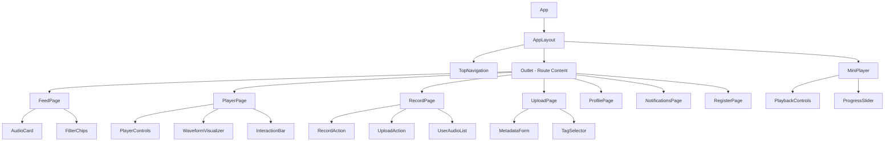
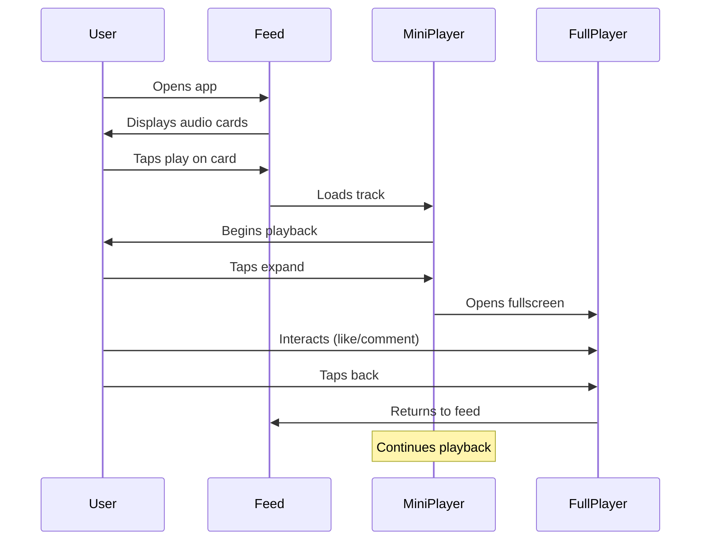
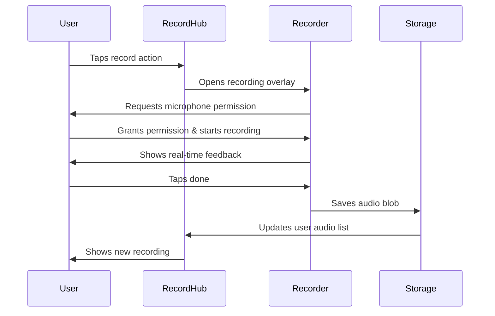
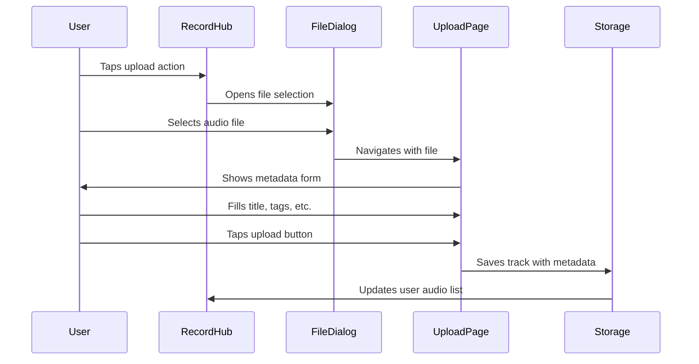

# Aural Mobile Web App - Wireframes & Page Structure Design

## Overview

Aural is a mobile-first web application designed as a "voice-based Instagram" - a social platform focused on audio content sharing and discovery. This milestone covers core functionalities including feed, mini-player, fullscreen player, upload, recording, and basic profile features with fundamental navigation structure.

### Core Concept
- Audio-centric social platform (no images/videos in main content)
- Mobile-first responsive design with dark mode only
- Persistent mini-player with seamless navigation
- Real-time audio recording and file upload capabilities
- Social interactions through likes, comments, and profiles

### Target Architecture
Frontend-only application for Milestone 1 with dummy data stored in localStorage, designed to be easily extended with backend integration in future milestones.

## Design System & Visual Guidelines

### Color Palette
```css
/* Primary Background */
--bg-primary: #0A0A0B;        /* Deep black background */
--text-primary: #FFFFFF;       /* Primary white text */
--text-secondary: #A3A3A3;     /* Secondary gray text */

/* Neon Accent Colors */
--accent-pink: #FF006E;        /* Neon pink */
--accent-red: #FF1744;         /* Neon red */
--accent-violet: #8338EC;      /* Neon violet */
--accent-turquoise: #06FFA5;   /* Neon turquoise */

/* Interactive States */
--active-glow: 0 0 20px rgba(255, 0, 110, 0.6);
--hover-glow: 0 0 15px rgba(131, 56, 236, 0.4);
```

### Typography System
- **Primary Font**: Inter or Manrope (modern, humanistic sans-serif)
- **Headlines**: Large, bold weights for impact
- **Body Text**: Regular weight with high contrast (white/light gray on dark)
- **Labels & Metadata**: Lighter weight for secondary information

### Icon System
- **Style**: Outline icons with ~2px stroke width
- **Size**: Minimum 44x44px touch targets for mobile accessibility
- **States**: 
  - Inactive: White/light gray monochrome
  - Active: Neon colors (red/violet) with subtle glow effect

### Visual Mood
Sensual, elegant, and professional aesthetic using expansive gradients and soft shadows without visual overload. Audio-first focus with minimal use of imagery except for covers, advertising, or onboarding.

## Navigation Architecture

### Top Navigation Structure
Fixed navigation bar appearing on every screen with consistent layout:

```
[Logo/Signet]                    [Home][Comments][Profile][Upload][Search]
```

#### Navigation Items (Left to Right)
1. **Home (Feed)** - Shows main audio feed
2. **Comments/Notifications** - Lists activity on user's content
3. **Profile** - User profile stub (`/profile/:id`)
4. **Upload/Record** - Opens recording and upload actions page
5. **Search** - Placeholder for future search functionality

#### Navigation States
- **Active State**: Neon underline with color matching accent palette
- **Responsive Behavior**: Always visible on small viewports
- **Z-Index Management**: Positioned above content but below mini-player

### Mini-Player Integration
Persistent mini-player positioned at bottom (`position: fixed; bottom: 0;`) that:
- Does not overlap main content
- Remains visible across all pages
- Provides seamless audio experience throughout app navigation

## Page Structure & Components

### 1. Feed Page (`/`)

#### Layout Structure
```
┌─────────────────────────────────┐
│ [Logo]    [Nav Icons]           │  ← Top Navigation
├─────────────────────────────────┤
│ Filter Chips: [All][Following]  │  ← Category Filters
├─────────────────────────────────┤
│ ┌─────────────────────────────┐ │
│ │ Audio Card 1                │ │  ← Scrollable Feed
│ │ [▶] Title by @username      │ │
│ │     ♡ 24  💬 5  ⏱ 01:50    │ │
│ └─────────────────────────────┘ │
│ ┌─────────────────────────────┐ │
│ │ Audio Card 2                │ │
│ │ [▶] Title by @username      │ │
│ │     ♡ 12  💬 2  ⏱ 02:30    │ │
│ └─────────────────────────────┘ │
│                                 │
├─────────────────────────────────┤
│ [▶] Current Track    [♡][⋯][↗] │  ← Mini-Player
└─────────────────────────────────┘
```

#### Audio Card Component
Each card contains:
- **Play Button**: Circular button (left/right) to start playback in mini-player
- **Track Title**: Multi-line title with clear hierarchy
- **Creator Nickname**: Username of uploader
- **Metadata Icons**: 
  - Heart icon + like count
  - Comment icon + comment count  
  - Clock icon + duration (MM:SS format)

#### Feed Categories
- **Filter Chips**: "All", "Following", "Trending" with pill-button styling
- **Optional Filters**: Couples, Females, Males (expandable in future)

#### Interaction Flow
- Card tap → Loads track in mini-player
- Play button → Starts immediate playback
- Title tap → Future enhancement to full player view

### 2. Mini-Player (Persistent Component)

#### Fixed Positioning
```css
.mini-player {
  position: fixed;
  bottom: 0;
  left: 0;
  right: 0;
  z-index: 100;
}
```

#### Component Layout
```
┌─────────────────────────────────────────────────────────┐
│ [▶] [Title & Artist - Scrolling...]  [♡] [Progress] [↗] │
└─────────────────────────────────────────────────────────┘
```

#### Functional Elements
- **Play/Pause Button**: Circular button with visual state transitions
- **Track Info**: Scrolling marquee for long titles and artist names
- **Progress Bar**: Thin scrub-enabled slider for position control
- **Like Button**: Heart icon with filled/empty states
- **Expand Button**: Chevron/arrow to open fullscreen player

#### State Management
- Persists across all page navigations
- Maintains playback position and track information
- Syncs with fullscreen player state

### 3. Fullscreen Player (`/player/:id`)

#### Page Structure
```
┌─────────────────────────────────┐
│ [←] Playback                    │  ← Header with back button
├─────────────────────────────────┤
│                                 │
│ @username                       │  ← Creator info
│ ♡ 24  💬 5                     │  ← Social metrics
│                                 │
│ **Track Title**                 │  ← Prominent title
│ Track description...            │  ← Optional description
│                                 │
│ [Soft] [Female] [Toy]          │  ← Tag chips
│                                 │
├─────────────────────────────────┤
│ 01:23        [▶▶]        02:45  │  ← Playback controls
│ ▓▓▓▓▓░░░░░░░░░░░░░░░░░░░       │  ← Progress slider
├─────────────────────────────────┤
│ ████▓▓▒▒░░  ████▓▓▒▒░░        │  ← Waveform/Equalizer
├─────────────────────────────────┤
│    [♡]      [💬]      [📌]      │  ← Interaction bar
└─────────────────────────────────┘
```

#### Content Sections
1. **Header**: Back navigation with page title
2. **Track Information**: 
   - Creator username
   - Like and comment counters
   - Prominent track title
   - Optional description text
3. **Tag System**: Rounded pill buttons for categorization
4. **Playback Control**:
   - Large central play/pause button
   - Time displays (elapsed/remaining)
   - Scrub-enabled progress slider
5. **Visual Feedback**: Animated waveform or equalizer display
6. **Interaction Bar**: Like, comment, bookmark/share icons with counters

#### Navigation Flow
- Back button returns to previous route
- Mini-player state maintained
- Deep-linkable URLs for sharing

### 4. Recording & Upload Hub (`/record`)

#### Main Action Page
```
┌─────────────────────────────────┐
│ [Logo]    [Nav Icons]           │
├─────────────────────────────────┤
│                                 │
│ ┌─────────────────────────────┐ │
│ │        🎤 Record            │ │  ← Record action button
│ │                             │ │
│ └─────────────────────────────┘ │
│                                 │
│ ┌─────────────────────────────┐ │
│ │        📁 Upload            │ │  ← Upload action button
│ │                             │ │
│ └─────────────────────────────┘ │
│                                 │
│ Your Recordings:                │
│ ┌─────────────────────────────┐ │
│ │ [▶] Recording 1     🔴 NEW  │ │  ← User's audio list
│ └─────────────────────────────┘ │
│ ┌─────────────────────────────┐ │
│ │ [▶] Recording 2             │ │
│ └─────────────────────────────┘ │
└─────────────────────────────────┘
```

#### Two Primary Actions
1. **Record Button**: Opens fullscreen recording overlay
2. **Upload Button**: Triggers file selection dialog

#### User Content List
- "Your Recordings" section with dummy state
- New activity indicated by red badge
- Playable items in mini-player

### 5. Audio Recorder Overlay (`/record/recorder`)

#### Fullscreen Recording Interface
```
┌─────────────────────────────────┐
│                                 │
│           00:01:23              │  ← Recording timer
│                                 │
│                                 │
│          ●●●●●●●                │  ← Pulsing recording indicator
│            🎤                   │  ← Large microphone button
│          ●●●●●●●                │
│                                 │
│                                 │
│                                 │
│   [🗑 Delete]    [✓ Done]      │  ← Action buttons
│                                 │
└─────────────────────────────────┘
```

#### Recording Flow
1. **Permission Request**: Browser microphone access via `navigator.mediaDevices.getUserMedia`
2. **Active Recording**: 
   - Pulsing visual feedback (expanding rings)
   - Real-time timer display
   - Ambient recording visualization
3. **Recording Controls**:
   - Delete: Discards current recording
   - Done: Stops and saves as blob to local state
4. **Preview State**: Post-recording playback with save option

#### Technical Implementation
- MediaRecorder API for audio capture
- Blob storage in component state
- Integration with local storage for persistence

### 6. Upload Flow (`/upload`)

#### File Selection to Metadata Entry
```
┌─────────────────────────────────┐
│ [←] Upload Audio                │
├─────────────────────────────────┤
│ Title                           │
│ ┌─────────────────────────────┐ │
│ │ audio-file-name.mp3         │ │  ← Editable title field
│ └─────────────────────────────┘ │
│                                 │
│ Description (Optional)          │
│ ┌─────────────────────────────┐ │
│ │                             │ │  ← Multi-line text area
│ │                             │ │
│ └─────────────────────────────┘ │
│                                 │
│ Who is featured?                │
│ [👤 Female] [👤 Male]          │  ← Gender selection
│                                 │
│ Tags                            │
│ [Soft] [ASMR] [+ Add Tag]      │  ← Tag selection
│                                 │
│ File: audio-file-name.mp3       │  ← File reference
│                                 │
│                           [⬆]   │  ← Floating upload button
└─────────────────────────────────┘
```

#### Metadata Form Fields
1. **Title**: Pre-filled with filename, fully editable
2. **Description**: Optional multi-line text input
3. **Speaker Gender**: "Female"/"Male" buttons (expandable for multiple selection)
4. **Tags**: Predefined tag chips plus custom tag input
5. **File Reference**: Display selected filename
6. **Upload Action**: Floating action button (bottom-right)

#### Form Validation & Submission
- Required field validation for title
- Optional fields clearly marked
- Success state navigates back to `/record` with updated list

### 7. User Profile (`/profile/:id`)

#### Profile Stub Structure
```
┌─────────────────────────────────┐
│ [←] Profile                     │
├─────────────────────────────────┤
│                                 │
│          👤                     │  ← Avatar placeholder
│                                 │
│      @username                  │  ← Username display
│                                 │
│   🔥 150 Total Likes            │  ← Statistics
│   📤 12 Uploads                 │
│                                 │
│ Bio: Voice artist and           │  ← Optional bio text
│ storyteller...                  │
│                                 │
│                                 │
│ [Following future milestone]    │  ← Placeholder for tracks
│                                 │
└─────────────────────────────────┘
```

#### Profile Information Display
- **Avatar**: Placeholder for profile image
- **Username**: Primary identifier
- **Statistics**: Total likes received, upload count
- **Bio**: Optional user description
- **Future Enhancement Areas**: Track listings, follower counts, follow buttons

### 8. Notifications/Comments (`/notifications`)

#### Activity Feed Structure
```
┌─────────────────────────────────┐
│ [Logo]    [Nav Icons]           │
├─────────────────────────────────┤
│ Activity                        │
├─────────────────────────────────┤
│ ♡ Sarah and Mike liked          │
│   "Morning Thoughts"            │  ← Like notification
│   2 hours ago                   │
├─────────────────────────────────┤
│ 💬 "Super amazing! Love this    │  ← Comment notification
│   one ❤" on "Evening Vibes"    │
│   4 hours ago                   │
├─────────────────────────────────┤
│ ♡ Alex liked "Whispered Words"  │
│   1 day ago                     │
└─────────────────────────────────┘
```

#### Notification Types
1. **Like Entries**: Heart icon + user names + track title (bold)
2. **Comment Entries**: Speech bubble icon + quoted comment text + track reference
3. **Chronological Order**: Newest entries at top
4. **Interactive Elements**: Future tap-to-navigate functionality

## Registration Flow (`/register`)

### Multi-Step Registration Process

#### Step 1: Username Entry
```
┌─────────────────────────────────┐
│ Create Account                  │
├─────────────────────────────────┤
│                                 │
│ Choose Username                 │
│ ┌─────────────────────────────┐ │
│ │ username                    │ │
│ └─────────────────────────────┘ │
│ ✓ Available                     │  ← Validation feedback
│                                 │
│                    [Continue]   │
└─────────────────────────────────┘
```

#### Step 2: Password Creation
```
┌─────────────────────────────────┐
│ Create Account                  │
├─────────────────────────────────┤
│                                 │
│ Password                        │
│ ┌─────────────────────────────┐ │
│ │ ••••••••                    │ │
│ └─────────────────────────────┘ │
│                                 │
│ Confirm Password                │
│ ┌─────────────────────────────┐ │
│ │ ••••••••                    │ │
│ └─────────────────────────────┘ │
│                                 │
│ ✓ 8+ chars, 3 character types  │  ← Requirements
│                    [Continue]   │
└─────────────────────────────────┘
```

#### Step 3: Email (Optional)
```
┌─────────────────────────────────┐
│ Create Account                  │
├─────────────────────────────────┤
│                                 │
│ Email (Optional)                │
│ For password recovery           │
│ ┌─────────────────────────────┐ │
│ │ email@example.com           │ │
│ └─────────────────────────────┘ │
│                                 │
│                    [Continue]   │
└─────────────────────────────────┘
```

#### Step 4: Age Verification
```
┌─────────────────────────────────┐
│ Age Verification                │
├─────────────────────────────────┤
│                                 │
│ This app contains adult content │
│                                 │
│ [✓] I am 18 years or older      │  ← Required checkbox
│                                 │
│              [Register]         │  ← Only active after check
└─────────────────────────────────┘
```

#### Step 5: Success Confirmation
```
┌─────────────────────────────────┐
│                                 │
│             ✓                   │  ← Green checkmark
│                                 │
│ Registration Successful!        │
│                                 │
│ Welcome to Aural                │
│                                 │
│           [Get Started]         │
└─────────────────────────────────┘
```

### Registration Implementation Notes
- **Validation**: Inline validation with real-time feedback
- **Storage**: localStorage for Milestone 1 (non-persistent across sessions)
- **Security Stub**: Form validation only, no server communication
- **Progressive Enhancement**: Multi-step approach with clear progress indication

## Route Structure & Component Mapping

### Application Routes

| Route | Component | Purpose | Key Features |
|-------|-----------|---------|--------------|
| `/` | FeedPage | Main audio feed | Filter chips, audio cards, mini-player integration |
| `/player/:id` | PlayerPage | Fullscreen player | Detailed track info, waveform, interaction controls |
| `/record` | RecordPage | Recording hub | Record/upload actions, user audio list |
| `/record/recorder` | RecorderOverlay | Audio recording | Microphone access, real-time recording, preview |
| `/upload` | UploadPage | File upload flow | Metadata form, tag selection, file processing |
| `/profile/:id` | ProfilePage | User profile | Statistics, bio, track listings (stub) |
| `/notifications` | NotificationsPage | Activity feed | Likes, comments, chronological display |
| `/register` | RegisterPage | User registration | Multi-step form, validation, age verification |

### Component Hierarchy



## Local State Management

### Data Structure for Milestone 1

#### Audio Track Model
```typescript
interface AudioTrack {
  id: string;
  title: string;
  author: string;
  duration: number; // seconds
  likes: number;
  comments: number;
  tags: string[];
  file: string; // URL to local audio blob
  description?: string;
  createdAt: Date;
}
```

#### User Model
```typescript
interface User {
  id: string;
  username: string;
  avatar?: string;
  totalLikes: number;
  totalUploads: number;
  bio?: string;
}
```

#### State Management Strategy
- **Frontend State**: React Context or Zustand for global state
- **Persistence**: localStorage for dummy data (session-persistent)
- **Audio Blobs**: URL.createObjectURL for file references
- **Player State**: Global state for mini-player synchronization

### Dummy Data Initialization
```typescript
const dummyTracks: AudioTrack[] = [
  {
    id: '1',
    title: 'Morning Thoughts',
    author: 'alex_voice',
    duration: 180,
    likes: 24,
    comments: 5,
    tags: ['soft', 'morning', 'female'],
    file: '/dummy-audio/morning-thoughts.mp3',
    description: 'Peaceful morning reflections...',
    createdAt: new Date('2024-01-15')
  },
  // Additional dummy tracks...
];
```

## User Interaction Flows

### Primary User Journeys

#### 1. Audio Discovery & Playback


#### 2. Audio Recording Journey


#### 3. Upload & Metadata Flow


## Implementation Guidelines

### Responsive Design Requirements
- **Primary Target**: Mobile viewport (375px-414px width)
- **Responsive Breakpoints**: 
  - Mobile: 320px-767px
  - Tablet: 768px-1023px  
  - Desktop: 1024px+
- **Layout Strategy**: Mobile-first with progressive enhancement
- **Touch Targets**: Minimum 44x44px for accessibility

### Accessibility Standards
- **ARIA Labels**: Semantic labeling for all interactive elements
- **Keyboard Navigation**: Full app usability without mouse
- **Color Contrast**: Minimum 4.5:1 ratio for text
- **Focus Management**: Clear visual focus indicators
- **Screen Reader Support**: Proper heading hierarchy and alt text

### Technical Implementation Notes

#### Audio Handling
- **Recording**: MediaRecorder API with getUserMedia
- **Playback**: HTML5 Audio element or Web Audio API
- **File Storage**: URL.createObjectURL for blob management
- **Format Support**: MP3, WAV, M4A for broad compatibility

#### State Persistence
- **localStorage**: JSON serialization for dummy data
- **Session Management**: Basic user state persistence
- **Audio URLs**: Blob URL lifecycle management
- **Performance**: Lazy loading for large audio lists

#### Routing Strategy
- **React Router**: Client-side routing with deep linking
- **Route Guards**: Age verification before main app access
- **History Management**: Proper back button behavior
- **Deep Links**: Shareable URLs for player and profiles

### Development Workflow
1. **Setup**: Initialize with React, TypeScript, Vite
2. **Layout**: Implement AppLayout with TopNavigation and MiniPlayer
3. **Feed**: Build audio card components and feed display
4. **Player**: Develop mini-player and fullscreen player
5. **Recording**: Implement MediaRecorder integration
6. **Upload**: Create file handling and metadata forms
7. **State**: Integrate global state management
8. **Polish**: Add animations, transitions, and accessibility features