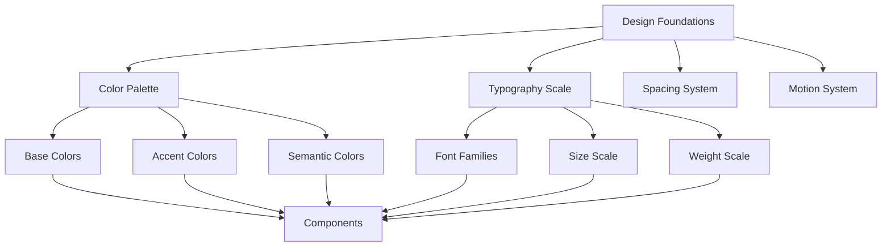
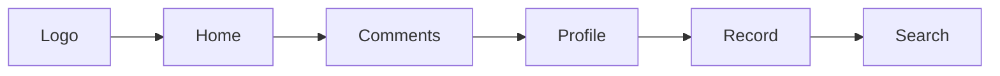

# Aural Design Tokens & Components System

## Overview

This document defines the complete design token system and component specifications for the Aural mobile web application. Aural is a voice-based social platform with a dark-only interface, featuring neon accent colors and an orange/red blur gradient background inspired by contemporary audio visualization aesthetics.

## Design System Architecture

### Design Foundations

The Aural design system is built on a foundation of semantic tokens that ensure consistency across all components while maintaining flexibility for future enhancements. The system follows a mobile-first approach with emphasis on accessibility and touch-friendly interactions.



## Color System

### Base Palette

The base color palette provides the foundational colors for backgrounds, surfaces, and text elements in the dark-themed interface.

| Token | Value | Usage |
|-------|-------|--------|
| `background` | `#0A0A0B` | Primary app background |
| `surface` | `#121216` | Card and panel backgrounds |
| `surfaceMuted` | `#1A1A20` | Subtle background variations |
| `textPrimary` | `#EDEDF0` | Primary text content |
| `textSecondary` | `#B8B8C2` | Secondary text and metadata |
| `textMuted` | `#8A8A95` | Placeholder and disabled text |
| `divider` | `#2A2A33` | Border and separator elements |

### Accent Colors

Vibrant accent colors create visual hierarchy and interactive states throughout the application.

| Token | Value | Usage |
|-------|-------|--------|
| `auralRed` | `#FF3B3B` | Primary brand color, active states |
| `auralRose` | `#FF5C7A` | Secondary interactions |
| `auralViolet` | `#A86CFF` | Tertiary accent |
| `auralCyan` | `#33E0FF` | Focus indicators |
| `auralTurquoise` | `#37D3C7` | Success states |

### Semantic Colors

Purpose-driven colors for system feedback and states.

| Token | Value | Usage |
|-------|-------|--------|
| `success` | `#4CD964` | Success feedback |
| `warning` | `#FFD666` | Warning states |
| `danger` | `#FF4D4D` | Error states |
| `info` | `#5AC8FA` | Information states |

## Background System

### Animated Skin-Texture Gradient

The signature background creates an intimate, organic atmosphere reminiscent of close-up skin texture with depth of field blur. The animated gradient system uses multiple layers with subtle pulsing movements to simulate the natural variation of human skin tones and texture.

#### Primary Container
- **Size**: 110vw × 110vh (overflow container)
- **Position**: -5vh top, -5vw left offset
- **Animation**: `gradientPulse` 2s infinite ease-in-out

#### Base Linear Gradient
- **Angle**: 135 degrees
- **Color Progression**: Deep red to near-black
- **Stops**:
  - 0%: `#ff3020` (bright red-orange)
  - 12%: `#e02515` (warm red)
  - 25%: `#d01f10` (medium red)
  - 35%: `#c01a0d` (deeper red)
  - 45%: `#b0150a` (dark red)
  - 55%: `#a01008` (very dark red)
  - 65%: `#900b06` (burgundy)
  - 75%: `#800605` (deep burgundy)
  - 85%: `#600303` (dark brown-red)
  - 92%: `#400202` (very dark brown)
  - 98%: `#200101` (almost black)
  - 100%: `#100000` (near black)

#### Primary Radial Gradient
- **Shape**: Ellipse 80% width, 60% height
- **Position**: 20% left, 25% top
- **Color Stops**:
  - 0%: `rgba(255, 255, 255, 0.9)` (bright highlight)
  - 15%: `rgba(255, 245, 200, 0.8)` (warm cream)
  - 30%: `rgba(255, 200, 100, 0.6)` (golden orange)
  - 45%: `rgba(255, 100, 50, 0.4)` (bright orange)
  - 60%: `rgba(255, 50, 30, 0.2)` (red-orange)
  - 80%: `transparent`

#### Secondary Radial Gradient
- **Shape**: Ellipse 70% width, 80% height
- **Position**: 10% left, 40% top
- **Color Stops**:
  - 0%: `rgba(255, 80, 40, 0.7)` (warm orange-red)
  - 25%: `rgba(255, 50, 20, 0.5)` (deep orange)
  - 50%: `rgba(220, 30, 15, 0.3)` (dark red-orange)
  - 75%: `transparent`

#### Animated Layers

**Before Pseudo-element** (Left Side Accent)
- **Shape**: Ellipse 120% width, 80% height at 0% left, 30% top
- **Animation**: `beforePulse` 2s infinite ease-in-out
- **Movement**: Subtle scale (1.025), translate (1px, -1px), opacity variation
- **Colors**: Red-orange tones with high opacity variation

**After Pseudo-element** (Right Bottom Accent)
- **Position**: Two ellipses at 80%/75% and 95%/85%
- **Animation**: `afterPulse` 2s infinite ease-in-out, 0.1s delay
- **Movement**: Counter-movement to before element
- **Colors**: Darker red-brown tones for depth

## Typography System

### Font Stack

```css
font-family: 'Inter', 'Manrope', system-ui, -apple-system, 'Segoe UI', 'Roboto';
```

### Scale Hierarchy

| Token | Size (px) | Line Height (px) | Weight | Letter Spacing |
|-------|-----------|------------------|--------|----------------|
| `h1` | 28 | 34 | 700 | -0.2px |
| `h2` | 22 | 28 | 700 | -0.1px |
| `title` | 18 | 24 | 700 | 0 |
| `subtitle` | 14 | 20 | 600 | 0 |
| `body` | 15 | 22 | 500 | 0 |
| `label` | 12 | 16 | 600 | 0 |
| `caption` | 11 | 14 | 500 | 0 |

### Numeric Tabular

For duration displays and statistics:
```css
font-family: 'Inter var', system-ui;
font-variant-numeric: tabular-nums;
```

## Spacing Scale

Consistent spacing maintains visual rhythm and hierarchy.

| Token | Value (px) | Usage |
|-------|------------|--------|
| `xxs` | 4 | Micro spacing |
| `xs` | 8 | Small gaps |
| `sm` | 12 | Component padding |
| `md` | 16 | Standard spacing |
| `lg` | 20 | Section spacing |
| `xl` | 24 | Large spacing |
| `xxl` | 32 | Major sections |

## Border Radius System

| Token | Value | Usage |
|-------|-------|--------|
| `chip` | 20px | Filter chips, tags |
| `button` | 28px | Buttons and controls |
| `card` | 16px | Cards and panels |
| `modal` | 24px | Modals and overlays |
| `circle` | 50% | Circular elements |

## Elevation & Shadows

| Token | Value | Usage |
|-------|-------|--------|
| `shadowSm` | `0 2px 8px rgba(0,0,0,.25)` | Chips, small cards |
| `shadowMd` | `0 6px 20px rgba(0,0,0,.35)` | Cards, buttons |
| `shadowLg` | `0 12px 36px rgba(0,0,0,.45)` | Modals, overlays |

## Motion System

### Timing

| Token | Duration (ms) | Usage |
|-------|---------------|--------|
| `fast` | 120 | Micro interactions |
| `base` | 180 | Standard transitions |
| `slow` | 260 | Complex animations |

### Easing

| Token | Value | Usage |
|-------|-------|--------|
| `standard` | `cubic-bezier(.2,.8,.2,1)` | Standard transitions |
| `emphasized` | `cubic-bezier(.2,.7,0,1)` | Important state changes |

### Micro Interactions

| Token | Value | Usage |
|-------|-------|--------|
| `pressScale` | 0.98 | Touch feedback |
| `hoverRaise` | 2px | Hover elevation |

## Component Specifications

### Top Navigation



#### Specifications
- **Height**: 56px
- **Horizontal Padding**: 16px
- **Icon Order**: Home, Comments, Profile, Record, Search
- **Active Indicator**: 3px red underline with 2px radius
- **Logo**: 36px circular heart-play hybrid

### Filter Tabs/Chips

#### Visual States

**Inactive Chip**
- Background: `#15151A`
- Text: `#DADAE0`
- Border: `#2C2C35`
- Height: 36px
- Padding: 14px horizontal
- Shadow: `shadowSm`

**Active Chip**
- Background: Transparent
- Text: `#FFFFFF`
- Border: `#FF3B3B`
- Same dimensions as inactive

#### Examples
- "Couples"
- "Females" 
- "Males"

### Category Headers

#### Typography
- Color: `#FF3B3B`
- Size: 22px
- Weight: 800
- Letter Spacing: -0.2px

#### See More Action
- Icon: Chevron right
- Color: `#FF3B3B`
- Touch Target: 44px minimum

### Feed Card Layout

#### Content Hierarchy
1. **Title First Layout** (title on top)
2. **Inline Metadata** (uploader, likes, duration in row)

#### Title Styling
- Style Token: `title`
- Color: `#FFFFFF`
- Max Lines: 2 with ellipsis

#### Metadata Items
- **Uploader**: `#B8B8C2`
- **Icons**: `#B8B8C2`
- **Gap**: 10px between items
- **Items**: uploader, likes, duration

#### Interaction Patterns
- **Tap**: Opens full player
- **Long Press**: Shows quick actions

### Mini Player

#### Layout Structure
```
[Progress Bar - 2px height]
[Play/Pause] [Title/Uploader] [Like] [Expand]
```

#### Specifications
- **Height**: 72px
- **Position**: Fixed bottom
- **Progress Bar**: 2px height, `#FF3B3B` on `#2A2A33`
- **Buttons**: 44px circular, white icons on `#FF3B3B`

### Full Player

#### Header
- **Title**: "Wiedergabe" (German for "Playback")
- **Back Icon**: Chevron left

#### Track Information
- **Show Uploader**: Yes
- **Statistics**: Likes, comments
- **Title Style**: `h1` token, `#FFFFFF`
- **Description**: `body` token, `#B8B8C2`, 4 line max

#### Tag Chips
- **Background**: `#121216`
- **Border**: `#3A3A46`
- **Text**: `#EDEDF0`

#### Primary Control
- **Type**: Circle
- **Size**: 96px
- **Border**: 3px `#FF3B3B`

#### Visualizer
- **Type**: Bars
- **Bar Width**: 3px
- **Gap**: 5px
- **Color**: `#FF3B3B`

#### Action Bar
- Icons: Like, Comment, Save

### Button System

#### Sizes
| Size | Height (px) |
|------|-------------|
| `sm` | 32 |
| `md` | 44 |
| `lg` | 54 |

#### Variants

**Primary Button**
- Background: `#FF3B3B`
- Text: `#0A0A0B`
- Radius: 28px

**Ghost Button**
- Background: Transparent
- Text: `#FFFFFF`
- Border: `#3A3A46`

**Danger Button**
- Background: `#FF4D4D`
- Text: `#0A0A0B`

### Input Fields

#### Standard Field
- Background: `#121216`
- Text: `#EDEDF0`
- Placeholder: `#8A8A95`
- Border: `#3A3A46`
- Focus Border: `#FF3B3B`
- Radius: 14px
- Padding: 12px vertical, 14px horizontal

#### Tag Entry
- Hint Text: "+ Eigenen Tag eingeben" (German: "Enter custom tag")

### Chip System

#### Default Chip
- Height: 32px
- Padding: 12px horizontal
- Background: `#15151A`
- Text: `#EDEDF0`
- Border: `#3A3A46`

#### Active Chip
- Background: Transparent
- Text: `#FFFFFF`
- Border: `#FF3B3B`

### Badge System

- Background: `#FF3B3B`
- Text: `#0A0A0B`
- Radius: 12px
- Padding: 8px horizontal
- Min Width: 22px

### Advertisement Banner

#### Styling
- Title: 22px, weight 800, `#EDEDF0`
- Dismiss Icon: `#FF3B3B`
- Image Aspect: 16:9 (1.7777777777777777)
- Padding: 16px
- Background: `#121216`
- Border: `#2A2A33`

## Interaction States

### Press State
- Scale: 0.98
- Duration: 100ms
- Easing: `emphasized`

### Focus State
- Ring Color: `#33E0FF`
- Ring Width: 2px
- Offset: 2px

### Disabled State
- Opacity: 0.5
- Pointer Events: None

### Active Tab State
- Border: `#FF3B3B`
- Text: `#FFFFFF`

## Application Patterns

### Feed Structure

#### Section Types
1. **Subscriptions** ("Subscribs")
2. **Top Rated** ("Top Rated")
3. **Most Commented** ("Most Commented")

#### Behavior
- **Preview Items**: 5 per section
- **Section Action**: Chevron right opens full list
- **Horizontal Scroll**: For preview items

### Navigation Patterns

#### Route Structure
- `/` - Feed
- `/player/:id` - Full Player
- `/upload` - Upload Flow
- `/record` - Recording Hub
- `/profile/:id` - User Profile
- `/search` - Search Interface

#### Active States
- Icon underline: `#FF3B3B`, 3px height, 2px radius

### Upload Flow

#### Form Fields
1. **Title** (required)
2. **Description** (optional)
3. **Gender** (Female/Male selection)
4. **Tags** (chip selection + custom entry)
5. **Filename** (display only)

#### Behavior
- **Submit Action**: Save to localStorage
- **Preview**: Playable before upload

### Recording Pattern

#### Control States
- **Start**: Begin recording
- **Pause**: Pause current recording
- **Resume**: Continue paused recording
- **Done**: Finish and save
- **Delete**: Discard recording

#### Post-Record
- **Preview**: Playback before saving
- **Save**: Add to user's recordings

## Accessibility Specifications

### Contrast Requirements
- **Minimum Contrast**: 4.5:1 on background
- **Large Text**: 3:1 minimum

### Touch Targets
- **Minimum Size**: 44px x 44px
- **Recommended Spacing**: 8px between targets

### ARIA Labels

| Element | Label |
|---------|-------|
| Play Button | "Play audio" |
| Pause Button | "Pause audio" |
| Like Button | "Like recording" |
| Comment Button | "Open comments" |
| Save Button | "Save to favorites" |
| Expand Button | "Expand player" |
| Back Button | "Go back" |

### Keyboard Navigation
- **Tab Order**: Logical flow through interactive elements
- **Focus Indicators**: 2px `#33E0FF` ring
- **Skip Links**: To main content and navigation

## Implementation Guidelines

### CSS Custom Properties

```css
:root {
  /* Base Colors */
  --aural-bg: #0A0A0B;
  --aural-surface: #121216;
  --aural-surface-muted: #1A1A20;
  --aural-text-primary: #EDEDF0;
  --aural-text-secondary: #B8B8C2;
  --aural-text-muted: #8A8A95;
  --aural-divider: #2A2A33;
  
  /* Accent Colors */
  --aural-red: #FF3B3B;
  --aural-rose: #FF5C7A;
  --aural-violet: #A86CFF;
  --aural-cyan: #33E0FF;
  --aural-turquoise: #37D3C7;
  
  /* Semantic Colors */
  --aural-success: #4CD964;
  --aural-warning: #FFD666;
  --aural-danger: #FF4D4D;
  --aural-info: #5AC8FA;
  
  /* Typography */
  --aural-font-primary: 'Inter', 'Manrope', system-ui, sans-serif;
  --aural-font-numeric: 'Inter var', system-ui;
  
  /* Spacing Scale */
  --aural-space-xxs: 4px;
  --aural-space-xs: 8px;
  --aural-space-sm: 12px;
  --aural-space-md: 16px;
  --aural-space-lg: 20px;
  --aural-space-xl: 24px;
  --aural-space-xxl: 32px;
  
  /* Border Radius */
  --aural-radius-chip: 20px;
  --aural-radius-button: 28px;
  --aural-radius-card: 16px;
  --aural-radius-modal: 24px;
  
  /* Shadows */
  --aural-shadow-sm: 0 2px 8px rgba(0,0,0,.25);
  --aural-shadow-md: 0 6px 20px rgba(0,0,0,.35);
  --aural-shadow-lg: 0 12px 36px rgba(0,0,0,.45);
  
  /* Motion */
  --aural-timing-fast: 120ms;
  --aural-timing-base: 180ms;
  --aural-timing-slow: 260ms;
  --aural-timing-background-pulse: 2000ms;
  --aural-ease-standard: cubic-bezier(.2,.8,.2,1);
  --aural-ease-emphasized: cubic-bezier(.2,.7,0,1);
  --aural-ease-organic: ease-in-out;
  
  /* Background Animation */
  --aural-background-scale-min: 0.98;
  --aural-background-scale-max: 1.025;
  --aural-background-opacity-min: 0.9;
  --aural-background-opacity-max: 1.15;
  --aural-background-translate: 1px;
}
```

### Background Implementation

```css
.aural-background {
  width: 110vw;
  height: 110vh;
  margin: -5vh 0 0 -5vw;
  position: relative;
  overflow: hidden;
  background: 
    /* Secondary radial highlight */
    radial-gradient(ellipse 70% 80% at 10% 40%, 
      rgba(255, 80, 40, 0.7) 0%,
      rgba(255, 50, 20, 0.5) 25%,
      rgba(220, 30, 15, 0.3) 50%,
      transparent 75%
    ),
    /* Primary radial highlight */
    radial-gradient(ellipse 80% 60% at 20% 25%, 
      rgba(255, 255, 255, 0.9) 0%,
      rgba(255, 245, 200, 0.8) 15%,
      rgba(255, 200, 100, 0.6) 30%,
      rgba(255, 100, 50, 0.4) 45%,
      rgba(255, 50, 30, 0.2) 60%,
      transparent 80%
    ),
    /* Base gradient - red to black */
    linear-gradient(135deg, 
      #ff3020 0%,
      #e02515 12%,
      #d01f10 25%,
      #c01a0d 35%,
      #b0150a 45%,
      #a01008 55%,
      #900b06 65%,
      #800605 75%,
      #600303 85%,
      #400202 92%,
      #200101 98%,
      #100000 100%
    );
  background-size: 100% 100%, 100% 100%, 100% 100%;
  background-repeat: no-repeat;
  animation: gradientPulse 2s ease-in-out infinite;
}

/* Animated highlight layers */
.aural-background::before {
  content: '';
  position: absolute;
  top: 0;
  left: 0;
  right: 0;
  bottom: 0;
  background: 
    radial-gradient(ellipse 120% 80% at 0% 30%, 
      rgba(255, 60, 30, 0.6) 0%,
      rgba(240, 40, 20, 0.4) 30%,
      rgba(200, 20, 10, 0.2) 60%,
      rgba(100, 10, 5, 0.2) 85%,
      transparent 100%
    );
  animation: beforePulse 2s ease-in-out infinite;
}

.aural-background::after {
  content: '';
  position: absolute;
  top: 0;
  left: 0;
  right: 0;
  bottom: 0;
  background: 
    radial-gradient(ellipse 80% 60% at 80% 75%, 
      rgba(50, 10, 5, 0.7) 0%,
      rgba(80, 15, 8, 0.5) 40%,
      rgba(120, 20, 10, 0.3) 70%,
      transparent 100%
    ),
    radial-gradient(ellipse 90% 70% at 95% 85%, 
      rgba(30, 5, 3, 0.8) 0%,
      rgba(60, 10, 5, 0.6) 30%,
      rgba(100, 15, 8, 0.3) 65%,
      transparent 90%
    );
  animation: afterPulse 2s ease-in-out infinite 0.1s;
}

/* Animation keyframes */
@keyframes gradientPulse {
  0%, 15%, 35%, 50%, 100% {
    transform: scale(1);
  }
}

@keyframes beforePulse {
  0% {
    opacity: 1;
    transform: scale(1) translateX(0px) translateY(0px);
  }
  20% {
    opacity: 1.15;
    transform: scale(1.025) translateX(1px) translateY(-1px);
  }
  40% {
    opacity: 0.9;
    transform: scale(0.98) translateX(0px) translateY(0px);
  }
  55%, 100% {
    opacity: 1;
    transform: scale(1) translateX(0px) translateY(0px);
  }
}

@keyframes afterPulse {
  0% {
    opacity: 1;
    transform: scale(1) translateX(0px) translateY(0px);
  }
  18% {
    opacity: 1.1;
    transform: scale(1.015) translateX(-1px) translateY(1px);
  }
  38% {
    opacity: 0.95;
    transform: scale(0.985) translateX(0px) translateY(0px);
  }
  52%, 100% {
    opacity: 1;
    transform: scale(1) translateX(0px) translateY(0px);
  }
}

/* Reduced motion accessibility */
@media (prefers-reduced-motion: reduce) {
  .aural-background,
  .aural-background::before,
  .aural-background::after {
    animation: none;
  }
}
```

### Component Examples

#### Filter Chip Component

```css
.chip {
  height: 36px;
  padding: 0 14px;
  border-radius: var(--aural-radius-chip);
  border: 1px solid var(--aural-divider);
  background: var(--aural-surface);
  color: var(--aural-text-primary);
  font-size: 14px;
  font-weight: 600;
  transition: all var(--aural-timing-base) var(--aural-ease-standard);
  box-shadow: var(--aural-shadow-sm);
}

.chip:hover {
  transform: translateY(-1px);
  box-shadow: var(--aural-shadow-md);
}

.chip.active {
  background: transparent;
  border-color: var(--aural-red);
  color: #FFFFFF;
}
```

#### Mini Player Component

```css
.mini-player {
  position: fixed;
  bottom: 0;
  left: 0;
  right: 0;
  height: 72px;
  background: var(--aural-surface);
  border-top: 1px solid var(--aural-divider);
  z-index: 100;
}

.mini-player__progress {
  height: 2px;
  background: var(--aural-divider);
  position: absolute;
  top: 0;
  left: 0;
  right: 0;
}

.mini-player__progress-fill {
  height: 100%;
  background: var(--aural-red);
  transition: width var(--aural-timing-fast) linear;
}

.mini-player__button {
  width: 44px;
  height: 44px;
  border-radius: 50%;
  background: var(--aural-red);
  color: var(--aural-bg);
  border: none;
  display: flex;
  align-items: center;
  justify-content: center;
  transition: all var(--aural-timing-base) var(--aural-ease-standard);
}

.mini-player__button:active {
  transform: scale(0.98);
}
```

## Quality Assurance

### Design Token Validation

Each design token should be validated against:
1. **Contrast Ratios**: Meet WCAG AA standards
2. **Touch Targets**: Minimum 44px for interactive elements
3. **Consistency**: Align with established patterns
4. **Performance**: Efficient CSS implementation

### Testing Checklist

- [ ] All color combinations meet contrast requirements
- [ ] Touch targets are appropriately sized
- [ ] Motion respects `prefers-reduced-motion`
- [ ] Typography scales correctly across devices
- [ ] Components render consistently in different contexts
- [ ] Interactive states provide clear feedback
- [ ] Focus indicators are visible and accessible
- [ ] Spacing maintains visual hierarchy

This design token system provides a comprehensive foundation for implementing the Aural mobile web application with consistency, accessibility, and visual excellence.


