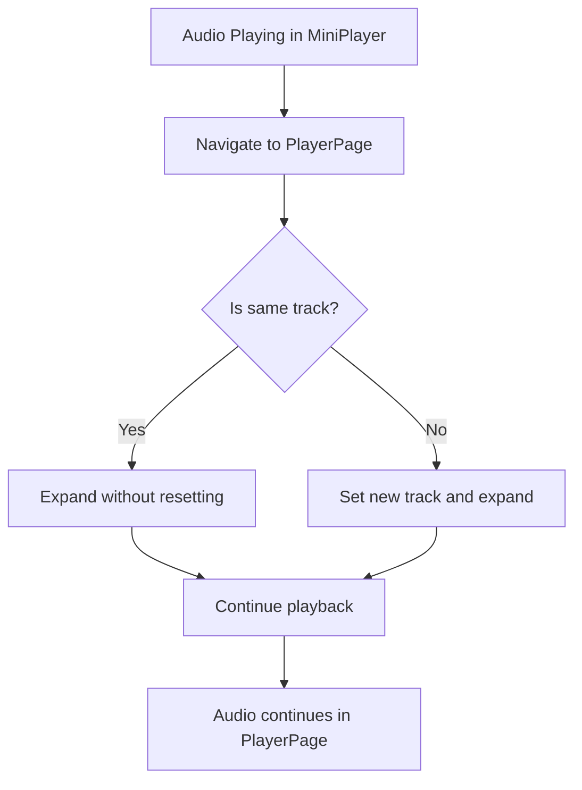

# Audio Playback Continuity When Expanding Track to Detail Page

## Overview
When a user is playing an audio track and expands it to view the detailed player page, the audio playback stops unexpectedly. The expected behavior is that the audio should continue playing seamlessly without any interruption during the transition.

## Current Implementation Analysis

### Component Structure
1. **MiniPlayer.tsx** - Fixed position player at the bottom of the screen
2. **InlineMiniPlayer.tsx** - Inline player shown within AudioCard when that track is playing
3. **PlayerPage.tsx** - Detailed player page accessed when expanding a track
4. **useAudioPlayer.ts** - Hook for controlling audio playback
5. **useGlobalAudioManager.ts** - Manages the global audio element
6. **playerStore.ts** - Zustand store for player state management

### Issue Identification
The problem occurs in the PlayerPage component where the `useEffect` hook calls `expand()` on mount and `collapse()` on unmount. This causes the mini player to be hidden when navigating to the player page, but the audio playback is not properly maintained during the transition.

Additionally, when navigating to the PlayerPage, the component tries to set the current track again, which may interrupt the ongoing playback.

## Proposed Solution

### Approach 1: Maintain Playback State During Navigation
The key is to ensure that when transitioning from the mini player to the detailed player page, the audio continues playing without re-initialization.

1. **Preserve Audio Context**: Ensure the global audio element continues playing when navigating between views
2. **Avoid Track Re-setting**: Prevent unnecessary re-setting of the current track in PlayerPage if it's already the current track
3. **Smooth State Transition**: Maintain all playback state (position, volume, etc.) during the view transition

### Implementation Details

#### 1. Modify PlayerPage.tsx
- Update the track setting logic to avoid resetting the current track if it's already playing
- Ensure the expand/collapse functions don't interfere with audio playback

#### 2. Enhance playerStore.ts
- Add a function to check if a track is already the current track without resetting playback state
- Improve state management to distinguish between "setting a new track" and "navigating to the current track's detail view"

#### 3. Update useAudioPlayer.ts
- Add logic to differentiate between playing a new track and navigating to the detail view of the current track

## Technical Implementation

### PlayerPage.tsx Modifications
```typescript
// In the track effect, avoid resetting if it's the same track
useEffect(() => {
  if (track && (!currentTrack || currentTrack.id !== track.id)) {
    // Only set if it's actually a different track
    setCurrentTrack(track);
  }
  // Always expand when component mounts
  expand();
  
  // Collapse when component unmounts
  return () => collapse();
}, [track, currentTrack, setCurrentTrack, expand, collapse]);
```

### playerStore.ts Modifications
```typescript
// Add a method to navigate to track detail without resetting playback
navigateToTrackDetail: (track: AudioTrack) => {
  // If it's the same track, just expand without resetting
  if (get().currentTrack?.id === track.id) {
    set({ isExpanded: true });
  } else {
    // Otherwise, set the new track and expand
    set({ 
      currentTrack: track, 
      currentTime: 0, 
      duration: 0,
      isLoading: true,
      isExpanded: true
    });
  }
}
```

### useAudioPlayer.ts Modifications
```typescript
// Add a method for navigating to detail view
const navigateToDetail = useCallback((track: AudioTrack) => {
  // Don't toggle play state, just ensure the track is set
  if (track && track.id !== currentTrack?.id) {
    setCurrentTrack(track);
  }
}, [currentTrack, setCurrentTrack]);
```

## Data Flow Architecture



## Testing Plan

### Unit Tests
1. Test that audio continues playing when navigating from MiniPlayer to PlayerPage
2. Test that audio position is preserved during navigation
3. Test that volume settings are maintained
4. Test edge cases where track data might differ between views

### Integration Tests
1. End-to-end test of playing a track and expanding to detail view
2. Verify no audio interruption during the transition
3. Confirm all player controls work correctly in the detail view

## Expected Outcomes
1. Seamless audio playback when expanding a track to the detail page
2. Preserved playback position and settings during navigation
3. Consistent user experience across different player views
4. No additional latency or performance impact

## Rollback Plan
If issues arise from the implementation:
1. Revert the PlayerPage track setting logic
2. Restore original playerStore behavior
3. Return to previous useAudioPlayer implementationuseEffect(() => {
  if (track && (!currentTrack || currentTrack.id !== track.id)) {
    // Only set if it's actually a different track
    setCurrentTrack(track);
  }
  // Always expand when component mounts
  expand();
  
  // Collapse when component unmounts
  return () => collapse();
}, [track, currentTrack, setCurrentTrack, expand, collapse]);
```

### playerStore.ts Modifications
```typescript
// Add a method to navigate to track detail without resetting playback
navigateToTrackDetail: (track: AudioTrack) => {
  // If it's the same track, just expand without resetting
  if (get().currentTrack?.id === track.id) {
    set({ isExpanded: true });
  } else {
    // Otherwise, set the new track and expand
    set({ 
      currentTrack: track, 
      currentTime: 0, 
      duration: 0,
      isLoading: true,
      isExpanded: true
    });
  }
}
```

### useAudioPlayer.ts Modifications
```typescript
// Add a method for navigating to detail view
const navigateToDetail = useCallback((track: AudioTrack) => {
  // Don't toggle play state, just ensure the track is set
  if (track && track.id !== currentTrack?.id) {
    setCurrentTrack(track);
  }
}, [currentTrack, setCurrentTrack]);
```

## Data Flow Architecture


## Testing Plan

### Unit Tests
1. Test that audio continues playing when navigating from MiniPlayer to PlayerPage
2. Test that audio position is preserved during navigation
3. Test that volume settings are maintained
4. Test edge cases where track data might differ between views

### Integration Tests
1. End-to-end test of playing a track and expanding to detail view
2. Verify no audio interruption during the transition
3. Confirm all player controls work correctly in the detail view

## Expected Outcomes
1. Seamless audio playback when expanding a track to the detail page
2. Preserved playback position and settings during navigation
3. Consistent user experience across different player views
4. No additional latency or performance impact

## Rollback Plan
If issues arise from the implementation:
1. Revert the PlayerPage track setting logic
2. Restore original playerStore behavior
3. Return to previous useAudioPlayer implementation


