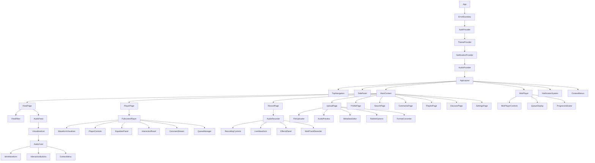
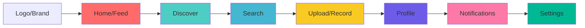
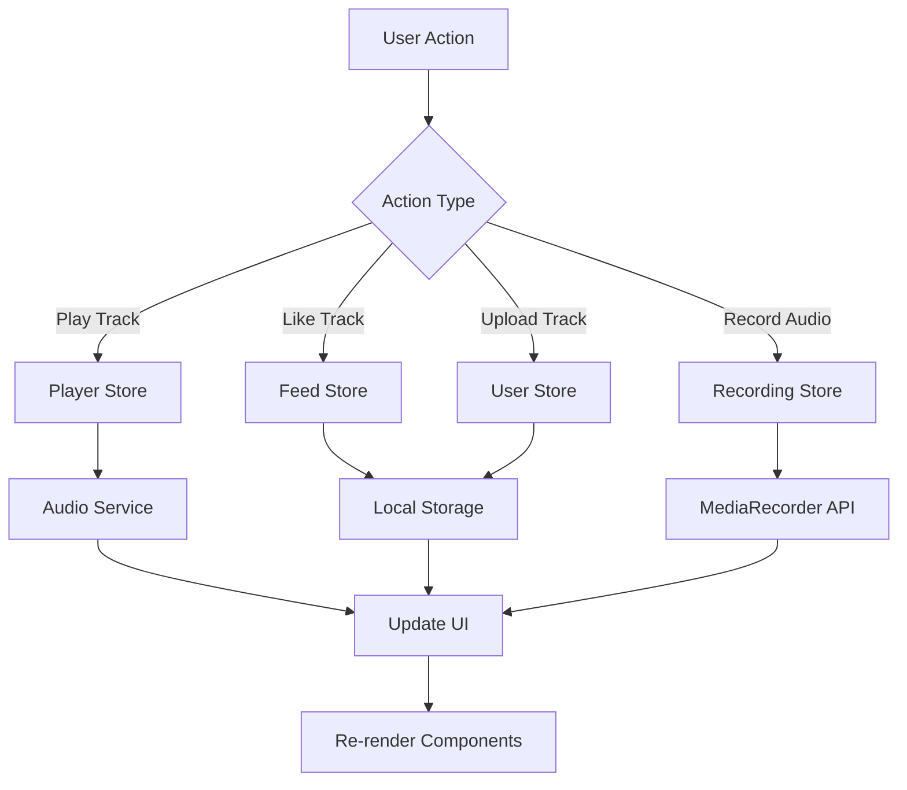

# Aural Mobile Web App - Advanced Implementation Design

## Overview

Aural is a sophisticated mobile-first web application designed as an "Instagram for voices" - a comprehensive social platform focused exclusively on audio content sharing and discovery. The platform enables users to create, share, discover, and interact with audio content through an elegant dark-mode interface featuring neon accent colors and smooth animations.

### Core Vision
- **Audio-First Social Platform**: Eliminating visual distractions to focus purely on voice and sound
- **Mobile-Optimized Experience**: Touch-friendly interfaces with thumb-accessible controls
- **Real-Time Audio Features**: Live recording, instant playback, and seamless transitions
- **Social Audio Discovery**: Algorithm-driven feed with trending, following, and personalized recommendations
- **Advanced Audio Processing**: Real-time effects, waveform visualization, and multi-format support

### Target Audience
- **Content Creators**: Podcasters, voice artists, musicians, storytellers
- **Social Audio Enthusiasts**: Users seeking voice-based social interactions
- **Mobile-First Users**: Smartphone-primary users who prefer audio over visual content
- **Community Builders**: Groups organizing around shared audio interests

## Advanced Technology Stack & Dependencies

### Core Framework & Language
- **React 19.1.1** with Hooks and Concurrent Features
- **TypeScript 5.8.3** with strict type checking and advanced generics
- **Vite 7.1.2** with HMR and optimized bundling
- **React Router DOM 7.8.2** with nested routing and lazy loading

### Audio Engine & Media Processing
- **Web Audio API** for advanced audio manipulation and visualization
- **MediaRecorder API** with cross-browser polyfills for recording
- **AudioContext** for real-time audio processing and effects
- **Web Workers** for background audio processing and file conversion
- **FFmpeg.wasm** for client-side audio format conversion and compression
- **Tone.js** for advanced audio synthesis and effects
- **Wavesurfer.js** for interactive waveform visualization

### State Management & Data Flow
- **Zustand 5.0.8** with middleware for persistence and devtools
- **React Query/TanStack Query** for server state management and caching
- **Immer** for immutable state updates
- **LocalStorage** with versioning for offline data persistence
- **IndexedDB** for large audio file caching
- **Valtio** for proxy-based reactive state management

### UI & Animation Framework
- **Tailwind CSS 4.1.12** with custom design system
- **Framer Motion 12.23.12** for advanced animations and gestures
- **Headless UI 2.2.7** for accessible component primitives
- **React Hook Form** with Zod validation schemas
- **React Virtual** for performance optimization in long lists
- **React Spring** for physics-based animations
- **Lottie React** for complex animations

### Advanced Features & Integrations
- **PWA Capabilities** with Service Workers and offline support
- **Push Notifications** via Web Push API
- **File System Access API** for local file management
- **Canvas API** for waveform visualization and audio spectrum analysis
- **Intersection Observer** for lazy loading and infinite scroll
- **Web Share API** for native sharing functionality
- **Background Sync** for offline upload queuing

### Performance & Analytics
- **Workbox** for advanced service worker management
- **Web Vitals** for performance monitoring
- **React DevTools Profiler** for component performance analysis
- **Bundle Analyzer** for code splitting optimization

## Advanced Component Architecture

### Enhanced Component Definition

Components are organized into a comprehensive hierarchy supporting advanced audio features, real-time interactions, and sophisticated UI patterns:

```
src/
├── components/
│   ├── ui/               # Reusable UI primitives
│   │   ├── Button/       # Advanced button variants
│   │   ├── Modal/        # Accessible modal system
│   │   ├── Slider/       # Audio control sliders
│   │   ├── Badge/        # Status indicators
│   │   └── Toast/        # Notification system
│   ├── layout/           # Layout components
│   │   ├── AppLayout/    # Main app container
│   │   ├── Navigation/   # Adaptive navigation
│   │   ├── Sidebar/      # Collapsible sidebar
│   │   └── StatusBar/    # System status display
│   ├── audio/            # Audio-specific components
│   │   ├── Player/       # Advanced audio player
│   │   ├── Recorder/     # Multi-format recorder
│   │   ├── Waveform/     # Interactive waveforms
│   │   ├── Effects/      # Audio effects panel
│   │   └── Visualizer/   # Spectrum analyzers
│   ├── feed/             # Feed-related components
│   │   ├── FeedList/     # Virtualized feed list
│   │   ├── AudioCard/    # Enhanced audio cards
│   │   ├── FeedFilter/   # Advanced filtering
│   │   └── InfiniteScroll/ # Performance scrolling
│   ├── social/           # Social interaction components
│   │   ├── Comments/     # Real-time comments
│   │   ├── Reactions/    # Like/reaction system
│   │   ├── Following/    # Follow management
│   │   └── Share/        # Advanced sharing
│   ├── forms/            # Form components
│   │   ├── Upload/       # File upload with preview
│   │   ├── Profile/      # Profile editing
│   │   └── Settings/     # User preferences
│   ├── search/           # Search & discovery
│   │   ├── SearchBar/    # Intelligent search
│   │   ├── Filters/      # Advanced filters
│   │   ├── Results/      # Search results
│   │   └── Suggestions/  # Auto-complete
│   └── notifications/    # Notification system
│       ├── Toast/        # Toast notifications
│       ├── Push/         # Push notification handler
│       └── InApp/        # In-app notifications
├── pages/                # Route components
│   ├── Feed/            # Main feed page
│   ├── Player/          # Fullscreen player
│   ├── Upload/          # Upload interface
│   ├── Record/          # Recording studio
│   ├── Profile/         # User profiles
│   ├── Search/          # Search & discovery
│   ├── Playlists/       # Playlist management
│   ├── Discover/        # Discovery algorithm
│   ├── Settings/        # App settings
│   └── Comments/        # Comments view
├── hooks/                # Custom React hooks
│   ├── audio/           # Audio-specific hooks
│   ├── social/          # Social interaction hooks
│   ├── ui/              # UI interaction hooks
│   └── data/            # Data fetching hooks
├── stores/               # Zustand stores
│   ├── player/          # Audio player state
│   ├── feed/            # Feed management
│   ├── user/            # User state
│   ├── social/          # Social interactions
│   ├── upload/          # Upload management
│   └── notifications/   # Notification state
├── services/             # API & external services
│   ├── audio/           # Audio processing
│   ├── api/             # Backend communication
│   ├── analytics/       # Usage analytics
│   └── push/            # Push notifications
├── workers/              # Web Workers
│   ├── audio-processor/ # Audio processing worker
│   ├── upload-worker/   # Background upload worker
│   └── analytics/       # Analytics worker
├── types/                # TypeScript definitions
│   ├── audio.ts         # Audio-related types
│   ├── user.ts          # User & social types
│   ├── api.ts           # API response types
│   └── ui.ts            # UI component types
├── utils/                # Utility functions
│   ├── audio/           # Audio processing utilities
│   ├── format/          # Data formatting
│   ├── validation/      # Form validation
│   └── performance/     # Performance utilities
└── constants/            # App constants
    ├── routes.ts        # Route definitions
    ├── config.ts        # App configuration
    └── themes.ts        # Theme definitions
```

### Advanced Component Hierarchy



### Advanced Props/State Management

#### Enhanced Core State Structure

```typescript
// Advanced Audio Player State
interface PlayerState {
  // Current Playback
  currentTrack: AudioTrack | null;
  playlist: AudioTrack[];
  currentIndex: number;
  isPlaying: boolean;
  currentTime: number;
  duration: number;
  volume: number;
  isExpanded: boolean;
  
  // Advanced Playback Features
  playbackRate: number;
  isShuffled: boolean;
  repeatMode: 'none' | 'one' | 'all';
  crossfadeDuration: number;
  equalizerSettings: EqualizerBand[];
  
  // Queue Management
  queue: AudioTrack[];
  history: AudioTrack[];
  autoplay: boolean;
  
  // Audio Analysis
  audioContext: AudioContext | null;
  analyzerNode: AnalyserNode | null;
  frequencyData: Uint8Array;
  waveformData: Float32Array;
  
  // Real-time Features
  liveListeners: number;
  currentListeners: User[];
}

// Enhanced Feed State
interface FeedState {
  // Feed Content
  tracks: AudioTrack[];
  featuredTracks: AudioTrack[];
  trendingTracks: AudioTrack[];
  
  // Filtering & Sorting
  filter: FeedFilter;
  sortBy: SortOption;
  timeRange: TimeRange;
  tags: string[];
  
  // Pagination & Loading
  hasMore: boolean;
  isLoading: boolean;
  lastFetchTime: number;
  cursor: string | null;
  
  // Search & Discovery
  searchQuery: string;
  searchResults: SearchResult[];
  recentSearches: string[];
  suggestedUsers: User[];
  
  // Personalization
  preferences: UserPreferences;
  algorithmWeights: AlgorithmWeights;
}

// Advanced User State
interface UserState {
  // Current User
  currentUser: User | null;
  isAuthenticated: boolean;
  authToken: string | null;
  
  // User Content
  myTracks: AudioTrack[];
  myPlaylists: Playlist[];
  likedTracks: AudioTrack[];
  bookmarkedTracks: AudioTrack[];
  
  // Social Network
  following: Set<string>;
  followers: Set<string>;
  blockedUsers: Set<string>;
  
  // Activity & Analytics
  listeningHistory: PlaybackEvent[];
  uploadHistory: UploadEvent[];
  interactionHistory: InteractionEvent[];
  
  // Preferences
  preferences: UserPreferences;
  notificationSettings: NotificationSettings;
  privacySettings: PrivacySettings;
}

// Advanced Recording State
interface RecordingState {
  // Recording Status
  isRecording: boolean;
  isPaused: boolean;
  isProcessing: boolean;
  
  // Audio Data
  recordedBlob: Blob | null;
  duration: number;
  currentTime: number;
  
  // Multi-track Support
  tracks: RecordingTrack[];
  activeTrack: number;
  
  // Effects & Processing
  enabledEffects: AudioEffect[];
  realtimeEffects: boolean;
  noiseReduction: boolean;
  
  // Technical Settings
  format: AudioFormat;
  bitrate: number;
  sampleRate: number;
  channels: 1 | 2;
  
  // Analysis Data
  levelMeter: number;
  frequencyAnalysis: Float32Array;
  waveformPreview: Float32Array;
}

// Social Interaction State
interface SocialState {
  // User Interactions
  likes: Record<string, boolean>;
  bookmarks: Record<string, boolean>;
  shares: Record<string, number>;
  comments: Record<string, Comment[]>;
  
  // Real-time Activity
  liveActivities: Activity[];
  notifications: Notification[];
  unreadCount: number;
  
  // Following System
  followingStatus: Record<string, FollowStatus>;
  followerRequests: FollowRequest[];
  
  // Content Moderation
  reportedContent: Record<string, Report>;
  blockedContent: Set<string>;
}
```

#### Enhanced Component Props Examples

```typescript
// Enhanced AudioCard Component
interface AudioCardProps {
  track: AudioTrack;
  variant: 'feed' | 'playlist' | 'search' | 'profile' | 'minimal';
  showWaveform?: boolean;
  enablePreview?: boolean;
  interactionMode: 'full' | 'readonly' | 'preview';
  
  // Callbacks
  onPlay: (track: AudioTrack, startTime?: number) => void;
  onPause: () => void;
  onLike: (trackId: string) => void;
  onComment: (trackId: string) => void;
  onShare: (track: AudioTrack) => void;
  onAddToPlaylist?: (trackId: string) => void;
  onReport?: (trackId: string) => void;
  onUserClick?: (userId: string) => void;
  
  // Visual Options
  showUserInfo?: boolean;
  showStats?: boolean;
  showTimestamp?: boolean;
  compactMode?: boolean;
  
  // Accessibility
  ariaLabel?: string;
  tabIndex?: number;
  
  className?: string;
}

// Advanced MiniPlayer Component
interface MiniPlayerProps {
  // Track Information
  track: AudioTrack;
  playlist: AudioTrack[];
  currentIndex: number;
  
  // Playback State
  isPlaying: boolean;
  currentTime: number;
  duration: number;
  volume: number;
  playbackRate: number;
  
  // Queue State
  isShuffled: boolean;
  repeatMode: RepeatMode;
  queue: AudioTrack[];
  
  // Control Callbacks
  onTogglePlay: () => void;
  onNext: () => void;
  onPrevious: () => void;
  onSeek: (time: number) => void;
  onVolumeChange: (volume: number) => void;
  onPlaybackRateChange: (rate: number) => void;
  onToggleShuffle: () => void;
  onToggleRepeat: () => void;
  
  // Navigation
  onExpandPlayer: () => void;
  onClose: () => void;
  onQueueOpen: () => void;
  
  // Visual Settings
  theme: 'dark' | 'light' | 'auto';
  accentColor: string;
  showWaveform: boolean;
  animationIntensity: number;
  
  // Gesture Support
  enableSwipeGestures: boolean;
  enableTouchControls: boolean;
}

// Multi-Format Audio Recorder
interface AudioRecorderProps {
  // Output Settings
  outputFormat: 'wav' | 'mp3' | 'ogg' | 'webm';
  bitrate: number;
  sampleRate: number;
  channels: 1 | 2;
  maxDuration?: number;
  
  // Effects & Processing
  enableEffects?: boolean;
  availableEffects: AudioEffect[];
  enableNoiseReduction?: boolean;
  enableAutoGain?: boolean;
  
  // Multi-track Support
  enableMultiTrack?: boolean;
  maxTracks?: number;
  
  // Callbacks
  onRecordingStart: () => void;
  onRecordingStop: (blob: Blob, metadata: AudioMetadata) => void;
  onRecordingPause: () => void;
  onRecordingResume: () => void;
  onError: (error: RecordingError) => void;
  onProgress: (currentTime: number, levelMeter: number) => void;
  onEffectChange: (effect: AudioEffect, enabled: boolean) => void;
  
  // Visual Feedback
  showWaveform: boolean;
  showLevelMeter: boolean;
  showSpectrum: boolean;
  
  // Accessibility
  keyboardShortcuts?: boolean;
  screenReaderSupport?: boolean;
}

// Interactive Waveform Visualizer
interface WaveformVisualizerProps {
  // Audio Data
  audioBuffer: AudioBuffer;
  currentTime: number;
  duration: number;
  isPlaying: boolean;
  
  // Visual Settings
  width: number;
  height: number;
  zoom: number;
  waveformColor: string;
  progressColor: string;
  backgroundColor: string;
  
  // Display Options
  showGrid: boolean;
  showTimeMarkers: boolean;
  showFrequencyAnalysis?: boolean;
  visualizationType: 'waveform' | 'frequency' | 'spectrogram';
  
  // Interaction
  interactionMode: 'seek' | 'selection' | 'annotation';
  enableRegionSelection?: boolean;
  
  // Callbacks
  onSeek: (time: number) => void;
  onSelectionChange?: (start: number, end: number) => void;
  onAddAnnotation?: (time: number, text: string) => void;
  onZoomChange?: (zoom: number) => void;
  
  // Performance
  renderQuality: 'low' | 'medium' | 'high';
  updateInterval: number;
}

// Advanced Search Component
interface SearchBarProps {
  // Search Configuration
  searchTypes: SearchType[];
  placeholder: string;
  debounceMs: number;
  minQueryLength: number;
  
  // Search Callbacks
  onSearch: (query: string, type: SearchType) => void;
  onSuggestionSelect: (suggestion: SearchSuggestion) => void;
  onFilterChange: (filters: SearchFilters) => void;
  
  // Auto-complete
  suggestions: SearchSuggestion[];
  showSuggestions: boolean;
  enableVoiceSearch?: boolean;
  
  // Recent Searches
  recentSearches: string[];
  onClearRecent: () => void;
  
  // Visual
  theme: SearchTheme;
  size: 'small' | 'medium' | 'large';
  
  // Advanced Features
  enableSmartSearch?: boolean;
  enableAudioSearch?: boolean;
}
```

### Advanced Lifecycle Methods/Hooks

#### Enhanced Custom Hooks

```typescript
// Advanced Audio Player Hook
const useAudioPlayer = (options?: AudioPlayerOptions) => {
  const [audio, setAudio] = useState<HTMLAudioElement | null>(null);
  const [audioContext, setAudioContext] = useState<AudioContext | null>(null);
  const [isPlaying, setIsPlaying] = useState(false);
  const [currentTime, setCurrentTime] = useState(0);
  const [duration, setDuration] = useState(0);
  const [volume, setVolume] = useState(1);
  const [playbackRate, setPlaybackRate] = useState(1);
  const [isLoading, setIsLoading] = useState(false);
  const [error, setError] = useState<AudioError | null>(null);
  
  // Advanced Audio Analysis
  const [analyzerNode, setAnalyzerNode] = useState<AnalyserNode | null>(null);
  const [frequencyData, setFrequencyData] = useState<Uint8Array>(new Uint8Array());
  const [waveformData, setWaveformData] = useState<Float32Array>(new Float32Array());
  
  // Equalizer Support
  const [equalizerNodes, setEqualizerNodes] = useState<BiquadFilterNode[]>([]);
  const [equalizerSettings, setEqualizerSettings] = useState<EqualizerBand[]>([]);
  
  // Audio Control Methods
  const play = useCallback(async (track?: AudioTrack) => {
    try {
      setIsLoading(true);
      if (track && audio) {
        audio.src = track.url;
        await audio.load();
      }
      await audio?.play();
      setIsPlaying(true);
    } catch (err) {
      setError(err as AudioError);
    } finally {
      setIsLoading(false);
    }
  }, [audio]);
  
  const pause = useCallback(() => {
    audio?.pause();
    setIsPlaying(false);
  }, [audio]);
  
  const seek = useCallback((time: number) => {
    if (audio) {
      audio.currentTime = time;
      setCurrentTime(time);
    }
  }, [audio]);
  
  const changeVolume = useCallback((newVolume: number) => {
    if (audio) {
      audio.volume = Math.max(0, Math.min(1, newVolume));
      setVolume(audio.volume);
    }
  }, [audio]);
  
  const changePlaybackRate = useCallback((rate: number) => {
    if (audio) {
      audio.playbackRate = Math.max(0.25, Math.min(4, rate));
      setPlaybackRate(audio.playbackRate);
    }
  }, [audio]);
  
  // Advanced Features
  const applyEqualizer = useCallback((settings: EqualizerBand[]) => {
    if (audioContext && equalizerNodes.length > 0) {
      settings.forEach((band, index) => {
        const node = equalizerNodes[index];
        if (node) {
          node.frequency.setValueAtTime(band.frequency, audioContext.currentTime);
          node.gain.setValueAtTime(band.gain, audioContext.currentTime);
          node.Q.setValueAtTime(band.Q, audioContext.currentTime);
        }
      });
      setEqualizerSettings(settings);
    }
  }, [audioContext, equalizerNodes]);
  
  const getAudioAnalysis = useCallback(() => {
    if (analyzerNode) {
      const bufferLength = analyzerNode.frequencyBinCount;
      const dataArray = new Uint8Array(bufferLength);
      const waveArray = new Float32Array(bufferLength);
      
      analyzerNode.getByteFrequencyData(dataArray);
      analyzerNode.getFloatTimeDomainData(waveArray);
      
      setFrequencyData(dataArray);
      setWaveformData(waveArray);
    }
  }, [analyzerNode]);
  
  return {
    // State
    isPlaying,
    currentTime,
    duration,
    volume,
    playbackRate,
    isLoading,
    error,
    frequencyData,
    waveformData,
    equalizerSettings,
    
    // Controls
    play,
    pause,
    seek,
    changeVolume,
    changePlaybackRate,
    applyEqualizer,
    getAudioAnalysis
  };
};

// Advanced Media Recorder Hook
const useMediaRecorder = (options: RecorderOptions = {}) => {
  const [mediaRecorder, setMediaRecorder] = useState<MediaRecorder | null>(null);
  const [isRecording, setIsRecording] = useState(false);
  const [isPaused, setIsPaused] = useState(false);
  const [recordedBlob, setRecordedBlob] = useState<Blob | null>(null);
  const [duration, setDuration] = useState(0);
  const [error, setError] = useState<RecorderError | null>(null);
  
  // Audio Analysis
  const [audioContext, setAudioContext] = useState<AudioContext | null>(null);
  const [analyzerNode, setAnalyzerNode] = useState<AnalyserNode | null>(null);
  const [levelMeter, setLevelMeter] = useState(0);
  const [frequencyData, setFrequencyData] = useState<Uint8Array>(new Uint8Array());
  
  // Multi-track Support
  const [tracks, setTracks] = useState<RecordingTrack[]>([]);
  const [activeTrack, setActiveTrack] = useState(0);
  
  // Effects Processing
  const [effectsChain, setEffectsChain] = useState<AudioNode[]>([]);
  const [enabledEffects, setEnabledEffects] = useState<Set<string>>(new Set());
  
  const startRecording = useCallback(async () => {
    try {
      const stream = await navigator.mediaDevices.getUserMedia({
        audio: {
          echoCancellation: options.echoCancellation ?? true,
          noiseSuppression: options.noiseSuppression ?? true,
          autoGainControl: options.autoGainControl ?? true,
          sampleRate: options.sampleRate ?? 44100,
          channelCount: options.channels ?? 1
        }
      });
      
      // Setup audio context for real-time analysis
      const context = new AudioContext({ sampleRate: options.sampleRate ?? 44100 });
      const source = context.createMediaStreamSource(stream);
      const analyzer = context.createAnalyser();
      
      analyzer.fftSize = 2048;
      analyzer.smoothingTimeConstant = 0.8;
      source.connect(analyzer);
      
      setAudioContext(context);
      setAnalyzerNode(analyzer);
      
      // Setup MediaRecorder
      const mimeType = getSupportedMimeType(options.format ?? 'webm');
      const recorder = new MediaRecorder(stream, {
        mimeType,
        audioBitsPerSecond: options.bitrate ?? 128000
      });
      
      const chunks: BlobPart[] = [];
      
      recorder.ondataavailable = (event) => {
        if (event.data.size > 0) {
          chunks.push(event.data);
        }
      };
      
      recorder.onstop = () => {
        const blob = new Blob(chunks, { type: mimeType });
        setRecordedBlob(blob);
        stream.getTracks().forEach(track => track.stop());
        context.close();
      };
      
      recorder.start(100); // Record in 100ms chunks
      setMediaRecorder(recorder);
      setIsRecording(true);
      
    } catch (err) {
      setError(err as RecorderError);
    }
  }, [options]);
  
  const stopRecording = useCallback(() => {
    if (mediaRecorder && isRecording) {
      mediaRecorder.stop();
      setIsRecording(false);
      setIsPaused(false);
    }
  }, [mediaRecorder, isRecording]);
  
  const pauseRecording = useCallback(() => {
    if (mediaRecorder && isRecording && !isPaused) {
      mediaRecorder.pause();
      setIsPaused(true);
    }
  }, [mediaRecorder, isRecording, isPaused]);
  
  const resumeRecording = useCallback(() => {
    if (mediaRecorder && isRecording && isPaused) {
      mediaRecorder.resume();
      setIsPaused(false);
    }
  }, [mediaRecorder, isRecording, isPaused]);
  
  // Real-time audio analysis
  const updateAudioAnalysis = useCallback(() => {
    if (analyzerNode && isRecording && !isPaused) {
      const bufferLength = analyzerNode.frequencyBinCount;
      const dataArray = new Uint8Array(bufferLength);
      
      analyzerNode.getByteFrequencyData(dataArray);
      
      // Calculate level meter (RMS)
      const rms = Math.sqrt(dataArray.reduce((sum, val) => sum + val * val, 0) / bufferLength);
      setLevelMeter(rms / 255);
      
      setFrequencyData(dataArray);
    }
  }, [analyzerNode, isRecording, isPaused]);
  
  // Multi-track management
  const addTrack = useCallback(() => {
    const newTrack: RecordingTrack = {
      id: generateId(),
      name: `Track ${tracks.length + 1}`,
      blob: null,
      duration: 0,
      isActive: false
    };
    setTracks(prev => [...prev, newTrack]);
    setActiveTrack(tracks.length);
  }, [tracks]);
  
  const removeTrack = useCallback((trackId: string) => {
    setTracks(prev => prev.filter(track => track.id !== trackId));
  }, []);
  
  // Effects management
  const toggleEffect = useCallback((effectId: string) => {
    setEnabledEffects(prev => {
      const newSet = new Set(prev);
      if (newSet.has(effectId)) {
        newSet.delete(effectId);
      } else {
        newSet.add(effectId);
      }
      return newSet;
    });
  }, []);
  
  return {
    // State
    isRecording,
    isPaused,
    recordedBlob,
    duration,
    error,
    levelMeter,
    frequencyData,
    tracks,
    activeTrack,
    enabledEffects,
    
    // Controls
    startRecording,
    stopRecording,
    pauseRecording,
    resumeRecording,
    updateAudioAnalysis,
    
    // Multi-track
    addTrack,
    removeTrack,
    setActiveTrack,
    
    // Effects
    toggleEffect
  };
};

// Advanced Local Storage Hook
const useLocalStorage = <T>(key: string, initialValue: T, options: StorageOptions = {}) => {
  const { 
    serialize = JSON.stringify, 
    deserialize = JSON.parse,
    validator,
    versioning = false
  } = options;
  
  const [storedValue, setStoredValue] = useState<T>(() => {
    try {
      const item = window.localStorage.getItem(key);
      if (item === null) return initialValue;
      
      const parsed = deserialize(item);
      
      // Version checking
      if (versioning && parsed.version !== APP_VERSION) {
        console.warn(`Storage version mismatch for ${key}, using default value`);
        return initialValue;
      }
      
      // Data validation
      if (validator && !validator(parsed.data || parsed)) {
        console.warn(`Invalid data in storage for ${key}, using default value`);
        return initialValue;
      }
      
      return versioning ? parsed.data : parsed;
    } catch (error) {
      console.error(`Error reading localStorage key "${key}":`, error);
      return initialValue;
    }
  });
  
  const setValue = useCallback((value: T | ((val: T) => T)) => {
    try {
      const valueToStore = value instanceof Function ? value(storedValue) : value;
      setStoredValue(valueToStore);
      
      const dataToStore = versioning 
        ? { version: APP_VERSION, data: valueToStore, timestamp: Date.now() }
        : valueToStore;
        
      window.localStorage.setItem(key, serialize(dataToStore));
      
      // Dispatch custom event for cross-tab synchronization
      window.dispatchEvent(new CustomEvent('localStorageChange', {
        detail: { key, value: valueToStore }
      }));
    } catch (error) {
      console.error(`Error setting localStorage key "${key}":`, error);
    }
  }, [key, serialize, storedValue, versioning]);
  
  const removeValue = useCallback(() => {
    try {
      window.localStorage.removeItem(key);
      setStoredValue(initialValue);
    } catch (error) {
      console.error(`Error removing localStorage key "${key}":`, error);
    }
  }, [key, initialValue]);
  
  // Cross-tab synchronization
  useEffect(() => {
    const handleStorageChange = (e: StorageEvent) => {
      if (e.key === key && e.newValue !== null) {
        try {
          const parsed = deserialize(e.newValue);
          const newValue = versioning ? parsed.data : parsed;
          setStoredValue(newValue);
        } catch (error) {
          console.error('Error parsing storage change:', error);
        }
      }
    };
    
    window.addEventListener('storage', handleStorageChange);
    return () => window.removeEventListener('storage', handleStorageChange);
  }, [key, deserialize, versioning]);
  
  return [storedValue, setValue, removeValue] as const;
};

// Advanced Gesture Hook
const useGestures = (ref: RefObject<HTMLElement>, options: GestureOptions = {}) => {
  const {
    enableSwipe = true,
    enablePinch = false,
    enableLongPress = false,
    swipeThreshold = 50,
    pinchThreshold = 0.1,
    longPressDelay = 500
  } = options;
  
  const [gestureState, setGestureState] = useState<GestureState>({
    isSwipe: false,
    isPinch: false,
    isLongPress: false,
    swipeDirection: null,
    pinchScale: 1,
    touchCount: 0
  });
  
  useEffect(() => {
    const element = ref.current;
    if (!element) return;
    
    let touchStart: { x: number; y: number; timestamp: number } | null = null;
    let longPressTimer: NodeJS.Timeout | null = null;
    let initialDistance = 0;
    let initialScale = 1;
    
    const handleTouchStart = (e: TouchEvent) => {
      const touches = e.touches;
      setGestureState(prev => ({ ...prev, touchCount: touches.length }));
      
      if (touches.length === 1) {
        // Single touch - potential swipe or long press
        touchStart = {
          x: touches[0].clientX,
          y: touches[0].clientY,
          timestamp: Date.now()
        };
        
        if (enableLongPress) {
          longPressTimer = setTimeout(() => {
            setGestureState(prev => ({ ...prev, isLongPress: true }));
            options.onLongPress?.(e);
          }, longPressDelay);
        }
      } else if (touches.length === 2 && enablePinch) {
        // Pinch gesture
        const dx = touches[0].clientX - touches[1].clientX;
        const dy = touches[0].clientY - touches[1].clientY;
        initialDistance = Math.sqrt(dx * dx + dy * dy);
        initialScale = 1;
      }
    };
    
    const handleTouchMove = (e: TouchEvent) => {
      const touches = e.touches;
      
      if (longPressTimer) {
        clearTimeout(longPressTimer);
        longPressTimer = null;
      }
      
      if (touches.length === 2 && enablePinch && initialDistance > 0) {
        const dx = touches[0].clientX - touches[1].clientX;
        const dy = touches[0].clientY - touches[1].clientY;
        const distance = Math.sqrt(dx * dx + dy * dy);
        const scale = distance / initialDistance;
        
        if (Math.abs(scale - initialScale) > pinchThreshold) {
          setGestureState(prev => ({ ...prev, isPinch: true, pinchScale: scale }));
          options.onPinch?.(scale, e);
        }
      }
    };
    
    const handleTouchEnd = (e: TouchEvent) => {
      if (longPressTimer) {
        clearTimeout(longPressTimer);
        longPressTimer = null;
      }
      
      if (touchStart && enableSwipe && e.changedTouches.length === 1) {
        const touch = e.changedTouches[0];
        const deltaX = touch.clientX - touchStart.x;
        const deltaY = touch.clientY - touchStart.y;
        const deltaTime = Date.now() - touchStart.timestamp;
        
        const distance = Math.sqrt(deltaX * deltaX + deltaY * deltaY);
        const velocity = distance / deltaTime;
        
        if (distance > swipeThreshold && velocity > 0.1) {
          let direction: SwipeDirection;
          
          if (Math.abs(deltaX) > Math.abs(deltaY)) {
            direction = deltaX > 0 ? 'right' : 'left';
          } else {
            direction = deltaY > 0 ? 'down' : 'up';
          }
          
          setGestureState(prev => ({ 
            ...prev, 
            isSwipe: true, 
            swipeDirection: direction 
          }));
          
          options.onSwipe?.(direction, { deltaX, deltaY, velocity }, e);
        }
      }
      
      // Reset gesture state
      setTimeout(() => {
        setGestureState({
          isSwipe: false,
          isPinch: false,
          isLongPress: false,
          swipeDirection: null,
          pinchScale: 1,
          touchCount: 0
        });
      }, 100);
      
      touchStart = null;
      initialDistance = 0;
      initialScale = 1;
    };
    
    element.addEventListener('touchstart', handleTouchStart, { passive: false });
    element.addEventListener('touchmove', handleTouchMove, { passive: false });
    element.addEventListener('touchend', handleTouchEnd, { passive: false });
    
    return () => {
      element.removeEventListener('touchstart', handleTouchStart);
      element.removeEventListener('touchmove', handleTouchMove);
      element.removeEventListener('touchend', handleTouchEnd);
      
      if (longPressTimer) {
        clearTimeout(longPressTimer);
      }
    };
  }, [ref, options, enableSwipe, enablePinch, enableLongPress, swipeThreshold, pinchThreshold, longPressDelay]);
  
  return gestureState;
};
```

### Example Component Usage

```typescript
// AudioCard Component Usage
<AudioCard
  track={track}
  onPlay={(track) => playerStore.setCurrentTrack(track)}
  onLike={(trackId) => feedStore.toggleLike(trackId)}
  className="mb-4"
/>

// MiniPlayer Component Usage
<MiniPlayer
  track={currentTrack}
  isPlaying={isPlaying}
  currentTime={currentTime}
  duration={duration}
  onTogglePlay={() => playerStore.togglePlay()}
  onExpand={() => navigate(`/player/${currentTrack.id}`)}
  onSeek={(time) => playerStore.seek(time)}
/>
```

## Advanced Routing & Navigation

### Enhanced Route Structure

```typescript
// Advanced Route Configuration with Lazy Loading
interface RouteConfig {
  path: string;
  element: ComponentType<any>;
  title: string;
  description?: string;
  requiresAuth?: boolean;
  roles?: UserRole[];
  preload?: boolean;
  analyticsEvent?: string;
  seoMeta?: SEOMeta;
  layoutVariant?: LayoutVariant;
}

const routes: RouteConfig[] = [
  {
    path: "/",
    element: lazy(() => import("../pages/FeedPage")),
    title: "Feed",
    description: "Discover trending audio content",
    preload: true,
    analyticsEvent: "page_view_feed",
    seoMeta: {
      title: "Aural - Audio Social Network",
      description: "Discover and share amazing audio content",
      keywords: ["audio", "social", "podcast", "voice"]
    }
  },
  {
    path: "/player/:id",
    element: lazy(() => import("../pages/PlayerPage")),
    title: "Player",
    description: "Full-screen audio player",
    analyticsEvent: "page_view_player",
    layoutVariant: "minimal"
  },
  {
    path: "/upload",
    element: lazy(() => import("../pages/UploadPage")),
    title: "Upload",
    description: "Upload and share your audio",
    requiresAuth: true,
    analyticsEvent: "page_view_upload"
  },
  {
    path: "/record",
    element: lazy(() => import("../pages/RecordPage")),
    title: "Record",
    description: "Record audio with advanced features",
    requiresAuth: true,
    analyticsEvent: "page_view_record"
  },
  {
    path: "/profile/:id",
    element: lazy(() => import("../pages/ProfilePage")),
    title: "Profile",
    description: "User profile and audio collection",
    analyticsEvent: "page_view_profile"
  },
  {
    path: "/search",
    element: lazy(() => import("../pages/SearchPage")),
    title: "Search",
    description: "Search audio content and users",
    analyticsEvent: "page_view_search"
  },
  {
    path: "/discover",
    element: lazy(() => import("../pages/DiscoverPage")),
    title: "Discover",
    description: "Algorithmic content discovery",
    analyticsEvent: "page_view_discover"
  },
  {
    path: "/playlists",
    element: lazy(() => import("../pages/PlaylistsPage")),
    title: "Playlists",
    description: "Manage your audio playlists",
    requiresAuth: true,
    analyticsEvent: "page_view_playlists"
  },
  {
    path: "/playlists/:id",
    element: lazy(() => import("../pages/PlaylistDetailPage")),
    title: "Playlist",
    description: "Playlist details and tracks",
    analyticsEvent: "page_view_playlist_detail"
  },
  {
    path: "/comments/:trackId",
    element: lazy(() => import("../pages/CommentsPage")),
    title: "Comments",
    description: "Track comments and discussions",
    analyticsEvent: "page_view_comments"
  },
  {
    path: "/settings",
    element: lazy(() => import("../pages/SettingsPage")),
    title: "Settings",
    description: "App preferences and account settings",
    requiresAuth: true,
    analyticsEvent: "page_view_settings"
  },
  {
    path: "/notifications",
    element: lazy(() => import("../pages/NotificationsPage")),
    title: "Notifications",
    description: "Your notifications and activity",
    requiresAuth: true,
    analyticsEvent: "page_view_notifications"
  }
];

// Route Guard Component
const RouteGuard: React.FC<{ children: ReactNode; requiresAuth?: boolean; roles?: UserRole[] }> = ({
  children,
  requiresAuth,
  roles
}) => {
  const { currentUser, isAuthenticated } = useUserStore();
  const location = useLocation();
  
  if (requiresAuth && !isAuthenticated) {
    return <Navigate to={`/login?redirect=${encodeURIComponent(location.pathname)}`} replace />;
  }
  
  if (roles && currentUser && !roles.some(role => currentUser.roles.includes(role))) {
    return <Navigate to="/unauthorized" replace />;
  }
  
  return <>{children}</>;
};
```

### Advanced Navigation Component



#### Enhanced Navigation Features

```typescript
interface NavigationItem {
  id: string;
  path: string;
  label: string;
  icon: LucideIcon;
  activeIcon?: LucideIcon;
  badge?: number | string;
  isActive: boolean;
  requiresAuth?: boolean;
  analyticsEvent?: string;
  tooltip?: string;
  shortcut?: string;
  submenu?: NavigationItem[];
}

interface AdaptiveNavigationProps {
  items: NavigationItem[];
  layout: 'bottom' | 'side' | 'top' | 'floating';
  adaptToContent: boolean;
  hideOnScroll: boolean;
  showLabels: boolean;
  animationDuration: number;
  colorScheme: 'auto' | 'dark' | 'light';
  size: 'compact' | 'normal' | 'large';
  position: 'fixed' | 'sticky' | 'static';
}

const AdaptiveNavigation: React.FC<AdaptiveNavigationProps> = ({
  items,
  layout = 'bottom',
  adaptToContent = true,
  hideOnScroll = true,
  showLabels = true,
  animationDuration = 300,
  colorScheme = 'auto',
  size = 'normal',
  position = 'fixed'
}) => {
  const [isVisible, setIsVisible] = useState(true);
  const [activeSubmenu, setActiveSubmenu] = useState<string | null>(null);
  const { pathname } = useLocation();
  const navigate = useNavigate();
  const { trackEvent } = useAnalytics();
  
  // Auto-hide on scroll
  const { scrollY } = useScroll();
  const [lastScrollY, setLastScrollY] = useState(0);
  
  useEffect(() => {
    if (hideOnScroll) {
      const shouldHide = scrollY > lastScrollY && scrollY > 100;
      setIsVisible(!shouldHide);
      setLastScrollY(scrollY);
    }
  }, [scrollY, lastScrollY, hideOnScroll]);
  
  const handleNavClick = (item: NavigationItem) => {
    if (item.analyticsEvent) {
      trackEvent(item.analyticsEvent, { path: item.path });
    }
    
    if (item.submenu) {
      setActiveSubmenu(activeSubmenu === item.id ? null : item.id);
    } else {
      navigate(item.path);
      setActiveSubmenu(null);
    }
  };
  
  const getLayoutClasses = () => {
    const baseClasses = 'navigation-container';
    const layoutClasses = {
      bottom: 'bottom-0 left-0 right-0 border-t',
      side: 'left-0 top-0 bottom-0 border-r',
      top: 'top-0 left-0 right-0 border-b',
      floating: 'bottom-4 left-4 right-4 rounded-2xl shadow-lg'
    };
    
    return `${baseClasses} ${layoutClasses[layout]} ${position}`;
  };
  
  return (
    <AnimatePresence>
      {isVisible && (
        <motion.nav
          className={getLayoutClasses()}
          initial={{ opacity: 0, y: layout === 'bottom' ? 100 : -100 }}
          animate={{ opacity: 1, y: 0 }}
          exit={{ opacity: 0, y: layout === 'bottom' ? 100 : -100 }}
          transition={{ duration: animationDuration / 1000 }}
        >
          <div className={`navigation-items ${layout === 'side' ? 'flex-col' : 'flex-row'}`}>
            {items.map((item) => (
              <NavigationItem
                key={item.id}
                item={item}
                isActive={pathname === item.path}
                showLabel={showLabels}
                size={size}
                onClick={() => handleNavClick(item)}
                hasSubmenu={activeSubmenu === item.id}
              />
            ))}
          </div>
          
          {/* Submenu Overlay */}
          <AnimatePresence>
            {activeSubmenu && (
              <motion.div
                className="submenu-overlay"
                initial={{ opacity: 0, scale: 0.95 }}
                animate={{ opacity: 1, scale: 1 }}
                exit={{ opacity: 0, scale: 0.95 }}
              >
                {items.find(item => item.id === activeSubmenu)?.submenu?.map(subItem => (
                  <NavigationItem
                    key={subItem.id}
                    item={subItem}
                    isActive={pathname === subItem.path}
                    showLabel={true}
                    size="compact"
                    onClick={() => handleNavClick(subItem)}
                  />
                ))}
              </motion.div>
            )}
          </AnimatePresence>
        </motion.nav>
      )}
    </AnimatePresence>
  );
};
```

#### Gesture-Based Navigation

```typescript
// Navigation Gestures Hook
const useNavigationGestures = () => {
  const navigate = useNavigate();
  const { pathname } = useLocation();
  const routes = ['/feed', '/discover', '/search', '/upload', '/profile'];
  
  const handleSwipe = useCallback((direction: SwipeDirection) => {
    const currentIndex = routes.indexOf(pathname);
    
    if (direction === 'left' && currentIndex < routes.length - 1) {
      navigate(routes[currentIndex + 1]);
    } else if (direction === 'right' && currentIndex > 0) {
      navigate(routes[currentIndex - 1]);
    }
  }, [navigate, pathname, routes]);
  
  const handleEdgeSwipe = useCallback((direction: SwipeDirection) => {
    if (direction === 'right' && window.history.length > 1) {
      navigate(-1); // Go back
    }
  }, [navigate]);
  
  return { handleSwipe, handleEdgeSwipe };
};

// Keyboard Navigation
const useKeyboardNavigation = () => {
  const navigate = useNavigate();
  
  useEffect(() => {
    const handleKeyDown = (e: KeyboardEvent) => {
      // Navigation shortcuts
      if (e.ctrlKey || e.metaKey) {
        switch (e.key) {
          case '1':
            e.preventDefault();
            navigate('/');
            break;
          case '2':
            e.preventDefault();
            navigate('/discover');
            break;
          case '3':
            e.preventDefault();
            navigate('/search');
            break;
          case '4':
            e.preventDefault();
            navigate('/upload');
            break;
          case '5':
            e.preventDefault();
            navigate('/profile');
            break;
        }
      }
      
      // Player shortcuts
      if (e.code === 'Space' && !e.target.matches('input, textarea')) {
        e.preventDefault();
        // Toggle play/pause
        const playerStore = usePlayerStore.getState();
        playerStore.togglePlay();
      }
    };
    
    window.addEventListener('keydown', handleKeyDown);
    return () => window.removeEventListener('keydown', handleKeyDown);
  }, [navigate]);
};
```

### Advanced Deep Linking & State Preservation

```typescript
// Advanced URL State Management
interface URLStateManager {
  // Player state in URL
  setPlayerState: (trackId: string, currentTime?: number, playlistId?: string) => void;
  getPlayerState: () => { trackId?: string; currentTime?: number; playlistId?: string };
  
  // Search state in URL
  setSearchState: (query: string, filters: SearchFilters) => void;
  getSearchState: () => { query?: string; filters?: SearchFilters };
  
  // Feed state in URL
  setFeedState: (filter: FeedFilter, sortBy?: SortOption) => void;
  getFeedState: () => { filter?: FeedFilter; sortBy?: SortOption };
}

const useURLStateManager = (): URLStateManager => {
  const [searchParams, setSearchParams] = useSearchParams();
  
  const setPlayerState = useCallback((trackId: string, currentTime?: number, playlistId?: string) => {
    const newParams = new URLSearchParams(searchParams);
    newParams.set('track', trackId);
    if (currentTime) newParams.set('t', Math.floor(currentTime).toString());
    if (playlistId) newParams.set('playlist', playlistId);
    setSearchParams(newParams, { replace: true });
  }, [searchParams, setSearchParams]);
  
  const getPlayerState = useCallback(() => {
    return {
      trackId: searchParams.get('track') || undefined,
      currentTime: Number(searchParams.get('t')) || undefined,
      playlistId: searchParams.get('playlist') || undefined
    };
  }, [searchParams]);
  
  const setSearchState = useCallback((query: string, filters: SearchFilters) => {
    const newParams = new URLSearchParams();
    newParams.set('q', query);
    if (filters.category) newParams.set('category', filters.category);
    if (filters.duration) newParams.set('duration', filters.duration);
    if (filters.dateRange) newParams.set('date', filters.dateRange);
    setSearchParams(newParams);
  }, [setSearchParams]);
  
  const getSearchState = useCallback(() => {
    const query = searchParams.get('q') || '';
    const filters: SearchFilters = {
      category: searchParams.get('category') || undefined,
      duration: searchParams.get('duration') || undefined,
      dateRange: searchParams.get('date') || undefined
    };
    return { query, filters };
  }, [searchParams]);
  
  const setFeedState = useCallback((filter: FeedFilter, sortBy?: SortOption) => {
    const newParams = new URLSearchParams(searchParams);
    newParams.set('filter', filter);
    if (sortBy) newParams.set('sort', sortBy);
    setSearchParams(newParams, { replace: true });
  }, [searchParams, setSearchParams]);
  
  const getFeedState = useCallback(() => {
    return {
      filter: searchParams.get('filter') as FeedFilter || 'all',
      sortBy: searchParams.get('sort') as SortOption || 'recent'
    };
  }, [searchParams]);
  
  return {
    setPlayerState,
    getPlayerState,
    setSearchState,
    getSearchState,
    setFeedState,
    getFeedState
  };
};

// State Preservation Hook
const useStatePersistence = () => {
  const playerStore = usePlayerStore();
  const feedStore = useFeedStore();
  const { setPlayerState, getPlayerState, setFeedState, getFeedState } = useURLStateManager();
  
  // Restore state from URL on mount
  useEffect(() => {
    const playerState = getPlayerState();
    const feedState = getFeedState();
    
    if (playerState.trackId) {
      // Restore player state
      const track = feedStore.tracks.find(t => t.id === playerState.trackId);
      if (track) {
        playerStore.setCurrentTrack(track);
        if (playerState.currentTime) {
          playerStore.seek(playerState.currentTime);
        }
      }
    }
    
    if (feedState.filter) {
      feedStore.setFilter(feedState.filter);
    }
    
    if (feedState.sortBy) {
      feedStore.setSortBy(feedState.sortBy);
    }
  }, []);
  
  // Update URL when state changes
  useEffect(() => {
    if (playerStore.currentTrack) {
      setPlayerState(
        playerStore.currentTrack.id,
        playerStore.currentTime,
        playerStore.currentPlaylist?.id
      );
    }
  }, [playerStore.currentTrack, playerStore.currentTime]);
  
  useEffect(() => {
    setFeedState(feedStore.filter, feedStore.sortBy);
  }, [feedStore.filter, feedStore.sortBy]);
};

// Shareable URLs
interface ShareableURL {
  type: 'track' | 'playlist' | 'profile' | 'search';
  id?: string;
  params?: Record<string, string>;
  metadata?: {
    title: string;
    description: string;
    image?: string;
  };
}

const generateShareableURL = (share: ShareableURL): string => {
  const baseURL = window.location.origin;
  let path = '';
  
  switch (share.type) {
    case 'track':
      path = `/player/${share.id}`;
      if (share.params?.t) path += `?t=${share.params.t}`;
      break;
    case 'playlist':
      path = `/playlists/${share.id}`;
      break;
    case 'profile':
      path = `/profile/${share.id}`;
      break;
    case 'search':
      path = `/search?q=${encodeURIComponent(share.params?.q || '')}`;
      break;
  }
  
  return `${baseURL}${path}`;
};
```

### Progressive Web App Navigation

```typescript
// PWA Navigation Handler
const usePWANavigation = () => {
  const [isStandalone, setIsStandalone] = useState(false);
  const [canInstall, setCanInstall] = useState(false);
  const [installPrompt, setInstallPrompt] = useState<BeforeInstallPromptEvent | null>(null);
  
  useEffect(() => {
    // Check if app is running as PWA
    const checkStandalone = () => {
      const isStandaloneMode = window.matchMedia('(display-mode: standalone)').matches ||
                              (window.navigator as any).standalone ||
                              document.referrer.includes('android-app://');
      setIsStandalone(isStandaloneMode);
    };
    
    checkStandalone();
    
    // Listen for install prompt
    const handleBeforeInstallPrompt = (e: BeforeInstallPromptEvent) => {
      e.preventDefault();
      setInstallPrompt(e);
      setCanInstall(true);
    };
    
    window.addEventListener('beforeinstallprompt', handleBeforeInstallPrompt);
    
    // Handle app installation
    const handleAppInstalled = () => {
      setCanInstall(false);
      setInstallPrompt(null);
    };
    
    window.addEventListener('appinstalled', handleAppInstalled);
    
    return () => {
      window.removeEventListener('beforeinstallprompt', handleBeforeInstallPrompt);
      window.removeEventListener('appinstalled', handleAppInstalled);
    };
  }, []);
  
  const promptInstall = async () => {
    if (installPrompt) {
      installPrompt.prompt();
      const { outcome } = await installPrompt.userChoice;
      console.log('Install prompt outcome:', outcome);
      setInstallPrompt(null);
      setCanInstall(false);
    }
  };
  
  return {
    isStandalone,
    canInstall,
    promptInstall
  };
};
```

## Styling Strategy

### Design System Foundation

#### Color Palette
```css
:root {
  /* Base Colors */
  --bg-primary: #0A0A0B;        /* Deep black background */
  --text-primary: #FFFFFF;       /* Primary text */
  --text-secondary: #A3A3A3;     /* Secondary text */
  
  /* Neon Gradients */
  --gradient-pink: linear-gradient(135deg, #FF006E, #8338EC);
  --gradient-blue: linear-gradient(135deg, #3A86FF, #06FFA5);
  --gradient-purple: linear-gradient(135deg, #8338EC, #3A86FF);
  
  /* Accent Colors */
  --accent-red: #FF006E;
  --accent-violet: #8338EC;
  --accent-blue: #3A86FF;
  --accent-turquoise: #06FFA5;
}
```

#### Typography Scale
```css
/* Typography System */
.text-display {
  font-family: 'Inter', sans-serif;
  font-size: 2.5rem;
  font-weight: 700;
  line-height: 1.2;
}

.text-headline {
  font-family: 'Inter', sans-serif;
  font-size: 1.75rem;
  font-weight: 600;
  line-height: 1.3;
}

.text-body {
  font-family: 'Inter', sans-serif;
  font-size: 1rem;
  font-weight: 400;
  line-height: 1.5;
}

.text-label {
  font-family: 'Inter', sans-serif;
  font-size: 0.875rem;
  font-weight: 500;
  line-height: 1.4;
}
```

#### Spacing System
```css
/* Spacing Scale */
--space-1: 0.25rem;   /* 4px */
--space-2: 0.5rem;    /* 8px */
--space-3: 0.75rem;   /* 12px */
--space-4: 1rem;      /* 16px */
--space-6: 1.5rem;    /* 24px */
--space-8: 2rem;      /* 32px */
--space-12: 3rem;     /* 48px */
--space-16: 4rem;     /* 64px */
```

### Component-Specific Styles

#### Audio Card Styling
```css
.audio-card {
  background: rgba(255, 255, 255, 0.05);
  border: 1px solid rgba(255, 255, 255, 0.1);
  border-radius: 12px;
  backdrop-filter: blur(10px);
  transition: all 0.3s ease;
}

.audio-card:hover {
  border-color: var(--accent-violet);
  box-shadow: 0 8px 32px rgba(131, 56, 236, 0.3);
}
```

#### Player Controls Styling
```css
.play-button {
  width: 64px;
  height: 64px;
  border-radius: 50%;
  background: var(--gradient-pink);
  border: none;
  display: flex;
  align-items: center;
  justify-content: center;
  transition: transform 0.2s ease;
}

.play-button:active {
  transform: scale(0.95);
}
```

### Responsive Breakpoints
```css
/* Mobile First Approach */
@media (min-width: 640px) { /* sm */ }
@media (min-width: 768px) { /* md */ }
@media (min-width: 1024px) { /* lg */ }
@media (min-width: 1280px) { /* xl */ }
```

## Advanced State Management Architecture

### Enhanced Zustand Store Architecture

#### Advanced Player Store
```typescript
interface PlayerStore {
  // Current State
  currentTrack: AudioTrack | null;
  playlist: AudioTrack[];
  currentIndex: number;
  isPlaying: boolean;
  currentTime: number;
  duration: number;
  volume: number;
  isExpanded: boolean;
  
  // Advanced Playback Features
  playbackRate: number;
  isShuffled: boolean;
  repeatMode: 'none' | 'one' | 'all';
  crossfadeDuration: number;
  equalizerSettings: EqualizerBand[];
  
  // Queue Management
  queue: AudioTrack[];
  history: AudioTrack[];
  autoplay: boolean;
  
  // Audio Analysis
  audioContext: AudioContext | null;
  analyzerNode: AnalyserNode | null;
  frequencyData: Uint8Array;
  waveformData: Float32Array;
  
  // Real-time Features
  liveListeners: number;
  currentListeners: User[];
  
  // Actions
  setCurrentTrack: (track: AudioTrack, playlist?: AudioTrack[]) => void;
  togglePlay: () => Promise<void>;
  seekTo: (time: number) => void;
  nextTrack: () => void;
  previousTrack: () => void;
  setVolume: (volume: number) => void;
  setPlaybackRate: (rate: number) => void;
  toggleShuffle: () => void;
  toggleRepeat: () => void;
  addToQueue: (track: AudioTrack) => void;
  removeFromQueue: (index: number) => void;
  reorderQueue: (startIndex: number, endIndex: number) => void;
  updateEqualizer: (settings: EqualizerBand[]) => void;
  expand: () => void;
  collapse: () => void;
  
  // Advanced Audio Features
  initializeAudioContext: () => Promise<void>;
  updateAudioAnalysis: () => void;
  applyCrossfade: (fromTrack: AudioTrack, toTrack: AudioTrack) => Promise<void>;
}

const usePlayerStore = create<PlayerStore>()(
  subscribeWithSelector(
    persist(
      (set, get) => ({
        // Initial state
        currentTrack: null,
        playlist: [],
        currentIndex: -1,
        isPlaying: false,
        currentTime: 0,
        duration: 0,
        volume: 1,
        isExpanded: false,
        playbackRate: 1,
        isShuffled: false,
        repeatMode: 'none',
        crossfadeDuration: 3,
        equalizerSettings: [],
        queue: [],
        history: [],
        autoplay: true,
        audioContext: null,
        analyzerNode: null,
        frequencyData: new Uint8Array(),
        waveformData: new Float32Array(),
        liveListeners: 0,
        currentListeners: [],
        
        // Actions
        setCurrentTrack: (track, playlist) => {
          const state = get();
          if (playlist) {
            const index = playlist.findIndex(t => t.id === track.id);
            set({
              currentTrack: track,
              playlist,
              currentIndex: index
            });
          } else {
            set({ currentTrack: track });
          }
          
          // Add to history
          if (state.currentTrack && state.currentTrack.id !== track.id) {
            set(state => ({
              history: [state.currentTrack!, ...state.history.slice(0, 49)]
            }));
          }
        },
        
        togglePlay: async () => {
          const state = get();
          if (!state.currentTrack) return;
          
          try {
            if (state.isPlaying) {
              // Pause logic
              set({ isPlaying: false });
            } else {
              // Play logic with potential crossfade
              if (state.crossfadeDuration > 0 && state.currentTrack) {
                await get().applyCrossfade(state.currentTrack, state.currentTrack);
              }
              set({ isPlaying: true });
            }
          } catch (error) {
            console.error('Playback error:', error);
          }
        },
        
        seekTo: (time) => {
          const state = get();
          const clampedTime = Math.max(0, Math.min(time, state.duration));
          set({ currentTime: clampedTime });
        },
        
        nextTrack: () => {
          const state = get();
          if (state.playlist.length === 0) return;
          
          let nextIndex: number;
          if (state.isShuffled) {
            nextIndex = Math.floor(Math.random() * state.playlist.length);
          } else {
            nextIndex = (state.currentIndex + 1) % state.playlist.length;
          }
          
          const nextTrack = state.playlist[nextIndex];
          if (nextTrack) {
            get().setCurrentTrack(nextTrack, state.playlist);
          }
        },
        
        previousTrack: () => {
          const state = get();
          if (state.currentTime > 3) {
            // If more than 3 seconds played, restart current track
            get().seekTo(0);
          } else if (state.playlist.length > 0) {
            // Go to previous track
            let prevIndex: number;
            if (state.isShuffled) {
              prevIndex = Math.floor(Math.random() * state.playlist.length);
            } else {
              prevIndex = state.currentIndex > 0 ? state.currentIndex - 1 : state.playlist.length - 1;
            }
            
            const prevTrack = state.playlist[prevIndex];
            if (prevTrack) {
              get().setCurrentTrack(prevTrack, state.playlist);
            }
          }
        },
        
        setVolume: (volume) => {
          set({ volume: Math.max(0, Math.min(1, volume)) });
        },
        
        setPlaybackRate: (rate) => {
          set({ playbackRate: Math.max(0.25, Math.min(4, rate)) });
        },
        
        toggleShuffle: () => {
          set(state => ({ isShuffled: !state.isShuffled }));
        },
        
        toggleRepeat: () => {
          set(state => {
            const modes: Array<'none' | 'one' | 'all'> = ['none', 'one', 'all'];
            const currentIndex = modes.indexOf(state.repeatMode);
            const nextMode = modes[(currentIndex + 1) % modes.length];
            return { repeatMode: nextMode };
          });
        },
        
        addToQueue: (track) => {
          set(state => ({ queue: [...state.queue, track] }));
        },
        
        removeFromQueue: (index) => {
          set(state => ({
            queue: state.queue.filter((_, i) => i !== index)
          }));
        },
        
        reorderQueue: (startIndex, endIndex) => {
          set(state => {
            const newQueue = [...state.queue];
            const [removed] = newQueue.splice(startIndex, 1);
            newQueue.splice(endIndex, 0, removed);
            return { queue: newQueue };
          });
        },
        
        updateEqualizer: (settings) => {
          set({ equalizerSettings: settings });
          // Apply to audio context
          const { audioContext, equalizerNodes } = get() as any;
          if (audioContext && equalizerNodes) {
            settings.forEach((band, index) => {
              const node = equalizerNodes[index];
              if (node) {
                node.frequency.setValueAtTime(band.frequency, audioContext.currentTime);
                node.gain.setValueAtTime(band.gain, audioContext.currentTime);
                node.Q.setValueAtTime(band.Q, audioContext.currentTime);
              }
            });
          }
        },
        
        expand: () => set({ isExpanded: true }),
        collapse: () => set({ isExpanded: false }),
        
        // Advanced Features
        initializeAudioContext: async () => {
          try {
            const context = new AudioContext();
            const analyzer = context.createAnalyser();
            analyzer.fftSize = 2048;
            analyzer.smoothingTimeConstant = 0.8;
            
            set({
              audioContext: context,
              analyzerNode: analyzer
            });
          } catch (error) {
            console.error('Failed to initialize audio context:', error);
          }
        },
        
        updateAudioAnalysis: () => {
          const { analyzerNode } = get();
          if (analyzerNode) {
            const bufferLength = analyzerNode.frequencyBinCount;
            const frequencyArray = new Uint8Array(bufferLength);
            const waveformArray = new Float32Array(bufferLength);
            
            analyzerNode.getByteFrequencyData(frequencyArray);
            analyzerNode.getFloatTimeDomainData(waveformArray);
            
            set({
              frequencyData: frequencyArray,
              waveformData: waveformArray
            });
          }
        },
        
        applyCrossfade: async (fromTrack, toTrack) => {
          const { crossfadeDuration } = get();
          // Crossfade implementation would go here
          console.log(`Crossfading from ${fromTrack.title} to ${toTrack.title} over ${crossfadeDuration}s`);
        }
      }),
      {
        name: 'aural-player-store',
        partialize: (state) => ({
          volume: state.volume,
          playbackRate: state.playbackRate,
          isShuffled: state.isShuffled,
          repeatMode: state.repeatMode,
          equalizerSettings: state.equalizerSettings,
          crossfadeDuration: state.crossfadeDuration
        })
      }
    )
  )
);
```

#### Enhanced Feed Store
```typescript
interface FeedStore {
  // Feed Content
  tracks: AudioTrack[];
  featuredTracks: AudioTrack[];
  trendingTracks: AudioTrack[];
  
  // Filtering & Sorting
  filter: FeedFilter;
  sortBy: SortOption;
  timeRange: TimeRange;
  tags: string[];
  
  // Pagination & Loading
  hasMore: boolean;
  isLoading: boolean;
  lastFetchTime: number;
  cursor: string | null;
  
  // Search & Discovery
  searchQuery: string;
  searchResults: SearchResult[];
  recentSearches: string[];
  suggestedUsers: User[];
  
  // Personalization
  preferences: UserPreferences;
  algorithmWeights: AlgorithmWeights;
  
  // Actions
  loadFeed: (refresh?: boolean) => Promise<void>;
  loadMoreTracks: () => Promise<void>;
  setFilter: (filter: FeedFilter) => void;
  setSortBy: (sortBy: SortOption) => void;
  setTimeRange: (timeRange: TimeRange) => void;
  addTag: (tag: string) => void;
  removeTag: (tag: string) => void;
  searchTracks: (query: string) => Promise<void>;
  refreshFeed: () => Promise<void>;
  updatePreferences: (preferences: Partial<UserPreferences>) => void;
  toggleLike: (trackId: string) => Promise<void>;
  addTrack: (track: AudioTrack) => void;
  removeTrack: (trackId: string) => void;
  optimisticUpdate: (trackId: string, updates: Partial<AudioTrack>) => void;
}

const useFeedStore = create<FeedStore>()(
  subscribeWithSelector(
    immer((set, get) => ({
      // Initial state
      tracks: [],
      featuredTracks: [],
      trendingTracks: [],
      filter: 'all',
      sortBy: 'recent',
      timeRange: 'all',
      tags: [],
      hasMore: true,
      isLoading: false,
      lastFetchTime: 0,
      cursor: null,
      searchQuery: '',
      searchResults: [],
      recentSearches: [],
      suggestedUsers: [],
      preferences: {
        showExplicit: false,
        preferredLanguages: ['en'],
        blockedTags: []
      },
      algorithmWeights: {
        recency: 0.3,
        popularity: 0.2,
        similarity: 0.3,
        social: 0.2
      },
      
      // Actions
      loadFeed: async (refresh = false) => {
        const state = get();
        if (state.isLoading && !refresh) return;
        
        set(draft => {
          draft.isLoading = true;
        });
        
        try {
          const response = await feedService.getFeedTracks({
            filter: state.filter,
            sortBy: state.sortBy,
            timeRange: state.timeRange,
            tags: state.tags,
            cursor: refresh ? null : state.cursor,
            preferences: state.preferences,
            algorithmWeights: state.algorithmWeights
          });
          
          set(draft => {
            if (refresh) {
              draft.tracks = response.tracks;
            } else {
              draft.tracks.push(...response.tracks);
            }
            draft.hasMore = response.hasMore;
            draft.cursor = response.cursor;
            draft.lastFetchTime = Date.now();
            draft.isLoading = false;
          });
        } catch (error) {
          console.error('Failed to load feed:', error);
          set(draft => {
            draft.isLoading = false;
          });
        }
      },
      
      loadMoreTracks: async () => {
        const state = get();
        if (!state.hasMore || state.isLoading) return;
        
        await get().loadFeed(false);
      },
      
      setFilter: (filter) => {
        set(draft => {
          draft.filter = filter;
          draft.cursor = null;
        });
        get().loadFeed(true);
      },
      
      setSortBy: (sortBy) => {
        set(draft => {
          draft.sortBy = sortBy;
          draft.cursor = null;
        });
        get().loadFeed(true);
      },
      
      setTimeRange: (timeRange) => {
        set(draft => {
          draft.timeRange = timeRange;
          draft.cursor = null;
        });
        get().loadFeed(true);
      },
      
      addTag: (tag) => {
        set(draft => {
          if (!draft.tags.includes(tag)) {
            draft.tags.push(tag);
            draft.cursor = null;
          }
        });
        get().loadFeed(true);
      },
      
      removeTag: (tag) => {
        set(draft => {
          draft.tags = draft.tags.filter(t => t !== tag);
          draft.cursor = null;
        });
        get().loadFeed(true);
      },
      
      searchTracks: async (query) => {
        if (!query.trim()) {
          set(draft => {
            draft.searchQuery = '';
            draft.searchResults = [];
          });
          return;
        }
        
        set(draft => {
          draft.searchQuery = query;
          draft.isLoading = true;
        });
        
        try {
          const results = await searchService.searchTracks(query, {
            filters: get().preferences
          });
          
          set(draft => {
            draft.searchResults = results;
            draft.isLoading = false;
            
            // Add to recent searches
            if (!draft.recentSearches.includes(query)) {
              draft.recentSearches = [query, ...draft.recentSearches.slice(0, 9)];
            }
          });
        } catch (error) {
          console.error('Search failed:', error);
          set(draft => {
            draft.isLoading = false;
          });
        }
      },
      
      refreshFeed: async () => {
        await get().loadFeed(true);
      },
      
      updatePreferences: (preferences) => {
        set(draft => {
          Object.assign(draft.preferences, preferences);
        });
      },
      
      toggleLike: async (trackId) => {
        // Optimistic update
        set(draft => {
          const track = draft.tracks.find(t => t.id === trackId);
          if (track) {
            track.likes += track.isLiked ? -1 : 1;
            track.isLiked = !track.isLiked;
          }
        });
        
        try {
          await socialService.toggleLike(trackId);
        } catch (error) {
          // Revert optimistic update
          set(draft => {
            const track = draft.tracks.find(t => t.id === trackId);
            if (track) {
              track.likes += track.isLiked ? -1 : 1;
              track.isLiked = !track.isLiked;
            }
          });
          console.error('Failed to toggle like:', error);
        }
      },
      
      addTrack: (track) => {
        set(draft => {
          draft.tracks.unshift(track);
        });
      },
      
      removeTrack: (trackId) => {
        set(draft => {
          draft.tracks = draft.tracks.filter(t => t.id !== trackId);
        });
      },
      
      optimisticUpdate: (trackId, updates) => {
        set(draft => {
          const track = draft.tracks.find(t => t.id === trackId);
          if (track) {
            Object.assign(track, updates);
          }
        });
      }
    }))
  )
);
```

#### Social Interaction Store
```typescript
interface SocialStore {
  // User Interactions
  likes: Record<string, boolean>;
  bookmarks: Record<string, boolean>;
  shares: Record<string, number>;
  comments: Record<string, Comment[]>;
  
  // Following System
  following: Set<string>;
  followers: Set<string>;
  
  // Activity Feed
  activities: Activity[];
  notifications: Notification[];
  unreadCount: number;
  
  // Real-time Features
  liveListeners: Record<string, number>;
  currentListeners: Record<string, User[]>;
  
  // Actions
  toggleLike: (trackId: string) => Promise<void>;
  toggleBookmark: (trackId: string) => Promise<void>;
  shareTrack: (trackId: string, platform: SharePlatform) => Promise<void>;
  addComment: (trackId: string, content: string, parentId?: string) => Promise<void>;
  deleteComment: (commentId: string) => Promise<void>;
  followUser: (userId: string) => Promise<void>;
  unfollowUser: (userId: string) => Promise<void>;
  loadComments: (trackId: string) => Promise<void>;
  loadActivities: () => Promise<void>;
  loadNotifications: () => Promise<void>;
  markNotificationRead: (notificationId: string) => void;
  markAllNotificationsRead: () => void;
  subscribeToLiveUpdates: (trackId: string) => void;
  unsubscribeFromLiveUpdates: (trackId: string) => void;
}

const useSocialStore = create<SocialStore>()(
  subscribeWithSelector(
    immer((set, get) => ({
      // Initial state
      likes: {},
      bookmarks: {},
      shares: {},
      comments: {},
      following: new Set(),
      followers: new Set(),
      activities: [],
      notifications: [],
      unreadCount: 0,
      liveListeners: {},
      currentListeners: {},
      
      // Actions
      toggleLike: async (trackId) => {
        const state = get();
        const wasLiked = state.likes[trackId];
        
        // Optimistic update
        set(draft => {
          draft.likes[trackId] = !wasLiked;
        });
        
        try {
          await socialService.toggleLike(trackId);
          
          // Update feed store
          const feedStore = useFeedStore.getState();
          feedStore.optimisticUpdate(trackId, {
            likes: wasLiked ? -1 : 1,
            isLiked: !wasLiked
          } as any);
        } catch (error) {
          // Revert optimistic update
          set(draft => {
            draft.likes[trackId] = wasLiked;
          });
          console.error('Failed to toggle like:', error);
        }
      },
      
      toggleBookmark: async (trackId) => {
        const state = get();
        const wasBookmarked = state.bookmarks[trackId];
        
        set(draft => {
          draft.bookmarks[trackId] = !wasBookmarked;
        });
        
        try {
          await socialService.toggleBookmark(trackId);
        } catch (error) {
          set(draft => {
            draft.bookmarks[trackId] = wasBookmarked;
          });
          console.error('Failed to toggle bookmark:', error);
        }
      },
      
      shareTrack: async (trackId, platform) => {
        try {
          await socialService.shareTrack(trackId, platform);
          
          set(draft => {
            draft.shares[trackId] = (draft.shares[trackId] || 0) + 1;
          });
          
          // Update feed store
          const feedStore = useFeedStore.getState();
          feedStore.optimisticUpdate(trackId, {
            shares: (get().shares[trackId] || 0)
          } as any);
        } catch (error) {
          console.error('Failed to share track:', error);
        }
      },
      
      addComment: async (trackId, content, parentId) => {
        try {
          const comment = await socialService.addComment(trackId, content, parentId);
          
          set(draft => {
            if (!draft.comments[trackId]) {
              draft.comments[trackId] = [];
            }
            draft.comments[trackId].push(comment);
          });
          
          // Update feed store comment count
          const feedStore = useFeedStore.getState();
          feedStore.optimisticUpdate(trackId, {
            comments: (get().comments[trackId]?.length || 0)
          } as any);
        } catch (error) {
          console.error('Failed to add comment:', error);
        }
      },
      
      deleteComment: async (commentId) => {
        try {
          await socialService.deleteComment(commentId);
          
          set(draft => {
            Object.keys(draft.comments).forEach(trackId => {
              draft.comments[trackId] = draft.comments[trackId].filter(
                comment => comment.id !== commentId
              );
            });
          });
        } catch (error) {
          console.error('Failed to delete comment:', error);
        }
      },
      
      followUser: async (userId) => {
        set(draft => {
          draft.following.add(userId);
        });
        
        try {
          await socialService.followUser(userId);
        } catch (error) {
          set(draft => {
            draft.following.delete(userId);
          });
          console.error('Failed to follow user:', error);
        }
      },
      
      unfollowUser: async (userId) => {
        set(draft => {
          draft.following.delete(userId);
        });
        
        try {
          await socialService.unfollowUser(userId);
        } catch (error) {
          set(draft => {
            draft.following.add(userId);
          });
          console.error('Failed to unfollow user:', error);
        }
      },
      
      loadComments: async (trackId) => {
        try {
          const comments = await socialService.getComments(trackId);
          
          set(draft => {
            draft.comments[trackId] = comments;
          });
        } catch (error) {
          console.error('Failed to load comments:', error);
        }
      },
      
      loadActivities: async () => {
        try {
          const activities = await socialService.getActivities();
          
          set(draft => {
            draft.activities = activities;
          });
        } catch (error) {
          console.error('Failed to load activities:', error);
        }
      },
      
      loadNotifications: async () => {
        try {
          const notifications = await notificationService.getNotifications();
          
          set(draft => {
            draft.notifications = notifications;
            draft.unreadCount = notifications.filter(n => !n.read).length;
          });
        } catch (error) {
          console.error('Failed to load notifications:', error);
        }
      },
      
      markNotificationRead: (notificationId) => {
        set(draft => {
          const notification = draft.notifications.find(n => n.id === notificationId);
          if (notification && !notification.read) {
            notification.read = true;
            draft.unreadCount = Math.max(0, draft.unreadCount - 1);
          }
        });
        
        notificationService.markRead(notificationId).catch(console.error);
      },
      
      markAllNotificationsRead: () => {
        set(draft => {
          draft.notifications.forEach(n => n.read = true);
          draft.unreadCount = 0;
        });
        
        notificationService.markAllRead().catch(console.error);
      },
      
      subscribeToLiveUpdates: (trackId) => {
        // WebSocket subscription for live listener counts
        const ws = new WebSocket(`${WS_URL}/live/${trackId}`);
        
        ws.onmessage = (event) => {
          const data = JSON.parse(event.data);
          
          set(draft => {
            draft.liveListeners[trackId] = data.listenerCount;
            draft.currentListeners[trackId] = data.listeners;
          });
        };
        
        return ws;
      },
      
      unsubscribeFromLiveUpdates: (trackId) => {
        set(draft => {
          delete draft.liveListeners[trackId];
          delete draft.currentListeners[trackId];
        });
      }
    }))
  )
);
```

#### Advanced User Store
```typescript
interface UserStore {
  // Authentication State
  currentUser: User | null;
  isAuthenticated: boolean;
  authToken: string | null;
  
  // User Content
  myTracks: AudioTrack[];
  myPlaylists: Playlist[];
  likedTracks: AudioTrack[];
  bookmarkedTracks: AudioTrack[];
  
  // Social Network
  following: Set<string>;
  followers: Set<string>;
  blockedUsers: Set<string>;
  
  // Activity & Analytics
  listeningHistory: PlaybackEvent[];
  uploadHistory: UploadEvent[];
  interactionHistory: InteractionEvent[];
  
  // Preferences
  preferences: UserPreferences;
  notificationSettings: NotificationSettings;
  privacySettings: PrivacySettings;
  
  // Actions
  login: (credentials: LoginCredentials) => Promise<void>;
  logout: () => void;
  register: (userData: RegisterData) => Promise<void>;
  updateProfile: (updates: Partial<User>) => Promise<void>;
  addMyTrack: (track: AudioTrack) => void;
  removeMyTrack: (trackId: string) => void;
  createPlaylist: (name: string, description?: string) => Promise<Playlist>;
  updatePlaylist: (playlistId: string, updates: Partial<Playlist>) => Promise<void>;
  deletePlaylist: (playlistId: string) => Promise<void>;
  addToPlaylist: (playlistId: string, trackId: string) => Promise<void>;
  removeFromPlaylist: (playlistId: string, trackId: string) => Promise<void>;
  updatePreferences: (preferences: Partial<UserPreferences>) => void;
  updateNotificationSettings: (settings: Partial<NotificationSettings>) => void;
  updatePrivacySettings: (settings: Partial<PrivacySettings>) => void;
  trackPlayback: (event: PlaybackEvent) => void;
  trackUpload: (event: UploadEvent) => void;
  trackInteraction: (event: InteractionEvent) => void;
}

const useUserStore = create<UserStore>()(
  subscribeWithSelector(
    persist(
      immer((set, get) => ({
        // Initial state
        currentUser: null,
        isAuthenticated: false,
        authToken: null,
        myTracks: [],
        myPlaylists: [],
        likedTracks: [],
        bookmarkedTracks: [],
        following: new Set(),
        followers: new Set(),
        blockedUsers: new Set(),
        listeningHistory: [],
        uploadHistory: [],
        interactionHistory: [],
        preferences: {
          theme: 'dark',
          language: 'en',
          autoplay: true,
          highQualityAudio: true,
          showExplicitContent: false,
          enableNotifications: true,
          preferredGenres: [],
          blockedTags: []
        },
        notificationSettings: {
          likes: true,
          comments: true,
          follows: true,
          mentions: true,
          newTracks: true,
          email: false,
          push: true
        },
        privacySettings: {
          profileVisibility: 'public',
          trackVisibility: 'public',
          allowComments: true,
          allowDirectMessages: true,
          showListeningActivity: true
        },
        
        // Actions
        login: async (credentials) => {
          try {
            const { user, token } = await authService.login(credentials);
            
            set(draft => {
              draft.currentUser = user;
              draft.isAuthenticated = true;
              draft.authToken = token;
            });
            
            // Load user data
            await get().loadUserData();
          } catch (error) {
            console.error('Login failed:', error);
            throw error;
          }
        },
        
        logout: () => {
          set(draft => {
            draft.currentUser = null;
            draft.isAuthenticated = false;
            draft.authToken = null;
            draft.myTracks = [];
            draft.myPlaylists = [];
            draft.likedTracks = [];
            draft.bookmarkedTracks = [];
            draft.following.clear();
            draft.followers.clear();
          });
          
          // Clear auth token from storage
          localStorage.removeItem('auth-token');
          
          // Clear other stores
          useFeedStore.getState().reset?.();
          useSocialStore.getState().reset?.();
        },
        
        register: async (userData) => {
          try {
            const { user, token } = await authService.register(userData);
            
            set(draft => {
              draft.currentUser = user;
              draft.isAuthenticated = true;
              draft.authToken = token;
            });
          } catch (error) {
            console.error('Registration failed:', error);
            throw error;
          }
        },
        
        updateProfile: async (updates) => {
          try {
            const updatedUser = await userService.updateProfile(updates);
            
            set(draft => {
              if (draft.currentUser) {
                Object.assign(draft.currentUser, updatedUser);
              }
            });
          } catch (error) {
            console.error('Profile update failed:', error);
            throw error;
          }
        },
        
        addMyTrack: (track) => {
          set(draft => {
            draft.myTracks.unshift(track);
          });
        },
        
        removeMyTrack: (trackId) => {
          set(draft => {
            draft.myTracks = draft.myTracks.filter(t => t.id !== trackId);
          });
        },
        
        createPlaylist: async (name, description) => {
          try {
            const playlist = await playlistService.create(name, description);
            
            set(draft => {
              draft.myPlaylists.push(playlist);
            });
            
            return playlist;
          } catch (error) {
            console.error('Failed to create playlist:', error);
            throw error;
          }
        },
        
        updatePlaylist: async (playlistId, updates) => {
          try {
            const updatedPlaylist = await playlistService.update(playlistId, updates);
            
            set(draft => {
              const index = draft.myPlaylists.findIndex(p => p.id === playlistId);
              if (index !== -1) {
                draft.myPlaylists[index] = updatedPlaylist;
              }
            });
          } catch (error) {
            console.error('Failed to update playlist:', error);
            throw error;
          }
        },
        
        deletePlaylist: async (playlistId) => {
          try {
            await playlistService.delete(playlistId);
            
            set(draft => {
              draft.myPlaylists = draft.myPlaylists.filter(p => p.id !== playlistId);
            });
          } catch (error) {
            console.error('Failed to delete playlist:', error);
            throw error;
          }
        },
        
        addToPlaylist: async (playlistId, trackId) => {
          try {
            await playlistService.addTrack(playlistId, trackId);
            
            // Update local state would require fetching the updated playlist
            // or maintaining track lists in the playlist objects
          } catch (error) {
            console.error('Failed to add track to playlist:', error);
            throw error;
          }
        },
        
        removeFromPlaylist: async (playlistId, trackId) => {
          try {
            await playlistService.removeTrack(playlistId, trackId);
            
            // Update local state
          } catch (error) {
            console.error('Failed to remove track from playlist:', error);
            throw error;
          }
        },
        
        updatePreferences: (preferences) => {
          set(draft => {
            Object.assign(draft.preferences, preferences);
          });
        },
        
        updateNotificationSettings: (settings) => {
          set(draft => {
            Object.assign(draft.notificationSettings, settings);
          });
        },
        
        updatePrivacySettings: (settings) => {
          set(draft => {
            Object.assign(draft.privacySettings, settings);
          });
        },
        
        trackPlayback: (event) => {
          set(draft => {
            draft.listeningHistory.unshift(event);
            // Keep only last 1000 events
            if (draft.listeningHistory.length > 1000) {
              draft.listeningHistory = draft.listeningHistory.slice(0, 1000);
            }
          });
          
          // Send to analytics service
          analyticsService.trackPlayback(event).catch(console.error);
        },
        
        trackUpload: (event) => {
          set(draft => {
            draft.uploadHistory.unshift(event);
          });
          
          analyticsService.trackUpload(event).catch(console.error);
        },
        
        trackInteraction: (event) => {
          set(draft => {
            draft.interactionHistory.unshift(event);
            // Keep only last 500 events
            if (draft.interactionHistory.length > 500) {
              draft.interactionHistory = draft.interactionHistory.slice(0, 500);
            }
          });
          
          analyticsService.trackInteraction(event).catch(console.error);
        },
        
        // Private methods
        loadUserData: async () => {
          try {
            const [tracks, playlists, liked, bookmarked] = await Promise.all([
              userService.getMyTracks(),
              userService.getMyPlaylists(),
              userService.getLikedTracks(),
              userService.getBookmarkedTracks()
            ]);
            
            set(draft => {
              draft.myTracks = tracks;
              draft.myPlaylists = playlists;
              draft.likedTracks = liked;
              draft.bookmarkedTracks = bookmarked;
            });
          } catch (error) {
            console.error('Failed to load user data:', error);
          }
        }
      })),
      {
        name: 'aural-user-store',
        partialize: (state) => ({
          currentUser: state.currentUser,
          isAuthenticated: state.isAuthenticated,
          authToken: state.authToken,
          preferences: state.preferences,
          notificationSettings: state.notificationSettings,
          privacySettings: state.privacySettings
        })
      }
    )
  )
);
```

### Advanced State Synchronization

```typescript
// Cross-store State Synchronization
const useStateSynchronization = () => {
  const playerStore = usePlayerStore();
  const feedStore = useFeedStore();
  const socialStore = useSocialStore();
  const userStore = useUserStore();
  
  // Sync player events with analytics
  useEffect(() => {
    const unsubscribe = usePlayerStore.subscribe(
      (state) => state.currentTrack,
      (currentTrack, previousTrack) => {
        if (currentTrack && currentTrack !== previousTrack) {
          userStore.trackPlayback({
            trackId: currentTrack.id,
            timestamp: Date.now(),
            action: 'play',
            context: 'player'
          });
        }
      }
    );
    
    return unsubscribe;
  }, [userStore]);
  
  // Sync social interactions with feed
  useEffect(() => {
    const unsubscribe = useSocialStore.subscribe(
      (state) => state.likes,
      (likes, previousLikes) => {
        Object.keys(likes).forEach(trackId => {
          if (likes[trackId] !== previousLikes?.[trackId]) {
            feedStore.optimisticUpdate(trackId, {
              isLiked: likes[trackId],
              likes: likes[trackId] ? 1 : -1 // This is simplified
            } as any);
          }
        });
      }
    );
    
    return unsubscribe;
  }, [feedStore]);
  
  // Sync authentication state
  useEffect(() => {
    const unsubscribe = useUserStore.subscribe(
      (state) => state.isAuthenticated,
      (isAuthenticated) => {
        if (!isAuthenticated) {
          // Clear other stores when user logs out
          playerStore.pause();
          feedStore.refreshFeed();
        }
      }
    );
    
    return unsubscribe;
  }, [playerStore, feedStore]);
};

// Real-time State Updates via WebSocket
const useRealtimeUpdates = () => {
  const socialStore = useSocialStore();
  const feedStore = useFeedStore();
  
  useEffect(() => {
    const ws = new WebSocket(`${WS_URL}/updates`);
    
    ws.onmessage = (event) => {
      const update = JSON.parse(event.data);
      
      switch (update.type) {
        case 'like':
          socialStore.optimisticUpdate(update.trackId, { likes: update.likes });
          break;
          
        case 'comment':
          socialStore.addComment(update.trackId, update.comment);
          break;
          
        case 'new_track':
          if (update.userId === useUserStore.getState().currentUser?.id) {
            feedStore.addTrack(update.track);
          }
          break;
          
        case 'follow':
          if (update.followeeId === useUserStore.getState().currentUser?.id) {
            // Handle new follower notification
          }
          break;
      }
    };
    
    return () => ws.close();
  }, [socialStore, feedStore]);
};
```

### Local Storage Integration

```typescript
// Persistent state for dummy data
const usePersistentStore = <T>(
  store: StateCreator<T>,
  name: string
) => create<T>()(
  persist(store, {
    name,
    storage: createJSONStorage(() => localStorage),
  })
);
```

### State Flow Diagram



## API Integration Layer

### Service Architecture

Since this is Milestone 1 with dummy data, the API layer is designed to be easily replaceable with real backend services later.

#### Audio Service
```typescript
class AudioService {
  // File upload simulation
  async uploadAudio(file: File, metadata: AudioMetadata): Promise<AudioTrack> {
    // Simulate upload delay
    await new Promise(resolve => setTimeout(resolve, 1000));
    
    // Create dummy track with real file URL
    const track: AudioTrack = {
      id: generateId(),
      title: metadata.title,
      duration: await this.getAudioDuration(file),
      url: URL.createObjectURL(file),
      user: getCurrentUser(),
      likes: 0,
      createdAt: new Date()
    };
    
    return track;
  }
  
  // Recording save simulation
  async saveRecording(blob: Blob, metadata: AudioMetadata): Promise<AudioTrack> {
    const track: AudioTrack = {
      id: generateId(),
      title: metadata.title,
      duration: metadata.duration,
      url: URL.createObjectURL(blob),
      user: getCurrentUser(),
      likes: 0,
      createdAt: new Date()
    };
    
    return track;
  }
  
  // Get audio duration helper
  private async getAudioDuration(file: File): Promise<number> {
    return new Promise((resolve) => {
      const audio = new Audio();
      audio.onloadedmetadata = () => resolve(audio.duration);
      audio.src = URL.createObjectURL(file);
    });
  }
}
```

#### Feed Service
```typescript
class FeedService {
  private dummyTracks: AudioTrack[] = [
    {
      id: '1',
      title: 'Morning Thoughts',
      duration: 180,
      url: '/dummy-audio/morning-thoughts.mp3',
      user: { id: '1', username: 'alex_voice', avatar: '/avatars/1.jpg' },
      likes: 24,
      createdAt: new Date('2024-01-15')
    },
    // More dummy tracks...
  ];
  
  async getFeedTracks(filter: string = 'all'): Promise<AudioTrack[]> {
    // Simulate API delay
    await new Promise(resolve => setTimeout(resolve, 500));
    
    // Filter logic for dummy data
    switch (filter) {
      case 'trending':
        return this.dummyTracks.sort((a, b) => b.likes - a.likes);
      case 'following':
        return this.dummyTracks.filter(track => 
          track.user.id !== getCurrentUser()?.id
        );
      default:
        return this.dummyTracks;
    }
  }
}
```

#### User Service
```typescript
class UserService {
  async getUserProfile(userId: string): Promise<User> {
    // Dummy user data
    const dummyUsers: Record<string, User> = {
      '1': {
        id: '1',
        username: 'alex_voice',
        avatar: '/avatars/1.jpg',
        totalLikes: 150,
        totalUploads: 12,
        bio: 'Voice artist and storyteller'
      }
    };
    
    return dummyUsers[userId] || dummyUsers['1'];
  }
}
```

### Error Handling Strategy

```typescript
// Centralized error handling
class ApiError extends Error {
  constructor(
    message: string,
    public status: number,
    public code: string
  ) {
    super(message);
  }
}

// Error boundary for React components
export class ErrorBoundary extends Component {
  state = { hasError: false, error: null };
  
  static getDerivedStateFromError(error: Error) {
    return { hasError: true, error };
  }
  
  render() {
    if (this.state.hasError) {
      return <ErrorFallback error={this.state.error} />;
    }
    return this.props.children;
  }
}
```

## Testing Strategy

### Unit Testing Framework
- **Vitest** for fast unit testing
- **React Testing Library** for component testing
- **MSW (Mock Service Worker)** for API mocking

### Component Testing Approach

#### Audio Player Tests
```typescript
describe('AudioPlayer', () => {
  test('plays audio when play button clicked', async () => {
    const mockTrack = createMockTrack();
    render(<AudioPlayer track={mockTrack} />);
    
    const playButton = screen.getByRole('button', { name: /play/i });
    fireEvent.click(playButton);
    
    await waitFor(() => {
      expect(screen.getByRole('button', { name: /pause/i })).toBeInTheDocument();
    });
  });
  
  test('updates progress bar during playback', async () => {
    // Test implementation
  });
});
```

#### Feed Component Tests
```typescript
describe('FeedPage', () => {
  test('displays list of audio tracks', async () => {
    const mockTracks = createMockTracks(3);
    mockApiResponse('/api/feed', mockTracks);
    
    render(<FeedPage />);
    
    await waitFor(() => {
      expect(screen.getAllByRole('article')).toHaveLength(3);
    });
  });
  
  test('starts mini-player when track played', async () => {
    // Test implementation
  });
});
```

#### Recording Component Tests
```typescript
describe('AudioRecorder', () => {
  beforeEach(() => {
    // Mock MediaRecorder API
    global.MediaRecorder = MockMediaRecorder;
    global.navigator.mediaDevices = {
      getUserMedia: jest.fn().mockResolvedValue(new MediaStream())
    };
  });
  
  test('starts recording when record button pressed', async () => {
    render(<AudioRecorder />);
    
    const recordButton = screen.getByRole('button', { name: /start recording/i });
    fireEvent.click(recordButton);
    
    await waitFor(() => {
      expect(screen.getByText(/recording.../i)).toBeInTheDocument();
    });
  });
});
```

### Integration Testing

#### End-to-End User Flows
1. **Feed to Player Flow**
   - User clicks play on feed item
   - Mini-player appears with correct track
   - Expand opens fullscreen player
   - Back button returns to mini-player

2. **Upload Flow**
   - User selects audio file
   - Preview shows correct duration
   - Save adds track to feed
   - Track appears in "My Tracks"

3. **Recording Flow**
   - Start recording captures audio
   - Pause/resume works correctly
   - Finish creates playable track
   - Save adds to user's collection

### Accessibility Testing

#### ARIA Labels and Roles
```typescript
// Player button accessibility
<button
  aria-label={isPlaying ? 'Pause audio' : 'Play audio'}
  aria-pressed={isPlaying}
  role="button"
>
  {isPlaying ? <PauseIcon /> : <PlayIcon />}
</button>

// Progress bar accessibility
<div
  role="slider"
  aria-label="Audio progress"
  aria-valuemin={0}
  aria-valuemax={duration}
  aria-valuenow={currentTime}
  aria-valuetext={`${formatTime(currentTime)} of ${formatTime(duration)}`}
>
```

#### Keyboard Navigation
- Tab order follows logical flow
- Enter/Space activates buttons
- Arrow keys control sliders
- Escape closes modals/players

### Performance Testing

#### Audio Performance Metrics
- Audio load time < 2 seconds
- Playback latency < 100ms
- Recording start delay < 500ms
- UI responsiveness during audio operations

#### Bundle Size Optimization
- Code splitting for player components
- Lazy loading for non-critical features
- Audio codec optimization
- Image optimization for avatars

### Test Coverage Goals
- **Unit Tests**: >80% coverage for utils and hooks
- **Component Tests**: >70% coverage for UI components
- **Integration Tests**: Cover all critical user paths
- **Accessibility Tests**: 100% WCAG AA compliance