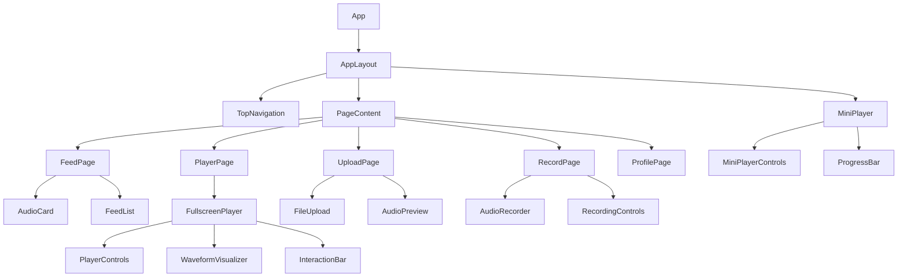
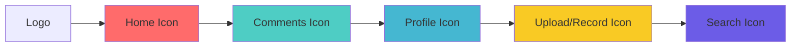
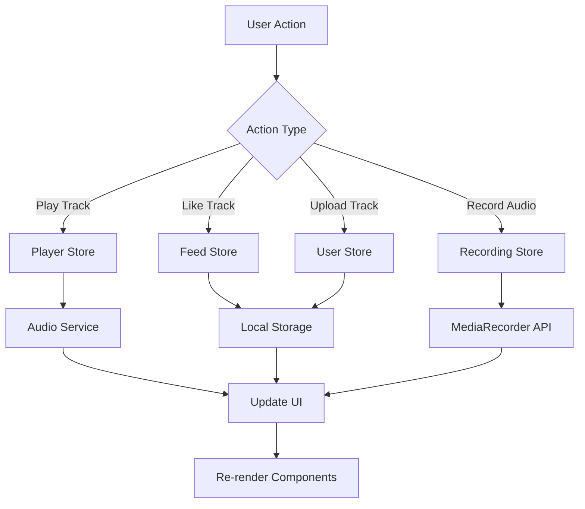

# Aural Mobile Web App - Implementation Design

## Overview

Aural is a mobile-first web application that functions as an "Instagram for voices" - a social platform focused on audio content sharing and discovery. Users can record, upload, and interact with audio content through an elegant dark-mode interface with neon accent colors.

### Core Concept
- Audio-centric social platform (no images/videos)
- Mobile-first responsive design
- Real-time audio playback with persistent mini-player
- Social interactions (likes, comments, profiles)

### Target Users
- Content creators who want to share voice recordings
- Users seeking audio-based social interactions
- Mobile-first audience preferring audio over visual content

## Technology Stack & Dependencies

### Frontend Framework
- **React 18** with TypeScript for type safety
- **Vite** for fast development and building
- **React Router v6** for client-side routing

### Audio Handling
- **Web Audio API** for recording and playback control
- **MediaRecorder API** for browser-based audio recording
- **HTML5 Audio** for basic playback functionality

### State Management
- **Zustand** for lightweight global state management
- **React Query/TanStack Query** for data fetching and caching
- **LocalStorage** for persistent dummy data

### Styling
- **Tailwind CSS** for utility-first styling
- **Framer Motion** for smooth animations and transitions
- **CSS Grid/Flexbox** for responsive layouts

### UI Components
- **Headless UI** for accessible component primitives
- **React Hook Form** for form handling
- **Lucide React** for consistent outline icons

### Development Tools
- **ESLint + Prettier** for code formatting
- **Husky** for git hooks
- **TypeScript** for type checking

## Component Architecture

### Component Definition

Components are organized into the following categories:

```
src/
├── components/
│   ├── ui/           # Reusable UI primitives
│   ├── layout/       # Layout components
│   ├── audio/        # Audio-specific components
│   ├── feed/         # Feed-related components
│   └── forms/        # Form components
├── pages/            # Route components
├── hooks/            # Custom React hooks
├── stores/           # Zustand stores
├── types/            # TypeScript type definitions
└── utils/            # Utility functions
```

### Component Hierarchy



### Props/State Management

#### Core State Structure

```typescript
// Audio Player State
interface PlayerState {
  currentTrack: AudioTrack | null;
  isPlaying: boolean;
  currentTime: number;
  duration: number;
  volume: number;
  isExpanded: boolean;
}

// Feed State
interface FeedState {
  tracks: AudioTrack[];
  isLoading: boolean;
  hasMore: boolean;
}

// User State
interface UserState {
  currentUser: User | null;
  myTracks: AudioTrack[];
}

// Recording State
interface RecordingState {
  isRecording: boolean;
  isPaused: boolean;
  recordedBlob: Blob | null;
  duration: number;
}
```

#### Component Props Examples

```typescript
// AudioCard Component
interface AudioCardProps {
  track: AudioTrack;
  onPlay: (track: AudioTrack) => void;
  onLike: (trackId: string) => void;
  className?: string;
}

// MiniPlayer Component
interface MiniPlayerProps {
  track: AudioTrack;
  isPlaying: boolean;
  currentTime: number;
  duration: number;
  onTogglePlay: () => void;
  onExpand: () => void;
  onSeek: (time: number) => void;
}

// AudioRecorder Component
interface AudioRecorderProps {
  onRecordingComplete: (blob: Blob, duration: number) => void;
  onError: (error: string) => void;
}
```

### Lifecycle Methods/Hooks

#### Custom Hooks

```typescript
// useAudioPlayer Hook
const useAudioPlayer = () => {
  const [audio, setAudio] = useState<HTMLAudioElement | null>(null);
  const [isPlaying, setIsPlaying] = useState(false);
  const [currentTime, setCurrentTime] = useState(0);
  const [duration, setDuration] = useState(0);

  // Audio control methods
  const play = useCallback(() => { /* implementation */ }, [audio]);
  const pause = useCallback(() => { /* implementation */ }, [audio]);
  const seek = useCallback((time: number) => { /* implementation */ }, [audio]);

  return { isPlaying, currentTime, duration, play, pause, seek };
};

// useMediaRecorder Hook
const useMediaRecorder = () => {
  const [isRecording, setIsRecording] = useState(false);
  const [recordedBlob, setRecordedBlob] = useState<Blob | null>(null);
  
  const startRecording = useCallback(async () => { /* implementation */ }, []);
  const stopRecording = useCallback(() => { /* implementation */ }, []);
  
  return { isRecording, recordedBlob, startRecording, stopRecording };
};

// useLocalStorage Hook
const useLocalStorage = <T>(key: string, initialValue: T) => {
  // Persistent state management for dummy data
};
```

### Example Component Usage

```typescript
// AudioCard Component Usage
<AudioCard
  track={track}
  onPlay={(track) => playerStore.setCurrentTrack(track)}
  onLike={(trackId) => feedStore.toggleLike(trackId)}
  className="mb-4"
/>

// MiniPlayer Component Usage
<MiniPlayer
  track={currentTrack}
  isPlaying={isPlaying}
  currentTime={currentTime}
  duration={duration}
  onTogglePlay={() => playerStore.togglePlay()}
  onExpand={() => navigate(`/player/${currentTrack.id}`)}
  onSeek={(time) => playerStore.seek(time)}
/>
```

## Routing & Navigation

### Route Structure

```typescript
// Route Configuration
const routes = [
  {
    path: "/",
    element: <FeedPage />,
    title: "Feed"
  },
  {
    path: "/player/:id",
    element: <PlayerPage />,
    title: "Player"
  },
  {
    path: "/upload",
    element: <UploadPage />,
    title: "Upload"
  },
  {
    path: "/record",
    element: <RecordPage />,
    title: "Record"
  },
  {
    path: "/profile/:id",
    element: <ProfilePage />,
    title: "Profile"
  }
];
```

### Navigation Component



#### Navigation States
- Active navigation items have red/violet underline
- Icons use 2px outline style
- Touch targets are minimum 44x44px for mobile accessibility
- Persistent across all pages

### Deep Linking Strategy
- Player URLs shareable: `/player/track-id`
- Profile URLs accessible: `/profile/user-id`
- Back button navigation maintains mini-player state
- Browser history preserves playback context

## Styling Strategy

### Design System Foundation

#### Color Palette
```css
:root {
  /* Base Colors */
  --bg-primary: #0A0A0B;        /* Deep black background */
  --text-primary: #FFFFFF;       /* Primary text */
  --text-secondary: #A3A3A3;     /* Secondary text */
  
  /* Neon Gradients */
  --gradient-pink: linear-gradient(135deg, #FF006E, #8338EC);
  --gradient-blue: linear-gradient(135deg, #3A86FF, #06FFA5);
  --gradient-purple: linear-gradient(135deg, #8338EC, #3A86FF);
  
  /* Accent Colors */
  --accent-red: #FF006E;
  --accent-violet: #8338EC;
  --accent-blue: #3A86FF;
  --accent-turquoise: #06FFA5;
}
```

#### Typography Scale
```css
/* Typography System */
.text-display {
  font-family: 'Inter', sans-serif;
  font-size: 2.5rem;
  font-weight: 700;
  line-height: 1.2;
}

.text-headline {
  font-family: 'Inter', sans-serif;
  font-size: 1.75rem;
  font-weight: 600;
  line-height: 1.3;
}

.text-body {
  font-family: 'Inter', sans-serif;
  font-size: 1rem;
  font-weight: 400;
  line-height: 1.5;
}

.text-label {
  font-family: 'Inter', sans-serif;
  font-size: 0.875rem;
  font-weight: 500;
  line-height: 1.4;
}
```

#### Spacing System
```css
/* Spacing Scale */
--space-1: 0.25rem;   /* 4px */
--space-2: 0.5rem;    /* 8px */
--space-3: 0.75rem;   /* 12px */
--space-4: 1rem;      /* 16px */
--space-6: 1.5rem;    /* 24px */
--space-8: 2rem;      /* 32px */
--space-12: 3rem;     /* 48px */
--space-16: 4rem;     /* 64px */
```

### Component-Specific Styles

#### Audio Card Styling
```css
.audio-card {
  background: rgba(255, 255, 255, 0.05);
  border: 1px solid rgba(255, 255, 255, 0.1);
  border-radius: 12px;
  backdrop-filter: blur(10px);
  transition: all 0.3s ease;
}

.audio-card:hover {
  border-color: var(--accent-violet);
  box-shadow: 0 8px 32px rgba(131, 56, 236, 0.3);
}
```

#### Player Controls Styling
```css
.play-button {
  width: 64px;
  height: 64px;
  border-radius: 50%;
  background: var(--gradient-pink);
  border: none;
  display: flex;
  align-items: center;
  justify-content: center;
  transition: transform 0.2s ease;
}

.play-button:active {
  transform: scale(0.95);
}
```

### Responsive Breakpoints
```css
/* Mobile First Approach */
@media (min-width: 640px) { /* sm */ }
@media (min-width: 768px) { /* md */ }
@media (min-width: 1024px) { /* lg */ }
@media (min-width: 1280px) { /* xl */ }
```

## State Management

### Zustand Store Architecture

#### Player Store
```typescript
interface PlayerStore {
  // State
  currentTrack: AudioTrack | null;
  isPlaying: boolean;
  currentTime: number;
  duration: number;
  volume: number;
  isExpanded: boolean;
  
  // Actions
  setCurrentTrack: (track: AudioTrack) => void;
  togglePlay: () => void;
  seek: (time: number) => void;
  setVolume: (volume: number) => void;
  expand: () => void;
  collapse: () => void;
}
```

#### Feed Store
```typescript
interface FeedStore {
  // State
  tracks: AudioTrack[];
  isLoading: boolean;
  filter: 'all' | 'following' | 'trending';
  
  // Actions
  loadTracks: () => Promise<void>;
  addTrack: (track: AudioTrack) => void;
  toggleLike: (trackId: string) => void;
  setFilter: (filter: string) => void;
}
```

#### User Store
```typescript
interface UserStore {
  // State
  currentUser: User | null;
  myTracks: AudioTrack[];
  
  // Actions
  login: (user: User) => void;
  logout: () => void;
  addMyTrack: (track: AudioTrack) => void;
  updateProfile: (updates: Partial<User>) => void;
}
```

### Local Storage Integration

```typescript
// Persistent state for dummy data
const usePersistentStore = <T>(
  store: StateCreator<T>,
  name: string
) => create<T>()(
  persist(store, {
    name,
    storage: createJSONStorage(() => localStorage),
  })
);
```

### State Flow Diagram



## API Integration Layer

### Service Architecture

Since this is Milestone 1 with dummy data, the API layer is designed to be easily replaceable with real backend services later.

#### Audio Service
```typescript
class AudioService {
  // File upload simulation
  async uploadAudio(file: File, metadata: AudioMetadata): Promise<AudioTrack> {
    // Simulate upload delay
    await new Promise(resolve => setTimeout(resolve, 1000));
    
    // Create dummy track with real file URL
    const track: AudioTrack = {
      id: generateId(),
      title: metadata.title,
      duration: await this.getAudioDuration(file),
      url: URL.createObjectURL(file),
      user: getCurrentUser(),
      likes: 0,
      createdAt: new Date()
    };
    
    return track;
  }
  
  // Recording save simulation
  async saveRecording(blob: Blob, metadata: AudioMetadata): Promise<AudioTrack> {
    const track: AudioTrack = {
      id: generateId(),
      title: metadata.title,
      duration: metadata.duration,
      url: URL.createObjectURL(blob),
      user: getCurrentUser(),
      likes: 0,
      createdAt: new Date()
    };
    
    return track;
  }
  
  // Get audio duration helper
  private async getAudioDuration(file: File): Promise<number> {
    return new Promise((resolve) => {
      const audio = new Audio();
      audio.onloadedmetadata = () => resolve(audio.duration);
      audio.src = URL.createObjectURL(file);
    });
  }
}
```

#### Feed Service
```typescript
class FeedService {
  private dummyTracks: AudioTrack[] = [
    {
      id: '1',
      title: 'Morning Thoughts',
      duration: 180,
      url: '/dummy-audio/morning-thoughts.mp3',
      user: { id: '1', username: 'alex_voice', avatar: '/avatars/1.jpg' },
      likes: 24,
      createdAt: new Date('2024-01-15')
    },
    // More dummy tracks...
  ];
  
  async getFeedTracks(filter: string = 'all'): Promise<AudioTrack[]> {
    // Simulate API delay
    await new Promise(resolve => setTimeout(resolve, 500));
    
    // Filter logic for dummy data
    switch (filter) {
      case 'trending':
        return this.dummyTracks.sort((a, b) => b.likes - a.likes);
      case 'following':
        return this.dummyTracks.filter(track => 
          track.user.id !== getCurrentUser()?.id
        );
      default:
        return this.dummyTracks;
    }
  }
}
```

#### User Service
```typescript
class UserService {
  async getUserProfile(userId: string): Promise<User> {
    // Dummy user data
    const dummyUsers: Record<string, User> = {
      '1': {
        id: '1',
        username: 'alex_voice',
        avatar: '/avatars/1.jpg',
        totalLikes: 150,
        totalUploads: 12,
        bio: 'Voice artist and storyteller'
      }
    };
    
    return dummyUsers[userId] || dummyUsers['1'];
  }
}
```

### Error Handling Strategy

```typescript
// Centralized error handling
class ApiError extends Error {
  constructor(
    message: string,
    public status: number,
    public code: string
  ) {
    super(message);
  }
}

// Error boundary for React components
export class ErrorBoundary extends Component {
  state = { hasError: false, error: null };
  
  static getDerivedStateFromError(error: Error) {
    return { hasError: true, error };
  }
  
  render() {
    if (this.state.hasError) {
      return <ErrorFallback error={this.state.error} />;
    }
    return this.props.children;
  }
}
```

## Testing Strategy

### Unit Testing Framework
- **Vitest** for fast unit testing
- **React Testing Library** for component testing
- **MSW (Mock Service Worker)** for API mocking

### Component Testing Approach

#### Audio Player Tests
```typescript
describe('AudioPlayer', () => {
  test('plays audio when play button clicked', async () => {
    const mockTrack = createMockTrack();
    render(<AudioPlayer track={mockTrack} />);
    
    const playButton = screen.getByRole('button', { name: /play/i });
    fireEvent.click(playButton);
    
    await waitFor(() => {
      expect(screen.getByRole('button', { name: /pause/i })).toBeInTheDocument();
    });
  });
  
  test('updates progress bar during playback', async () => {
    // Test implementation
  });
});
```

#### Feed Component Tests
```typescript
describe('FeedPage', () => {
  test('displays list of audio tracks', async () => {
    const mockTracks = createMockTracks(3);
    mockApiResponse('/api/feed', mockTracks);
    
    render(<FeedPage />);
    
    await waitFor(() => {
      expect(screen.getAllByRole('article')).toHaveLength(3);
    });
  });
  
  test('starts mini-player when track played', async () => {
    // Test implementation
  });
});
```

#### Recording Component Tests
```typescript
describe('AudioRecorder', () => {
  beforeEach(() => {
    // Mock MediaRecorder API
    global.MediaRecorder = MockMediaRecorder;
    global.navigator.mediaDevices = {
      getUserMedia: jest.fn().mockResolvedValue(new MediaStream())
    };
  });
  
  test('starts recording when record button pressed', async () => {
    render(<AudioRecorder />);
    
    const recordButton = screen.getByRole('button', { name: /start recording/i });
    fireEvent.click(recordButton);
    
    await waitFor(() => {
      expect(screen.getByText(/recording.../i)).toBeInTheDocument();
    });
  });
});
```

### Integration Testing

#### End-to-End User Flows
1. **Feed to Player Flow**
   - User clicks play on feed item
   - Mini-player appears with correct track
   - Expand opens fullscreen player
   - Back button returns to mini-player

2. **Upload Flow**
   - User selects audio file
   - Preview shows correct duration
   - Save adds track to feed
   - Track appears in "My Tracks"

3. **Recording Flow**
   - Start recording captures audio
   - Pause/resume works correctly
   - Finish creates playable track
   - Save adds to user's collection

### Accessibility Testing

#### ARIA Labels and Roles
```typescript
// Player button accessibility
<button
  aria-label={isPlaying ? 'Pause audio' : 'Play audio'}
  aria-pressed={isPlaying}
  role="button"
>
  {isPlaying ? <PauseIcon /> : <PlayIcon />}
</button>

// Progress bar accessibility
<div
  role="slider"
  aria-label="Audio progress"
  aria-valuemin={0}
  aria-valuemax={duration}
  aria-valuenow={currentTime}
  aria-valuetext={`${formatTime(currentTime)} of ${formatTime(duration)}`}
>
```

#### Keyboard Navigation
- Tab order follows logical flow
- Enter/Space activates buttons
- Arrow keys control sliders
- Escape closes modals/players

### Performance Testing

#### Audio Performance Metrics
- Audio load time < 2 seconds
- Playback latency < 100ms
- Recording start delay < 500ms
- UI responsiveness during audio operations

#### Bundle Size Optimization
- Code splitting for player components
- Lazy loading for non-critical features
- Audio codec optimization
- Image optimization for avatars

### Test Coverage Goals
- **Unit Tests**: >80% coverage for utils and hooks
- **Component Tests**: >70% coverage for UI components
- **Integration Tests**: Cover all critical user paths
- **Accessibility Tests**: 100% WCAG AA compliance