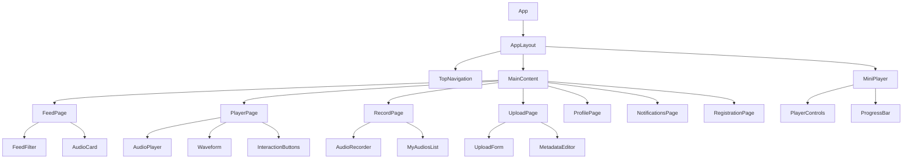
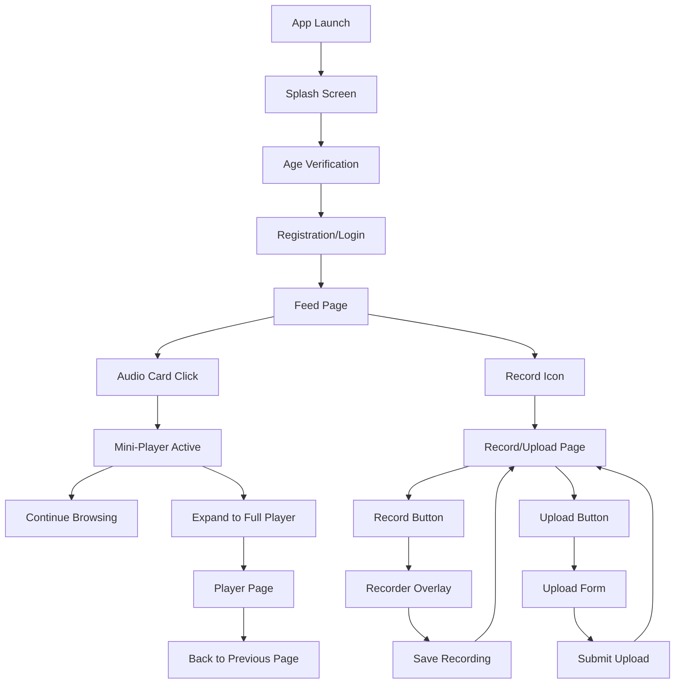

# Aural Mobile Web App - Milestone 1: Structure & Wireframes

## Overview

Aural is a mobile-first web application for sharing audio content - an "Instagram for voices". Milestone 1 includes core functionalities: Feed, Mini-Player, Full-Screen Player, Upload, Recording, and a basic Profile, plus fundamental navigation. This design document provides the app structure and specifications for frontend development implementation.

### Core Features - Milestone 1
- **Audio Feed**: Scrollable list of audio cards with play functionality
- **Persistent Mini-Player**: Bottom-fixed player that works across all pages
- **Full-Screen Player**: Detailed audio player with waveform visualization
- **Audio Recording**: Browser-based recording with MediaRecorder API
- **File Upload**: Audio file upload with metadata editing
- **User Registration**: Multi-step registration flow with validation
- **Basic Profile**: User profile stub for future expansion
- **Notifications**: Activity feed for likes and comments

### Technical Constraints - Milestone 1
- **No Backend**: All data stored in localStorage (dummy data)
- **Dark Mode Only**: Deep black background with neon accents
- **Mobile-First**: Optimized for touch interfaces and small screens
- **Audio-Focused**: Visual assets only for covers and onboarding

## Technology Stack

### Core Framework
- **React 19.1.1** with TypeScript 5.8.3
- **Vite 7.1.2** for development and build tooling
- **React Router DOM 7.8.2** for client-side routing

### Audio Processing
- **MediaRecorder API** for browser-based audio recording
- **Web Audio API** for playback control and audio analysis
- **HTML5 Audio Element** for basic audio playback

### State Management
- **Zustand 5.0.8** for global state management
- **localStorage** for data persistence (Milestone 1)

### UI & Styling
- **Tailwind CSS 4.1.12** with custom design system
- **Framer Motion 12.23.12** for animations
- **Lucide React** for icons

### Form Handling & Validation
- **React Hook Form** for form management
- **Zod** for schema validation

## Design System

### Color Palette
```css
:root {
  /* Base Colors */
  --bg-primary: #0A0A0B;        /* Deep black background */
  --text-primary: #FFFFFF;       /* Primary white text */
  --text-secondary: #A3A3A3;     /* Secondary gray text */
  --text-muted: #6B7280;         /* Muted gray text */
  
  /* Neon Accent Colors */
  --accent-pink: #FF006E;        /* Neon pink */
  --accent-red: #EF4444;         /* Neon red */
  --accent-violet: #8338EC;      /* Neon violet */
  --accent-turquoise: #06FFA5;   /* Neon turquoise */
  
  /* UI Elements */
  --surface-primary: rgba(255, 255, 255, 0.05);
  --surface-secondary: rgba(255, 255, 255, 0.1);
  --border-primary: rgba(255, 255, 255, 0.1);
  --border-accent: var(--accent-violet);
}
```

### Typography
- **Font Family**: Inter or Manrope (modern, humanistic sans-serif)
- **Headlines**: Large, bold weights for titles
- **Body Text**: Regular weight with high contrast (white/light gray on dark)
- **Labels & Metadata**: Light weight for secondary information

### Icon System
- **Style**: Outline icons with ~2px stroke width
- **States**: 
  - Inactive: White/light gray monochrome
  - Active: Neon accent colors (red/violet/pink/turquoise)
- **Touch Targets**: Minimum 44×44px for all interactive elements

### Visual Style
- **Mood**: Elegant, professional, sensual
- **Layout**: Large gradients and soft shadows without visual overload
- **Focus**: Audio-first, minimal visual distractions
- **Assets**: Images only for covers, advertising, or onboarding

## Navigation Architecture

### Top Navigation (Fixed)
The app features a fixed top navigation bar visible on every screen:

```
[Logo]                           [Home] [Comments] [Profile] [Record] [Search]
```

**Navigation Items** (left to right):
1. **Logo/Brand** (left): App signet/logo
2. **Home** (Feed): Shows the audio feed
3. **Comments/Notifications**: Lists activities (likes/comments on user's audio)
4. **Profile**: User profile stub (`/profile/:id`)
5. **Upload/Record**: Opens recording and upload actions
6. **Search**: Future implementation (Milestone 2+)

**Active State**: Currently active icon highlighted with neon underline
**Responsive**: Navigation remains visible on all viewport sizes

### Persistent Mini-Player
- **Position**: Fixed at bottom, doesn't overlap content
- **Visibility**: Present across all pages when audio is loaded
- **CSS Implementation**: `position: fixed; bottom: 0;`
- **Global State**: Managed via Zustand context for cross-page functionality

## Component Architecture

### Page Structure
```
src/
├── components/
│   ├── layout/
│   │   ├── AppLayout.tsx         # Main app container
│   │   ├── TopNavigation.tsx     # Fixed top navigation
│   │   └── MiniPlayer.tsx        # Persistent bottom player
│   ├── audio/
│   │   ├── AudioCard.tsx         # Feed item component
│   │   ├── AudioPlayer.tsx       # Full-screen player
│   │   ├── AudioRecorder.tsx     # Recording interface
│   │   └── Waveform.tsx          # Audio visualization
│   ├── forms/
│   │   ├── RegistrationForm.tsx  # Multi-step registration
│   │   ├── UploadForm.tsx        # File upload with metadata
│   │   └── ValidationInput.tsx   # Form input with validation
│   └── ui/
│       ├── Button.tsx            # Reusable button component
│       ├── Badge.tsx             # Status indicators
│       ├── Modal.tsx             # Modal dialogs
│       └── ProgressBar.tsx       # Audio progress slider
├── pages/
│   ├── FeedPage.tsx              # Main feed (/)
│   ├── PlayerPage.tsx            # Full player (/player/:id)
│   ├── RecordPage.tsx            # Record & upload (/record)
│   ├── UploadPage.tsx            # Upload form (/upload)
│   ├── ProfilePage.tsx           # User profile (/profile/:id)
│   ├── NotificationsPage.tsx     # Activity feed (/notifications)
│   └── RegistrationPage.tsx      # Registration flow (/register)
├── hooks/
│   ├── useAudioPlayer.ts         # Audio playback logic
│   ├── useMediaRecorder.ts       # Recording functionality
│   ├── useLocalStorage.ts        # Local storage utilities
│   └── useFormValidation.ts      # Form validation logic
├── stores/
│   ├── playerStore.ts            # Audio player state
│   ├── feedStore.ts              # Feed data management
│   ├── userStore.ts              # User authentication & data
│   └── notificationStore.ts      # Activity notifications
├── types/
│   └── index.ts                  # TypeScript type definitions
├── utils/
│   ├── audioUtils.ts             # Audio processing utilities
│   ├── formatUtils.ts            # Data formatting functions
│   └── validationSchemas.ts      # Zod validation schemas
└── constants/
    ├── routes.ts                 # Route definitions
    └── dummyData.ts             # Initial dummy data
```

### Component Hierarchy



## Page Specifications

### 1. Feed Page (`/`)

**Purpose**: Main audio discovery page with scrollable list of audio cards

**Components**:
- Feed filter chips (categories: "All", "Trending", "Following")
- Scrollable list of `AudioCard` components
- Category groupings (e.g., "Couples", "Females", "Males")

**AudioCard Structure**:
```typescript
interface AudioCard {
  title: string;           // Multi-line audio title
  author: string;          // Username of uploader
  duration: string;        // Format: "01:50"
  likes: number;           // Like count with heart icon
  comments?: number;       // Comment count (optional)
  playButton: ReactNode;   // Play button (left or right)
}
```

**Interactions**:
- Click AudioCard → Loads track into Mini-Player
- Click play button → Starts playback in Mini-Player
- Feed remains accessible while audio plays
- Infinite scroll for additional content

**Layout**:
- Responsive card grid
- Filter chips at top
- Category headers between groups
- Mini-Player space reserved at bottom

### 2. Mini-Player (Persistent Component)

**Purpose**: Global audio player that persists across all pages

**Features**:
- **Track Info**: Scrollable marquee for long titles and usernames
- **Play/Pause**: Circular button (left side)
- **Progress Bar**: Thin slider with scrub functionality
- **Expand Button**: Chevron/arrow (right side) opens full player
- **Like Button**: Heart icon with filled/red state for liked tracks

**Technical Implementation**:
```css
.mini-player {
  position: fixed;
  bottom: 0;
  left: 0;
  right: 0;
  z-index: 100;
  background: var(--surface-primary);
  backdrop-filter: blur(10px);
  padding: 12px 16px;
}
```

**State Management**:
- Global Zustand store for cross-page persistence
- Sync with full player state
- localStorage persistence for session continuity

### 3. Full-Screen Player (`/player/:id`)

**Purpose**: Detailed audio player replacing main content area

**Layout Sections**:

**Header**:
- Back button (chevron) returns to previous page
- Page title: "Playback" / "Wiedergabe"

**Track Information**:
- Username of uploader
- Like and comment counters
- Track title (prominent display)
- Optional audio description

**Tag System**:
- Rounded pill buttons with tags (e.g., "Soft", "Female", "Toy")
- Clickable tags navigate to filtered lists (future expansion)

**Playback Controls**:
- Large play/pause button (center)
- Elapsed/remaining time display (left/right of button)
- Progress slider with scrub functionality

**Waveform Visualization**:
- Animated audio waveform or simple equalizer
- Visual feedback only (no functional interaction)
- CSS animations or Canvas-based rendering

**Interaction Bar** (bottom):
- Like button (heart) with counter
- Comment button (speech bubble) with counter
- Bookmark/Share button (bookmark icon) with counter

**Navigation**:
- Back button returns to previous route
- Interaction buttons update local state
- Like/comment counters reflect changes

### 4. Record & Upload Page (`/record`)

**Purpose**: Central page for audio creation with two main actions

**Layout**:
- Two large action buttons:
  - **Record**: Opens audio recorder overlay
  - **Upload**: Triggers file selection dialog
- **"Your Recordings"** section below buttons
- List of user's uploaded/recorded audio (dummy state)
- Red badges indicate new comments/likes on tracks

**Interactions**:
- Record button → Navigate to `/record/recorder` overlay
- Upload button → File selection → Navigate to `/upload` page
- Track items in list → Playable via Mini-Player

### 4.1. Audio Recorder (`/record/recorder` - Overlay)

**Purpose**: Full-screen recording interface using MediaRecorder API

**Components**:

**Recording Interface**:
- Large microphone button (center) with pulsing animation during recording
- Recording timer showing elapsed time
- Real-time level meter or waveform visualization

**Controls**:
- **Delete Button**: Discards current recording
- **Done Button**: Saves recording temporarily and shows preview
- **Record/Stop**: Toggles recording state with visual feedback

**Preview Mode** (after Done):
- Play button for recorded audio preview
- Save option to add to "My Audios"
- Re-record option to start over

**Technical Requirements**:
```typescript
// MediaRecorder API implementation
const startRecording = async () => {
  const stream = await navigator.mediaDevices.getUserMedia({ audio: true });
  const mediaRecorder = new MediaRecorder(stream);
  // Recording logic with blob storage
};
```

### 4.2. Upload Flow (`/upload`)

**Purpose**: Metadata editor for uploaded audio files

**Form Fields**:

**Basic Information**:
- **Title**: Pre-filled with filename, editable input
- **Description**: Optional multi-line text area

**Categorization**:
- **Speaker Gender**: "Female" and "Male" buttons (multi-select in future, single-select in Milestone 1)
- **Tags**: 
  - Predefined tag selection (pill buttons)
  - Free text input for custom tags
  - Tags displayed as removable pill components

**File Information**:
- **Filename**: Display original filename (read-only)
- **Duration**: Auto-detected from file (read-only)
- **File size**: Display file size (read-only)

**Actions**:
- **Upload Button**: Floating action button (bottom right)
- Saves to dummy localStorage state
- Navigates back to `/record` page
- New track appears in "Your Recordings" list

**Validation**:
- Title required (min 3 characters)
- At least one gender selection required
- File format validation (audio/* only)

### 5. Registration Flow (`/register`)

**Purpose**: Multi-step user onboarding with age verification

**Steps**:

**Step 1 - Username**:
- Username input field with real-time availability check
- Inline validation and error messages
- "Continue" button enabled only with valid input
- Navigation to Step 2 on success

**Step 2 - Password**:
- Password input with strength requirements:
  - Minimum 8 characters
  - At least 3 different character types
- Password confirmation field
- Real-time validation feedback
- Navigation to Step 3 on success

**Step 3 - Email (Optional)**:
- Email address for password recovery
- Optional field with proper validation if filled
- Skip option available

**Step 4 - Age Verification**:
- "I am 18 years or older" checkbox
- Register button only enabled after checkbox confirmation
- Legal compliance requirement

**Step 5 - Success**:
- Green checkmark icon
- "Registration successful" message
- Auto-navigation to main app after delay

**Technical Implementation**:
```typescript
// localStorage stub for Milestone 1
const saveRegistration = (userData: RegisterData) => {
  localStorage.setItem('userData', JSON.stringify(userData));
  // No server communication in Milestone 1
};
```

### 6. Notifications Page (`/notifications`)

**Purpose**: Activity feed for user interactions on uploaded audio

**Content Types**:

**Like Notifications**:
- Heart icon (left)
- Text format: "[Username] likes [Your Audio Title]"
- Your audio title highlighted in bold
- Timestamp display

**Comment Notifications**:
- Speech bubble icon (left)
- Text format: "[Comment text in quotes]" - [Username] on [Your Audio Title]
- Comment text in quotation marks
- Your audio title highlighted in bold

**Layout**:
- Chronological order (newest first)
- Infinite scroll for older notifications
- No Mini-Player shown if no audio currently playing
- Top navigation remains visible

**Interactions**:
- Tap notification → Navigate to audio detail (future expansion)
- Mark as read functionality (visual state change)

### 7. Profile Page (`/profile/:id`)

**Purpose**: Basic user profile display (stub for future expansion)

**Content** (Milestone 1):
- **Avatar**: Placeholder image or initials
- **Username**: Display name
- **Statistics**:
  - Total likes received
  - Number of uploads
  - Join date
- **Bio**: Short user description (if provided)

**Future Expansion Areas**:
- Follow/unfollow functionality
- User's public audio collection
- Social statistics (followers/following)
- Audio playlists

## Routing Structure

### Route Definitions

```typescript
const routes = [
  {
    path: "/",
    element: <FeedPage />,
    title: "Feed"
  },
  {
    path: "/player/:id",
    element: <PlayerPage />,
    title: "Player"
  },
  {
    path: "/record",
    element: <RecordPage />,
    title: "Record & Upload"
  },
  {
    path: "/record/recorder",
    element: <AudioRecorderOverlay />,
    title: "Recording",
    overlay: true
  },
  {
    path: "/upload",
    element: <UploadPage />,
    title: "Upload Audio"
  },
  {
    path: "/profile/:id",
    element: <ProfilePage />,
    title: "Profile"
  },
  {
    path: "/notifications",
    element: <NotificationsPage />,
    title: "Notifications"
  },
  {
    path: "/register",
    element: <RegistrationPage />,
    title: "Registration"
  }
];
```

### Navigation Flow



## Data Models

### Core Data Structures

```typescript
// Audio Track
interface AudioTrack {
  id: string;
  title: string;
  author: string;
  duration: number;        // seconds
  likes: number;
  comments: number;
  tags: string[];
  file: string;           // URL to audio blob or file
  description?: string;
  createdAt: Date;
  isLiked?: boolean;      // current user's like status
}

// User Profile
interface User {
  id: string;
  username: string;
  email?: string;
  avatar?: string;
  totalLikes: number;
  totalUploads: number;
  bio?: string;
  createdAt: Date;
}

// Notification
interface Notification {
  id: string;
  type: 'like' | 'comment';
  fromUser: string;       // username
  audioTitle: string;
  content?: string;       // for comments
  timestamp: Date;
  read: boolean;
}

// Recording Session
interface RecordingSession {
  id: string;
  blob: Blob;
  duration: number;
  timestamp: Date;
  saved: boolean;
}
```

### Local Storage Schema

```typescript
// localStorage keys for Milestone 1
interface LocalStorageSchema {
  'aural_user': User;
  'aural_tracks': AudioTrack[];
  'aural_notifications': Notification[];
  'aural_player_state': {
    currentTrack: AudioTrack | null;
    currentTime: number;
    isPlaying: boolean;
    volume: number;
  };
  'aural_recordings': RecordingSession[];
}
```

## State Management

### Zustand Stores

```typescript
// Player Store
interface PlayerStore {
  currentTrack: AudioTrack | null;
  isPlaying: boolean;
  currentTime: number;
  duration: number;
  volume: number;
  
  // Actions
  setCurrentTrack: (track: AudioTrack) => void;
  togglePlay: () => void;
  seek: (time: number) => void;
  setVolume: (volume: number) => void;
}

// Feed Store
interface FeedStore {
  tracks: AudioTrack[];
  filter: 'all' | 'trending' | 'following';
  isLoading: boolean;
  
  // Actions
  loadTracks: () => Promise<void>;
  setFilter: (filter: string) => void;
  likeTrack: (trackId: string) => void;
  addTrack: (track: AudioTrack) => void;
}

// User Store
interface UserStore {
  currentUser: User | null;
  isAuthenticated: boolean;
  myTracks: AudioTrack[];
  
  // Actions
  login: (credentials: LoginData) => Promise<void>;
  register: (userData: RegisterData) => Promise<void>;
  logout: () => void;
  addMyTrack: (track: AudioTrack) => void;
}
```

### Custom Hooks

```typescript
// Audio Player Hook
const useAudioPlayer = () => {
  const [audio] = useState(() => new Audio());
  const playerStore = usePlayerStore();
  
  useEffect(() => {
    // Audio event listeners and state synchronization
  }, []);
  
  return {
    play: () => audio.play(),
    pause: () => audio.pause(),
    seek: (time: number) => { audio.currentTime = time; },
    // ... other controls
  };
};

// Media Recorder Hook
const useMediaRecorder = () => {
  const [mediaRecorder, setMediaRecorder] = useState<MediaRecorder | null>(null);
  const [isRecording, setIsRecording] = useState(false);
  const [recordedBlob, setRecordedBlob] = useState<Blob | null>(null);
  
  const startRecording = async () => {
    const stream = await navigator.mediaDevices.getUserMedia({ audio: true });
    const recorder = new MediaRecorder(stream);
    // Recording implementation
  };
  
  return {
    startRecording,
    stopRecording,
    isRecording,
    recordedBlob
  };
};
```

## User Interaction Flows

### Typical User Journeys

**1. App Launch & First Use**:
```
App Launch → Splash Screen → Age Verification → Registration → Feed
```

**2. Audio Playback Flow**:
```
Feed → Select Audio Card → Mini-Player Starts → 
Continue Browsing OR Expand to Full Player → 
Full Player Controls → Back to Previous Page
```

**3. Audio Recording Flow**:
```
Microphone Icon → Record/Upload Page → "Record" → 
Recorder Overlay → Start/Stop Recording → Preview → 
Save → Appears in "My Audios" → Playable via Mini-Player
```

**4. Audio Upload Flow**:
```
Microphone Icon → "Upload" → File Selection → 
Upload Form (Metadata) → Submit → 
Appears in "My Audios"
```

**5. Profile & Social Interaction**:
```
Profile Icon → User Profile Stub → 
(Future: View Other Profiles, Follow Users)
```

### Touch Interactions

**Audio Controls**:
- Tap Play/Pause buttons
- Slide progress bar for seeking
- Tap to expand Mini-Player
- Swipe gestures (future enhancement)

**Feed Navigation**:
- Scroll to browse content
- Tap cards to play audio
- Pull-to-refresh (future enhancement)

**Recording Interface**:
- Long-press to record (alternative method)
- Tap to toggle recording
- Swipe to delete/save gestures

## Implementation Guidelines

### Responsive Design

**Target Viewport**: iPhone 8/SE (375×667px) as baseline
**Breakpoints**:
```css
/* Mobile First Approach */
@media (min-width: 640px) { /* Large phones */ }
@media (min-width: 768px) { /* Tablets */ }
@media (min-width: 1024px) { /* Desktop */ }
```

**Layout Strategy**:
- Flexible containers using CSS Grid and Flexbox
- Touch-friendly button sizes (min 44×44px)
- Readable font sizes (min 16px for body text)
- Adequate spacing between interactive elements

### Accessibility Requirements

**ARIA Labels**:
```typescript
// Example: Audio controls with proper labeling
<button
  aria-label={isPlaying ? "Pause audio" : "Play audio"}
  aria-pressed={isPlaying}
  onClick={togglePlay}
>
  {isPlaying ? <PauseIcon /> : <PlayIcon />}
</button>
```

**Keyboard Navigation**:
- Tab order follows logical flow
- Enter/Space activates buttons
- Arrow keys control sliders
- Escape closes modals/overlays

**Color Contrast**:
- Minimum 4.5:1 contrast ratio for text
- Focus indicators visible and distinct
- Interactive elements clearly identifiable

### Performance Considerations

**Audio Optimization**:
- Lazy loading for audio files
- Audio buffer management for smooth playback
- Blob URL cleanup to prevent memory leaks

**Component Optimization**:
```typescript
// Example: Memoized audio card component
const AudioCard = React.memo(({ track, onPlay }) => {
  const handlePlay = useCallback(() => {
    onPlay(track);
  }, [track, onPlay]);
  
  return (
    // Component JSX
  );
});
```

**Bundle Size Management**:
- Code splitting for non-critical features
- Dynamic imports for heavy components
- Tree shaking for unused dependencies

### File Storage Strategy

**Audio Files**:
- Use `URL.createObjectURL()` for recorded/uploaded audio
- Store blob references in localStorage
- Clean up object URLs on component unmount

**Metadata Storage**:
```typescript
// localStorage with JSON serialization
const saveTrack = (track: AudioTrack) => {
  const tracks = JSON.parse(localStorage.getItem('aural_tracks') || '[]');
  tracks.push(track);
  localStorage.setItem('aural_tracks', JSON.stringify(tracks));
};
```

**Data Validation**:
```typescript
// Zod schema for audio upload
const audioUploadSchema = z.object({
  title: z.string().min(3).max(100),
  description: z.string().max(500).optional(),
  tags: z.array(z.string()).max(10),
  gender: z.enum(['female', 'male']),
  file: z.instanceof(File).refine(
    (file) => file.type.startsWith('audio/'),
    "File must be an audio file"
  )
});
```

## Testing Strategy

### Unit Testing
- **Components**: React Testing Library for UI component testing
- **Hooks**: Custom hooks testing with `@testing-library/react-hooks`
- **Utils**: Pure function testing with Vitest
- **Stores**: Zustand store testing with mock implementations

### Integration Testing
- **User Flows**: End-to-end testing for critical paths
- **Audio Functionality**: MediaRecorder and Web Audio API mocking
- **Local Storage**: Data persistence testing
- **Cross-Component**: Mini-Player interaction across pages

### Accessibility Testing
- **Automated**: axe-core integration for WCAG compliance
- **Manual**: Keyboard navigation and screen reader testing
- **Color Contrast**: Automated contrast ratio validation

This design document provides the comprehensive structure and specifications needed to implement Aural's Milestone 1. The focus on mobile-first design, audio functionality, and clear component architecture enables efficient development while maintaining the elegant, professional aesthetic required for the audio-focused social platform.