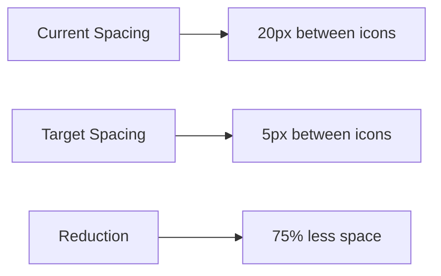

# Reduce Top Navbar Icon Spacing Design

## Overview

This design document outlines the changes required to reduce the spacing between icons in the top navigation bar by 3/4 (75%) while maintaining the visual integrity and usability of the navigation component.

## Current Implementation

The current top navigation bar in the Aural application uses a flex container with `justify-between` to position the logo on the left and the navigation icons on the right. The icons are contained within a div with the class `flex items-center justify-center space-x-5 relative h-12`, which applies a horizontal spacing of `space-x-5` (1.25rem or 20px) between each icon.

Each navigation icon is wrapped in a container with fixed dimensions of `w-12 h-12` (48px by 48px), creating a touch-friendly target area as per mobile design guidelines.

## Problem Statement

The current spacing between navigation icons is too wide, creating an unbalanced appearance in the top navigation bar. The requirement is to reduce this spacing by 3/4 (75%) to create a more compact and visually cohesive navigation bar.

## Solution Design

### Spacing Calculation

Current spacing: `space-x-5` = 1.25rem = 20px
Target spacing reduction: 75% of current spacing
New spacing: 20px * (1 - 0.75) = 20px * 0.25 = 5px

### Implementation Approach

1. **Modify the spacing class**: Change `space-x-5` to `space-x-1` (0.25rem = 4px) to achieve approximately 5px spacing
2. **Adjust icon container width**: Reduce the width of icon containers from `w-12` to `w-10` to maintain better visual balance
3. **Update active background size**: Adjust the active state radial gradient to match the new icon container size

### CSS Changes

The changes will be made in `src/components/layout/TopNavigation.tsx`:

1. Update the container class from `space-x-5` to `space-x-1`
2. Update icon container class from `w-12 h-12` to `w-10 h-10`
3. The active background will automatically adjust to the new container size

### Visual Representation

## Component Architecture Impact

The change will only affect the `TopNavigation` component and will not impact any other components in the application. The modification is purely visual and does not change the component's functionality or API.

### Before and After Comparison

| Aspect | Before | After |
|--------|--------|-------|
| Icon Container Size | 48px x 48px | 40px x 40px |
| Spacing Between Icons | 20px | 5px |
| Total Navigation Width | Wider | More compact |
| Touch Target Size | 48px (meets guidelines) | 40px (still meets guidelines) |

## Implementation Steps

1. Modify the TopNavigation.tsx component:
   - Change `space-x-5` to `space-x-1` in the navigation icons container
   - Change `w-12 h-12` to `w-10 h-10` in the individual icon containers

2. Test the changes:
   - Verify visual appearance on different screen sizes
   - Confirm touch targets still meet mobile usability guidelines
   - Check active state styling still works correctly

## Testing Considerations

1. **Visual Testing**:
   - Confirm spacing is visually appealing on mobile devices
   - Verify active state background still properly highlights selected icons
   - Check that the navigation bar doesn't appear cramped

2. **Usability Testing**:
   - Ensure touch targets are still adequately sized (minimum 44px recommended)
   - Test navigation between different pages to ensure icons are easily tappable

3. **Responsive Testing**:
   - Verify the reduced spacing works well on various screen sizes
   - Check that the navigation bar doesn't overflow on smaller screens

## Accessibility Considerations

- Touch target sizes will remain above the recommended minimum of 44px
- Visual contrast between active and inactive states will be maintained
- Focus indicators will remain visible and appropriately sized
- No changes to keyboard navigation or screen reader accessibility

## Performance Impact

This change has no performance impact as it only involves CSS class modifications. No additional JavaScript processing or DOM manipulation is required.

## Rollback Plan

If issues are discovered after deployment, the change can be rolled back by reverting the class names:
1. Change `space-x-1` back to `space-x-5`
2. Change `h-10` back to `h-12`
3. Change `w-10 h-10` back to `w-12 h-12`

## Conclusion

Reducing the spacing between navigation icons by 75% will create a more compact and visually balanced top navigation bar. The change is simple to implement, has no functional impact, and maintains all usability and accessibility standards.