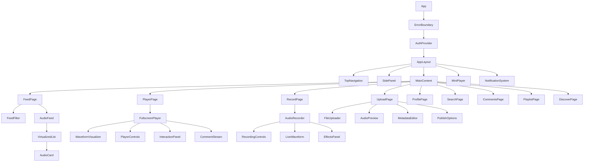

# Aural Mobile Web App - Advanced Feature Design

## Overview

Aural is a sophisticated mobile-first web application designed as an "Instagram for voices" - a comprehensive social platform focused exclusively on audio content sharing and discovery. The platform enables users to create, share, discover, and interact with audio content through an elegant dark-mode interface featuring neon accent colors and smooth animations.

### Core Vision
- **Audio-First Social Platform**: Eliminating visual distractions to focus purely on voice and sound
- **Mobile-Optimized Experience**: Touch-friendly interfaces with thumb-accessible controls
- **Real-Time Audio Features**: Live recording, instant playback, and seamless transitions
- **Social Audio Discovery**: Algorithm-driven feed with trending, following, and personalized recommendations

### Target Audience
- **Content Creators**: Podcasters, voice artists, musicians, storytellers
- **Social Audio Enthusiasts**: Users seeking voice-based social interactions
- **Mobile-First Users**: Smartphone-primary users who prefer audio over visual content
- **Community Builders**: Groups organizing around shared audio interests

## Advanced Technology Stack

### Core Framework & Language
- **React 19.1.1** with Hooks and Concurrent Features
- **TypeScript 5.8.3** with strict type checking and advanced generics
- **Vite 7.1.2** with HMR and optimized bundling
- **React Router DOM 7.8.2** with nested routing and lazy loading

### Audio Engine & Media Processing
- **Web Audio API** for advanced audio manipulation and visualization
- **MediaRecorder API** with cross-browser polyfills for recording
- **AudioContext** for real-time audio processing and effects
- **Web Workers** for background audio processing and file conversion
- **FFmpeg.wasm** for client-side audio format conversion and compression

### State Management & Data Flow
- **Zustand 5.0.8** with middleware for persistence and devtools
- **React Query/TanStack Query** for server state management and caching
- **Immer** for immutable state updates
- **LocalStorage** with versioning for offline data persistence
- **IndexedDB** for large audio file caching

### UI & Animation Framework
- **Tailwind CSS 4.1.12** with custom design system
- **Framer Motion 12.23.12** for advanced animations and gestures
- **Headless UI 2.2.7** for accessible component primitives
- **React Hook Form** with validation schemas
- **React Virtual** for performance optimization in long lists

### Advanced Features & Integrations
- **PWA Capabilities** with Service Workers and offline support
- **Push Notifications** via Web Push API
- **File System Access API** for local file management
- **Canvas API** for waveform visualization and audio spectrum analysis
- **Intersection Observer** for lazy loading and infinite scroll

## Enhanced Component Architecture

### Advanced Component Hierarchy



### Advanced Component Features

#### Enhanced AudioCard Component
```typescript
interface AudioCardProps {
  track: AudioTrack;
  variant: 'feed' | 'playlist' | 'search' | 'profile';
  showWaveform?: boolean;
  enablePreview?: boolean;
  onPlay: (track: AudioTrack, startTime?: number) => void;
  onAddToPlaylist?: (trackId: string) => void;
  onShare?: (track: AudioTrack) => void;
  onReport?: (trackId: string) => void;
}
```

**Advanced Features:**
- **Mini Waveform Preview**: Visual audio representation in card
- **Gesture Controls**: Swipe actions for quick interactions
- **Context Menu**: Long-press for additional options
- **Lazy Loading**: Intersection Observer for performance
- **Accessibility**: Full ARIA support and keyboard navigation

#### Enhanced MiniPlayer Component
```typescript
interface MiniPlayerProps {
  track: AudioTrack;
  playlist: AudioTrack[];
  currentIndex: number;
  isPlaying: boolean;
  currentTime: number;
  duration: number;
  volume: number;
  isShuffled: boolean;
  repeatMode: RepeatMode;
  onTogglePlay: () => void;
  onNext: () => void;
  onPrevious: () => void;
  onSeek: (time: number) => void;
  onVolumeChange: (volume: number) => void;
  onExpandPlayer: () => void;
  onToggleShuffle: () => void;
  onToggleRepeat: () => void;
}
```

**Advanced Features:**
- **Queue Management**: Next/previous track navigation
- **Gesture Controls**: Swipe gestures for track control
- **Progressive Enhancement**: Adaptive controls based on device capabilities
- **Background Audio**: Persistent playback during navigation
- **Smart Notifications**: Lock screen and notification controls

### Advanced Audio Recording System

#### Multi-Format Recording Component
```typescript
interface AudioRecorderProps {
  outputFormat: 'wav' | 'mp3' | 'ogg' | 'webm';
  bitrate: number;
  sampleRate: number;
  channels: 1 | 2;
  maxDuration?: number;
  enableEffects?: boolean;
  enableNoiseReduction?: boolean;
  onRecordingStart: () => void;
  onRecordingStop: (blob: Blob, metadata: AudioMetadata) => void;
  onError: (error: RecordingError) => void;
  onProgress: (currentTime: number) => void;
}
```

**Advanced Recording Features:**
- **Real-Time Effects**: Echo, reverb, noise reduction
- **Multi-Track Recording**: Layer multiple audio tracks
- **Auto-Save**: Periodic saves during long recordings
- **Quality Optimization**: Adaptive bitrate based on content
- **Background Recording**: Continue recording during app navigation

#### Live Audio Visualization
```typescript
interface LiveWaveformProps {
  audioStream: MediaStream;
  analyzerOptions: {
    fftSize: number;
    smoothingTimeConstant: number;
    minDecibels: number;
    maxDecibels: number;
  };
  visualizationType: 'waveform' | 'frequency' | 'spectrogram';
  colorScheme: 'neon' | 'gradient' | 'minimal';
  sensitivity: number;
  showMetrics?: boolean;
}
```

## Advanced State Management Architecture

### Enhanced Store Structure

#### Player Store with Advanced Features
```typescript
interface PlayerStore {
  // Current State
  currentTrack: AudioTrack | null;
  playlist: AudioTrack[];
  currentIndex: number;
  isPlaying: boolean;
  currentTime: number;
  duration: number;
  volume: number;
  isExpanded: boolean;
  
  // Advanced Playback Features
  playbackRate: number;
  isShuffled: boolean;
  repeatMode: 'none' | 'one' | 'all';
  crossfadeDuration: number;
  equalizerSettings: EqualizerBand[];
  
  // Queue Management
  queue: AudioTrack[];
  history: AudioTrack[];
  autoplay: boolean;
  
  // Audio Analysis
  audioContext: AudioContext | null;
  analyzerNode: AnalyserNode | null;
  frequencyData: Uint8Array;
  waveformData: Float32Array;
  
  // Actions
  setCurrentTrack: (track: AudioTrack, playlist?: AudioTrack[]) => void;
  togglePlay: () => void;
  seekTo: (time: number) => void;
  nextTrack: () => void;
  previousTrack: () => void;
  setVolume: (volume: number) => void;
  setPlaybackRate: (rate: number) => void;
  toggleShuffle: () => void;
  toggleRepeat: () => void;
  addToQueue: (track: AudioTrack) => void;
  removeFromQueue: (index: number) => void;
  reorderQueue: (startIndex: number, endIndex: number) => void;
  updateEqualizer: (settings: EqualizerBand[]) => void;
}
```

#### Social Interaction Store
```typescript
interface SocialStore {
  // User Interactions
  likes: Record<string, boolean>;
  bookmarks: Record<string, boolean>;
  shares: Record<string, number>;
  comments: Record<string, Comment[]>;
  
  // Following System
  following: Set<string>;
  followers: Set<string>;
  
  // Activity Feed
  activities: Activity[];
  notifications: Notification[];
  
  // Real-time Features
  liveListeners: Record<string, number>;
  currentListeners: Record<string, User[]>;
  
  // Actions
  toggleLike: (trackId: string) => Promise<void>;
  toggleBookmark: (trackId: string) => Promise<void>;
  shareTrack: (trackId: string, platform: SharePlatform) => Promise<void>;
  addComment: (trackId: string, content: string) => Promise<void>;
  followUser: (userId: string) => Promise<void>;
  unfollowUser: (userId: string) => Promise<void>;
  markNotificationRead: (notificationId: string) => void;
}
```

#### Advanced Feed Store
```typescript
interface FeedStore {
  // Feed Content
  tracks: AudioTrack[];
  featuredTracks: AudioTrack[];
  trendingTracks: AudioTrack[];
  
  // Filtering & Sorting
  filter: FeedFilter;
  sortBy: SortOption;
  timeRange: TimeRange;
  tags: string[];
  
  // Pagination & Loading
  hasMore: boolean;
  isLoading: boolean;
  lastFetchTime: number;
  cursor: string | null;
  
  // Search & Discovery
  searchQuery: string;
  searchResults: SearchResult[];
  recentSearches: string[];
  suggestedUsers: User[];
  
  // Personalization
  preferences: UserPreferences;
  algorithmeweights: AlgorithmWeights;
  
  // Actions
  loadFeed: (refresh?: boolean) => Promise<void>;
  loadMoreTracks: () => Promise<void>;
  setFilter: (filter: FeedFilter) => void;
  searchTracks: (query: string) => Promise<void>;
  refreshFeed: () => Promise<void>;
  updatePreferences: (preferences: Partial<UserPreferences>) => void;
}
```

### Advanced Data Models

#### Enhanced Audio Track Model
```typescript
interface AudioTrack {
  id: string;
  title: string;
  description?: string;
  url: string;
  duration: number;
  size: number;
  format: AudioFormat;
  bitrate: number;
  sampleRate: number;
  
  // User & Social
  user: User;
  likes: number;
  comments: number;
  shares: number;
  plays: number;
  
  // Content Metadata
  tags: string[];
  category: AudioCategory;
  language: string;
  isExplicit: boolean;
  
  // Technical Metadata
  waveformData?: Float32Array;
  spectrogram?: ImageData;
  audioFingerprint: string;
  
  // Timestamps
  createdAt: Date;
  updatedAt: Date;
  publishedAt?: Date;
  
  // Advanced Features
  chapters?: Chapter[];
  transcript?: Transcript;
  isLive?: boolean;
  recordingLocation?: GeoLocation;
  
  // Accessibility
  accessibilityDescription?: string;
  closedCaptions?: Caption[];
}
```

#### Advanced User Model
```typescript
interface User {
  id: string;
  username: string;
  displayName: string;
  email: string;
  avatar: string;
  coverImage?: string;
  bio: string;
  
  // Statistics
  totalTracks: number;
  totalLikes: number;
  totalFollowers: number;
  totalFollowing: number;
  totalListens: number;
  
  // Profile Settings
  isVerified: boolean;
  isPrivate: boolean;
  allowComments: boolean;
  allowDirectMessages: boolean;
  
  // Preferences
  preferences: UserPreferences;
  notificationSettings: NotificationSettings;
  privacySettings: PrivacySettings;
  
  // Social Features
  socialLinks: SocialLink[];
  location?: string;
  timezone: string;
  
  // Timestamps
  createdAt: Date;
  lastActiveAt: Date;
  verifiedAt?: Date;
}
```

## Advanced Audio Processing Features

### Real-Time Audio Effects Engine

#### Audio Effects Pipeline
```typescript
interface AudioEffectsEngine {
  // Effect Nodes
  reverbNode: ConvolverNode;
  delayNode: DelayNode;
  distortionNode: WaveShaperNode;
  filterNode: BiquadFilterNode;
  compressorNode: DynamicsCompressorNode;
  
  // Equalizer
  equalizerBands: BiquadFilterNode[];
  
  // Analysis
  analyzerNode: AnalyserNode;
  meterNode: ScriptProcessorNode;
  
  // Methods
  applyReverb: (roomSize: number, dampening: number) => void;
  applyDelay: (delayTime: number, feedback: number) => void;
  applyDistortion: (amount: number) => void;
  applyFilter: (type: BiquadFilterType, frequency: number, Q: number) => void;
  adjustEqualizer: (bands: EqualizerBand[]) => void;
  enableNoiseGate: (threshold: number) => void;
  enableCompressor: (settings: CompressorSettings) => void;
}
```

#### Advanced Waveform Visualization
```typescript
interface WaveformVisualizerProps {
  audioBuffer: AudioBuffer;
  currentTime: number;
  isPlaying: boolean;
  zoom: number;
  showSpectogram?: boolean;
  interactionMode: 'seek' | 'selection' | 'annotation';
  
  // Visual Settings
  waveformColor: string;
  progressColor: string;
  backgroundColor: string;
  gridLines: boolean;
  timeMarkers: boolean;
  
  // Interaction Callbacks
  onSeek: (time: number) => void;
  onSelectionChange: (start: number, end: number) => void;
  onAddAnnotation: (time: number, text: string) => void;
  
  // Advanced Features
  showFrequencyAnalysis?: boolean;
  enableRegionSelection?: boolean;
  showWaveformMetrics?: boolean;
}
```

### Audio File Processing

#### Multi-Format Audio Converter
```typescript
interface AudioConverter {
  // Format Conversion
  convertToFormat: (
    audioBuffer: AudioBuffer,
    targetFormat: AudioFormat,
    quality: number
  ) => Promise<Blob>;
  
  // Compression
  compressAudio: (
    input: Blob,
    targetBitrate: number,
    algorithm: CompressionAlgorithm
  ) => Promise<Blob>;
  
  // Metadata Extraction
  extractMetadata: (file: File) => Promise<AudioMetadata>;
  
  // Waveform Generation
  generateWaveform: (
    audioBuffer: AudioBuffer,
    samples: number
  ) => Promise<Float32Array>;
  
  // Normalization
  normalizeAudio: (
    audioBuffer: AudioBuffer,
    targetLUFS: number
  ) => Promise<AudioBuffer>;
}
```

## Advanced User Interface Features

### Enhanced Navigation System

#### Adaptive Navigation
```typescript
interface NavigationItem {
  path: string;
  label: string;
  icon: LucideIcon;
  badge?: number;
  isActive: boolean;
  requiresAuth?: boolean;
  analyticsEvent?: string;
}

interface AdaptiveNavigationProps {
  items: NavigationItem[];
  layout: 'bottom' | 'side' | 'top';
  adaptToContent: boolean;
  hideOnScroll: boolean;
  showLabels: boolean;
  animationDuration: number;
}
```

#### Gesture-Based Navigation
- **Swipe Gestures**: Left/right swipe for track navigation
- **Pinch to Zoom**: Waveform zooming in player view
- **Long Press**: Context menu activation
- **Pull to Refresh**: Feed refresh gesture
- **Edge Swipe**: Back navigation gesture

### Advanced Search & Discovery

#### Intelligent Search System
```typescript
interface SearchEngine {
  // Search Types
  textSearch: (query: string) => Promise<SearchResult[]>;
  audioSearch: (audioFile: File) => Promise<SimilarTrack[]>;
  voiceSearch: (transcript: string) => Promise<SearchResult[]>;
  
  // Advanced Filters
  applyFilters: (filters: SearchFilters) => Promise<SearchResult[]>;
  
  // Personalization
  getPersonalizedResults: (
    query: string,
    userPreferences: UserPreferences
  ) => Promise<SearchResult[]>;
  
  // Auto-complete
  getSuggestions: (partialQuery: string) => Promise<string[]>;
  
  // Trending
  getTrendingSearches: () => Promise<TrendingSearch[]>;
}
```

#### Discovery Algorithm
```typescript
interface DiscoveryEngine {
  // Recommendation Types
  getPersonalizedFeed: (userId: string) => Promise<AudioTrack[]>;
  getSimilarTracks: (trackId: string) => Promise<AudioTrack[]>;
  getArtistRecommendations: (userId: string) => Promise<User[]>;
  
  // Trending & Popular
  getTrendingTracks: (timeRange: TimeRange) => Promise<AudioTrack[]>;
  getPopularInCategory: (category: string) => Promise<AudioTrack[]>;
  
  // Social Discovery
  getFriendsActivity: (userId: string) => Promise<Activity[]>;
  getLocationBasedTracks: (location: GeoLocation) => Promise<AudioTrack[]>;
  
  // Algorithm Weights
  updateAlgorithmWeights: (
    userId: string,
    weights: AlgorithmWeights
  ) => Promise<void>;
}
```

### Advanced Social Features

#### Real-Time Comments System
```typescript
interface CommentsSystemProps {
  trackId: string;
  enableRealTimeUpdates: boolean;
  allowReactions: boolean;
  moderationEnabled: boolean;
  maxCommentLength: number;
  
  // Real-time Features
  onNewComment: (comment: Comment) => void;
  onCommentUpdate: (commentId: string, update: CommentUpdate) => void;
  onCommentDelete: (commentId: string) => void;
  
  // Moderation
  onReportComment: (commentId: string, reason: string) => void;
  onBlockUser: (userId: string) => void;
}
```

#### Live Listening Sessions
```typescript
interface LiveSessionProps {
  sessionId: string;
  hostUserId: string;
  currentTrack: AudioTrack;
  listeners: User[];
  maxListeners: number;
  isPrivate: boolean;
  
  // Session Controls
  onJoinSession: () => Promise<void>;
  onLeaveSession: () => Promise<void>;
  onSyncPlayback: (timestamp: number) => void;
  
  // Chat Features
  enableChat: boolean;
  onSendMessage: (message: string) => void;
  onReceiveMessage: (message: ChatMessage) => void;
  
  // Host Controls
  onSkipTrack: () => void;
  onAddToQueue: (trackId: string) => void;
  onKickListener: (userId: string) => void;
}
```

## Performance Optimization & Advanced Features

### Audio Performance Optimization

#### Intelligent Audio Caching
```typescript
interface AudioCacheManager {
  // Cache Strategies
  preloadStrategy: 'aggressive' | 'conservative' | 'adaptive';
  maxCacheSize: number;
  cacheExpiration: number;
  
  // Cache Operations
  preloadTrack: (trackId: string) => Promise<void>;
  getCachedTrack: (trackId: string) => Promise<AudioBuffer | null>;
  clearCache: (olderThan?: number) => Promise<void>;
  
  // Adaptive Streaming
  enableAdaptiveStreaming: boolean;
  adjustQualityBasedOnConnection: (connectionSpeed: number) => void;
  
  // Background Processing
  processInBackground: boolean;
  enableServiceWorker: boolean;
}
```

#### Progressive Audio Loading
```typescript
interface ProgressiveLoader {
  // Loading Strategy
  loadingStrategy: 'sequential' | 'parallel' | 'priority';
  
  // Chunk Loading
  loadChunk: (
    trackId: string,
    startByte: number,
    endByte: number
  ) => Promise<ArrayBuffer>;
  
  // Priority Queue
  addToQueue: (trackId: string, priority: number) => void;
  removeFromQueue: (trackId: string) => void;
  
  // Bandwidth Adaptation
  adaptToConnection: (connectionInfo: ConnectionInfo) => void;
}
```

### Advanced PWA Features

#### Service Worker Strategy
```typescript
interface ServiceWorkerManager {
  // Caching Strategies
  precacheAssets: string[];
  runtimeCaching: CacheStrategy[];
  
  // Offline Support
  enableOfflinePlayback: boolean;
  syncWhenOnline: boolean;
  
  // Background Sync
  backgroundSyncTasks: SyncTask[];
  
  // Push Notifications
  subscribeToPush: () => Promise<PushSubscription>;
  handlePushMessage: (message: PushMessageData) => void;
  
  // Update Management
  checkForUpdates: () => Promise<boolean>;
  applyUpdate: () => Promise<void>;
}
```

#### Offline Capabilities
```typescript
interface OfflineManager {
  // Offline Storage
  downloadForOffline: (trackIds: string[]) => Promise<void>;
  removeFromOffline: (trackIds: string[]) => Promise<void>;
  getOfflineTracks: () => Promise<AudioTrack[]>;
  
  // Sync Management
  queueForSync: (action: SyncAction) => void;
  syncWhenOnline: () => Promise<void>;
  
  // Conflict Resolution
  resolveConflicts: (conflicts: SyncConflict[]) => Promise<void>;
}
```

## Advanced Security & Privacy

### Content Security
```typescript
interface ContentSecurity {
  // Audio Fingerprinting
  generateFingerprint: (audioBuffer: AudioBuffer) => Promise<string>;
  detectDuplicates: (fingerprint: string) => Promise<AudioTrack[]>;
  
  // Content Moderation
  scanForExplicitContent: (audioBuffer: AudioBuffer) => Promise<ModerationResult>;
  detectCopyrightedContent: (fingerprint: string) => Promise<CopyrightMatch[]>;
  
  // Encryption
  encryptAudioData: (data: ArrayBuffer, key: CryptoKey) => Promise<ArrayBuffer>;
  decryptAudioData: (encryptedData: ArrayBuffer, key: CryptoKey) => Promise<ArrayBuffer>;
}
```

### Privacy Controls
```typescript
interface PrivacyManager {
  // Data Control
  exportUserData: (userId: string) => Promise<UserDataExport>;
  deleteUserData: (userId: string) => Promise<void>;
  
  // Privacy Settings
  updatePrivacySettings: (settings: PrivacySettings) => Promise<void>;
  getDataUsageReport: (userId: string) => Promise<DataUsageReport>;
  
  // Consent Management
  updateConsentPreferences: (preferences: ConsentPreferences) => Promise<void>;
  trackConsentChanges: (change: ConsentChange) => void;
}
```

## Testing Strategy for Advanced Features

### Comprehensive Testing Framework

#### Audio Testing Suite
```typescript
interface AudioTestSuite {
  // Playback Testing
  testPlaybackLatency: () => Promise<number>;
  testAudioQuality: (originalBuffer: AudioBuffer, processedBuffer: AudioBuffer) => Promise<QualityScore>;
  testCrossfading: (track1: AudioTrack, track2: AudioTrack) => Promise<boolean>;
  
  // Recording Testing
  testRecordingLatency: () => Promise<number>;
  testRecordingQuality: (sampleRate: number, bitrate: number) => Promise<QualityScore>;
  testEffectsProcessing: (effect: AudioEffect) => Promise<boolean>;
  
  // Performance Testing
  testMemoryUsage: () => Promise<MemoryReport>;
  testCPUUsage: () => Promise<CPUReport>;
  testBatteryImpact: () => Promise<BatteryReport>;
}
```

#### Integration Testing
```typescript
interface IntegrationTestSuite {
  // User Flow Testing
  testCompleteUploadFlow: () => Promise<TestResult>;
  testPlaybackFlow: () => Promise<TestResult>;
  testSocialInteractionFlow: () => Promise<TestResult>;
  
  // Cross-Browser Testing
  testBrowserCompatibility: (browser: BrowserType) => Promise<CompatibilityReport>;
  testMobileDeviceCompatibility: (device: DeviceType) => Promise<CompatibilityReport>;
  
  // Performance Testing
  testLoadTimes: () => Promise<PerformanceReport>;
  testMemoryLeaks: () => Promise<MemoryLeakReport>;
  testNetworkEfficiency: () => Promise<NetworkReport>;
}
```

## Deployment & Advanced Configuration

### Advanced Build Configuration
```typescript
interface BuildConfig {
  // Code Splitting
  enableCodeSplitting: boolean;
  chunkStrategy: 'route' | 'feature' | 'vendor';
  
  // Bundle Optimization
  enableTreeShaking: boolean;
  minimizeAudio: boolean;
  compressAssets: boolean;
  
  // Progressive Loading
  enableLazyLoading: boolean;
  preloadCriticalRoutes: string[];
  
  // Service Worker
  generateServiceWorker: boolean;
  cacheStrategy: CacheStrategy;
  
  // Analytics Integration
  enableAnalytics: boolean;
  analyticsProvider: 'google' | 'mixpanel' | 'custom';
}
```

### Advanced Monitoring
```typescript
interface MonitoringSystem {
  // Performance Monitoring
  trackAudioLatency: (latency: number) => void;
  trackUserEngagement: (metrics: EngagementMetrics) => void;
  trackErrorRates: (errors: ErrorReport[]) => void;
  
  // Real-Time Analytics
  trackPlaybackEvents: (event: PlaybackEvent) => void;
  trackUserInteractions: (interaction: UserInteraction) => void;
  trackFeatureUsage: (feature: string, usage: UsageData) => void;
  
  // A/B Testing
  configureExperiment: (experiment: Experiment) => void;
  trackExperimentResults: (results: ExperimentResults) => void;
}
```