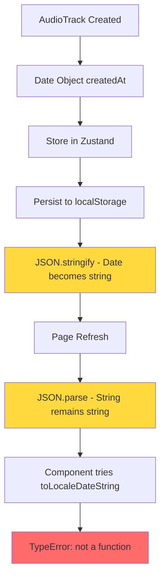

# Aural Mobile Web App - Robust Date Handling & Error Prevention Design

## Overview

This design addresses critical JavaScript runtime errors related to date handling in the Aural audio social platform, specifically focusing on the `createdAt.toLocaleDateString is not a function` error occurring in RecordPage.tsx. The design implements comprehensive error prevention, data validation, and robust date formatting utilities to ensure consistent application behavior across all components.

## Technology Stack & Dependencies

### Core Framework
- **React 18** with TypeScript for type safety
- **Zustand** for state management with localStorage persistence
- **Vite** for development and building
- **Tailwind CSS** for styling

### Enhanced Error Handling Stack
- **Robust Date Utilities** for safe date operations
- **Type Guards** for runtime type validation
- **Error Boundaries** for graceful error recovery
- **Data Sanitization** for store persistence

## Architecture

### Error Analysis & Root Cause

The current error occurs because the `createdAt` property in AudioTrack objects can become a string when persisted to localStorage and restored, losing its Date object methods. This happens during the Zustand persistence cycle:



### Enhanced Data Types

#### Robust Date Interface
```typescript
interface SafeDateField {
  value: Date | string | number;
  formatted?: string;
  timestamp?: number;
}

interface AudioTrack {
  id: string;
  title: string;
  description?: string;
  duration: number;
  url: string;
  user: User;
  likes: number;
  isLiked?: boolean;
  comments?: Comment[];
  createdAt: Date | string | number; // Allow multiple types for flexibility
  waveformData?: number[];
  tags?: string[];
  gender?: 'Female' | 'Male' | 'Mixed';
}
```

#### Enhanced User Interface
```typescript
interface User {
  id: string;
  username: string;
  avatar?: string;
  totalLikes: number;
  totalUploads: number;
  bio?: string;
  createdAt: Date | string | number;
}
```

### Utility Functions for Safe Date Handling

#### Core Date Utilities
```typescript
// Safe date conversion utility
export const toSafeDate = (value: Date | string | number | undefined | null): Date => {
  if (!value) return new Date();
  
  if (value instanceof Date) {
    return isNaN(value.getTime()) ? new Date() : value;
  }
  
  if (typeof value === 'string') {
    const parsed = new Date(value);
    return isNaN(parsed.getTime()) ? new Date() : parsed;
  }
  
  if (typeof value === 'number') {
    const parsed = new Date(value);
    return isNaN(parsed.getTime()) ? new Date() : parsed;
  }
  
  return new Date();
};

// Safe date formatting with fallbacks
export const formatSafeDate = (
  value: Date | string | number | undefined | null,
  options: Intl.DateTimeFormatOptions = {}
): string => {
  try {
    const safeDate = toSafeDate(value);
    return safeDate.toLocaleDateString(undefined, {
      year: 'numeric',
      month: 'short',
      day: 'numeric',
      ...options
    });
  } catch (error) {
    console.warn('Date formatting failed:', error);
    return 'Invalid date';
  }
};

// Relative time formatting
export const formatRelativeTime = (value: Date | string | number | undefined | null): string => {
  try {
    const safeDate = toSafeDate(value);
    const now = new Date();
    const diffInMs = now.getTime() - safeDate.getTime();
    const diffInHours = diffInMs / (1000 * 60 * 60);
    const diffInDays = diffInHours / 24;
    
    if (diffInHours < 1) {
      const minutes = Math.floor(diffInMs / (1000 * 60));
      return minutes < 1 ? 'Just now' : `${minutes}m ago`;
    }
    
    if (diffInHours < 24) {
      return `${Math.floor(diffInHours)}h ago`;
    }
    
    if (diffInDays < 7) {
      return `${Math.floor(diffInDays)}d ago`;
    }
    
    return formatSafeDate(value, { month: 'short', day: 'numeric' });
  } catch (error) {
    console.warn('Relative time formatting failed:', error);
    return 'Unknown time';
  }
};

// Duration formatting utility
export const formatDuration = (seconds: number | undefined | null): string => {
  if (typeof seconds !== 'number' || isNaN(seconds) || seconds < 0) {
    return '0:00';
  }
  
  const mins = Math.floor(seconds / 60);
  const secs = Math.floor(seconds % 60);
  return `${mins}:${secs.toString().padStart(2, '0')}`;
};

// Time ago utility
export const timeAgo = (value: Date | string | number | undefined | null): string => {
  return formatRelativeTime(value);
};
```

#### Data Validation Utilities
```typescript
// Type guards for runtime validation
export const isValidDate = (value: any): value is Date => {
  return value instanceof Date && !isNaN(value.getTime());
};

export const isValidDateString = (value: any): value is string => {
  return typeof value === 'string' && !isNaN(Date.parse(value));
};

export const isValidTimestamp = (value: any): value is number => {
  return typeof value === 'number' && !isNaN(value) && value > 0;
};

// Data sanitization for AudioTrack
export const sanitizeAudioTrack = (track: any): AudioTrack => {
  return {
    id: String(track.id || ''),
    title: String(track.title || 'Untitled'),
    description: track.description ? String(track.description) : undefined,
    duration: typeof track.duration === 'number' ? track.duration : 0,
    url: String(track.url || ''),
    user: sanitizeUser(track.user),
    likes: typeof track.likes === 'number' ? track.likes : 0,
    isLiked: Boolean(track.isLiked),
    comments: Array.isArray(track.comments) ? track.comments : undefined,
    createdAt: track.createdAt || new Date(),
    waveformData: Array.isArray(track.waveformData) ? track.waveformData : undefined,
    tags: Array.isArray(track.tags) ? track.tags : undefined,
    gender: track.gender in ['Female', 'Male', 'Mixed'] ? track.gender : undefined
  };
};

// Data sanitization for User
export const sanitizeUser = (user: any): User => {
  return {
    id: String(user?.id || ''),
    username: String(user?.username || 'Unknown User'),
    avatar: user?.avatar ? String(user.avatar) : undefined,
    totalLikes: typeof user?.totalLikes === 'number' ? user.totalLikes : 0,
    totalUploads: typeof user?.totalUploads === 'number' ? user.totalUploads : 0,
    bio: user?.bio ? String(user.bio) : undefined,
    createdAt: user?.createdAt || new Date()
  };
};
```

### Enhanced Store Configuration

#### Robust Zustand Persistence
```typescript
// Custom storage with data sanitization
const createRobustStorage = () => ({
  getItem: (name: string) => {
    try {
      const item = localStorage.getItem(name);
      if (!item) return null;
      
      const parsed = JSON.parse(item);
      
      // Sanitize data on retrieval
      if (parsed.state) {
        if (parsed.state.myTracks) {
          parsed.state.myTracks = parsed.state.myTracks.map(sanitizeAudioTrack);
        }
        if (parsed.state.currentUser) {
          parsed.state.currentUser = sanitizeUser(parsed.state.currentUser);
        }
      }
      
      return JSON.stringify(parsed);
    } catch (error) {
      console.warn(`Failed to retrieve ${name} from localStorage:`, error);
      return null;
    }
  },
  
  setItem: (name: string, value: string) => {
    try {
      localStorage.setItem(name, value);
    } catch (error) {
      console.warn(`Failed to store ${name} to localStorage:`, error);
    }
  },
  
  removeItem: (name: string) => {
    try {
      localStorage.removeItem(name);
    } catch (error) {
      console.warn(`Failed to remove ${name} from localStorage:`, error);
    }
  }
});

// Enhanced user store with data sanitization
export const useUserStore = create<UserStore>()(
  persist(
    (set, get) => ({
      // ... existing state
      
      addMyTrack: (track) => {
        const sanitizedTrack = sanitizeAudioTrack({
          ...track,
          createdAt: new Date() // Ensure fresh Date object
        });
        
        set((state) => {
          const updatedUser = state.currentUser ? {
            ...state.currentUser,
            totalUploads: state.currentUser.totalUploads + 1
          } : null;
          
          return {
            myTracks: [sanitizedTrack, ...state.myTracks],
            currentUser: updatedUser
          };
        });
      },
      
      // ... other actions
    }),
    {
      name: 'aural-user-store',
      storage: createJSONStorage(() => createRobustStorage()),
      partialize: (state) => ({
        currentUser: state.currentUser,
        myTracks: state.myTracks,
        likedTracks: state.likedTracks,
        bookmarkedTracks: state.bookmarkedTracks,
        followedUsers: state.followedUsers,
        preferences: state.preferences
      })
    }
  )
);
```

### Component Error Prevention

#### Enhanced RecordPage Component
```typescript
// RecordPage.tsx - Safe date rendering
const RecordPage: React.FC = () => {
  const { myTracks } = useUserStore();
  
  return (
    <div className="max-w-md mx-auto px-4 py-6">
      {/* ... recording interface */}
      
      {/* Safe track display */}
      {myTracks.length > 0 && (
        <div className="space-y-4">
          {myTracks.map((track) => {
            // Sanitize track data before rendering
            const safeTrack = sanitizeAudioTrack(track);
            
            return (
              <motion.div key={safeTrack.id} className="audio-card">
                <div className="flex items-center space-x-4 text-sm text-text-secondary">
                  <div className="flex items-center space-x-1">
                    <Calendar size={14} />
                    <span>{formatSafeDate(safeTrack.createdAt)}</span>
                  </div>
                  <div className="flex items-center space-x-1">
                    <TrendingUp size={14} />
                    <span>{safeTrack.likes} likes</span>
                  </div>
                  <span>{formatDuration(safeTrack.duration)}</span>
                </div>
              </motion.div>
            );
          })}
        </div>
      )}
    </div>
  );
};
```

#### Enhanced AudioCard Component
```typescript
// AudioCard.tsx - Robust data handling
interface AudioCardProps {
  track: AudioTrack;
  onPlay: (track: AudioTrack) => void;
  onLike?: (trackId: string) => void;
  className?: string;
}

const AudioCard: React.FC<AudioCardProps> = ({ track, onPlay, onLike, className }) => {
  // Sanitize track data
  const safeTrack = sanitizeAudioTrack(track);
  const safeUser = sanitizeUser(track.user);
  
  return (
    <div className={`audio-card ${className}`}>
      {/* User info */}
      <div className="flex items-center space-x-3 mb-3">
        <div className="w-10 h-10 rounded-full bg-gradient-pink flex items-center justify-center">
          {safeUser.avatar ? (
            
          ) : (
            <span className="text-white font-medium">
              {safeUser.username.charAt(0).toUpperCase()}
            </span>
          )}
        </div>
        <div>
          <h3 className="font-medium text-white">{safeUser.username}</h3>
          <p className="text-xs text-text-secondary">{timeAgo(safeTrack.createdAt)}</p>
        </div>
      </div>
      
      {/* Track info */}
      <div className="mb-4">
        <h4 className="font-medium text-white mb-1">{safeTrack.title}</h4>
        <div className="flex items-center space-x-2 text-sm text-text-secondary">
          <span>{formatDuration(safeTrack.duration)}</span>
          <span>•</span>
          <span>{safeTrack.likes} likes</span>
        </div>
      </div>
      
      {/* Controls */}
      <div className="flex items-center justify-between">
        <button
          onClick={() => onPlay(safeTrack)}
          className="flex items-center space-x-2 px-4 py-2 bg-gradient-pink rounded-full text-white font-medium"
        >
          <Play size={16} />
          <span>Play</span>
        </button>
        
        {onLike && (
          <button
            onClick={() => onLike(safeTrack.id)}
            className={`p-2 rounded-full ${safeTrack.isLiked ? 'text-red-500' : 'text-text-secondary'}`}
          >
            <Heart size={16} fill={safeTrack.isLiked ? 'currentColor' : 'none'} />
          </button>
        )}
      </div>
    </div>
  );
};
```

### Error Boundary Implementation

#### Global Error Boundary
```typescript
interface ErrorBoundaryState {
  hasError: boolean;
  error: Error | null;
  errorInfo: ErrorInfo | null;
}

class GlobalErrorBoundary extends Component<PropsWithChildren, ErrorBoundaryState> {
  constructor(props: PropsWithChildren) {
    super(props);
    this.state = {
      hasError: false,
      error: null,
      errorInfo: null
    };
  }
  
  static getDerivedStateFromError(error: Error): Partial<ErrorBoundaryState> {
    return {
      hasError: true,
      error
    };
  }
  
  componentDidCatch(error: Error, errorInfo: ErrorInfo) {
    console.error('Global Error Boundary caught an error:', error, errorInfo);
    
    this.setState({
      error,
      errorInfo
    });
    
    // Log to error reporting service
    // reportError(error, errorInfo);
  }
  
  render() {
    if (this.state.hasError) {
      return (
        <div className="min-h-screen bg-bg-primary flex items-center justify-center p-4">
          <div className="max-w-md mx-auto text-center">
            <div className="w-16 h-16 mx-auto mb-4 rounded-full bg-red-500/20 flex items-center justify-center">
              <AlertTriangle className="w-8 h-8 text-red-500" />
            </div>
            
            <h1 className="text-xl font-semibold text-white mb-2">
              Something went wrong
            </h1>
            
            <p className="text-text-secondary mb-6">
              We're sorry, but something unexpected happened. Please try refreshing the page.
            </p>
            
            <div className="space-y-3">
              <button
                onClick={() => window.location.reload()}
                className="w-full px-4 py-2 bg-gradient-pink rounded-lg text-white font-medium"
              >
                Refresh Page
              </button>
              
              <button
                onClick={() => this.setState({ hasError: false, error: null, errorInfo: null })}
                className="w-full px-4 py-2 border border-text-secondary rounded-lg text-text-secondary"
              >
                Try Again
              </button>
            </div>
            
            {process.env.NODE_ENV === 'development' && this.state.error && (
              <details className="mt-6 text-left">
                <summary className="text-red-400 cursor-pointer mb-2">
                  Error Details (Development)
                </summary>
                <pre className="text-xs text-red-300 bg-red-900/20 p-3 rounded overflow-auto">
                  {this.state.error.toString()}
                  {this.state.errorInfo?.componentStack}
                </pre>
              </details>
            )}
          </div>
        </div>
      );
    }
    
    return this.props.children;
  }
}
```

### Migration & Data Recovery

#### Store Migration Utility
```typescript
// Store migration for existing data
export const migrateStorageData = () => {
  try {
    // Migrate user store
    const userStoreData = localStorage.getItem('aural-user-store');
    if (userStoreData) {
      const parsed = JSON.parse(userStoreData);
      
      if (parsed.state) {
        // Migrate myTracks
        if (parsed.state.myTracks) {
          parsed.state.myTracks = parsed.state.myTracks.map(sanitizeAudioTrack);
        }
        
        // Migrate currentUser
        if (parsed.state.currentUser) {
          parsed.state.currentUser = sanitizeUser(parsed.state.currentUser);
        }
        
        localStorage.setItem('aural-user-store', JSON.stringify(parsed));
      }
    }
    
    // Migrate feed store
    const feedStoreData = localStorage.getItem('aural-feed-store');
    if (feedStoreData) {
      const parsed = JSON.parse(feedStoreData);
      
      if (parsed.state?.tracks) {
        parsed.state.tracks = parsed.state.tracks.map(sanitizeAudioTrack);
        localStorage.setItem('aural-feed-store', JSON.stringify(parsed));
      }
    }
    
    console.log('Storage data migration completed');
  } catch (error) {
    console.warn('Storage migration failed:', error);
  }
};

// Run migration on app start
export const initializeApp = () => {
  // Run data migration
  migrateStorageData();
  
  // Initialize error reporting
  window.addEventListener('unhandledrejection', (event) => {
    console.error('Unhandled promise rejection:', event.reason);
  });
  
  window.addEventListener('error', (event) => {
    console.error('Global error:', event.error);
  });
};
```

### Implementation Strategy

#### Phase 1: Immediate Error Fix
1. **Update utility functions** with safe date handling
2. **Replace direct date method calls** in components with safe utilities
3. **Add data sanitization** to store persistence
4. **Deploy error boundary** for graceful error handling

#### Phase 2: Comprehensive Data Validation
1. **Implement type guards** for runtime validation
2. **Add store migration utility** for existing data
3. **Enhanced error logging** and monitoring
4. **Component-level error boundaries** for isolated failures

#### Phase 3: Preventive Measures
1. **Automated data validation** in development
2. **Unit tests** for date utilities and edge cases
3. **Integration tests** for store persistence
4. **Performance monitoring** for error frequency

### Validation & Testing

#### Unit Tests for Date Utilities
```typescript
describe('Safe Date Utilities', () => {
  test('toSafeDate handles various input types', () => {
    expect(toSafeDate(new Date('2024-01-01'))).toBeInstanceOf(Date);
    expect(toSafeDate('2024-01-01')).toBeInstanceOf(Date);
    expect(toSafeDate(1704067200000)).toBeInstanceOf(Date);
    expect(toSafeDate(null)).toBeInstanceOf(Date);
    expect(toSafeDate(undefined)).toBeInstanceOf(Date);
  });
  
  test('formatSafeDate never throws errors', () => {
    expect(() => formatSafeDate(null)).not.toThrow();
    expect(() => formatSafeDate('invalid')).not.toThrow();
    expect(() => formatSafeDate(NaN)).not.toThrow();
  });
  
  test('sanitizeAudioTrack normalizes data', () => {
    const invalidTrack = {
      id: 123,
      title: null,
      createdAt: '2024-01-01'
    };
    
    const sanitized = sanitizeAudioTrack(invalidTrack);
    expect(typeof sanitized.id).toBe('string');
    expect(typeof sanitized.title).toBe('string');
    expect(sanitized.createdAt).toBeInstanceOf(Date);
  });
});
```

#### Integration Testing
```typescript
describe('Store Persistence', () => {
  test('tracks survive localStorage round trip', () => {
    const originalTrack = {
      id: 'test-1',
      title: 'Test Track',
      createdAt: new Date(),
      // ... other properties
    };
    
    // Simulate store persistence
    const serialized = JSON.stringify({ state: { myTracks: [originalTrack] } });
    const deserialized = JSON.parse(serialized);
    
    // Apply sanitization
    const sanitized = sanitizeAudioTrack(deserialized.state.myTracks[0]);
    
    expect(formatSafeDate(sanitized.createdAt)).toBeDefined();
    expect(() => formatSafeDate(sanitized.createdAt)).not.toThrow();
  });
});
```

This design ensures robust date handling across the entire Aural application, preventing JavaScript runtime errors and providing graceful fallbacks for invalid data. The implementation focuses on type safety, data validation, and user experience continuity.