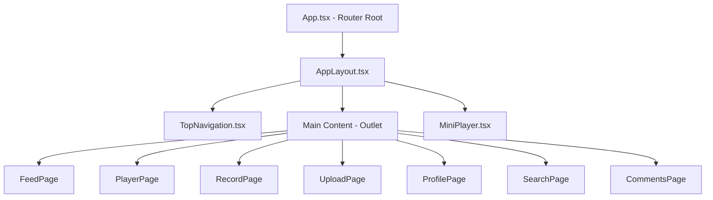
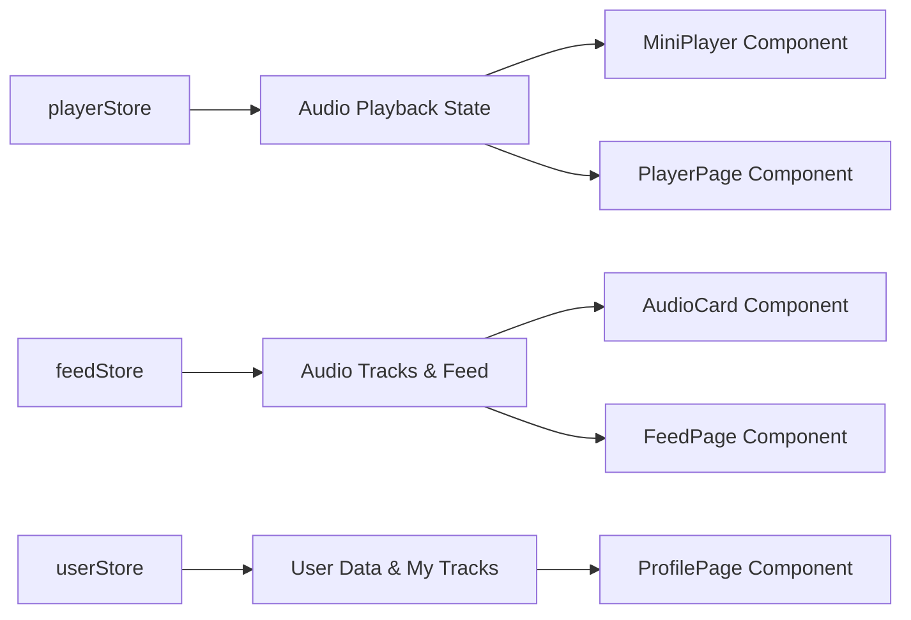
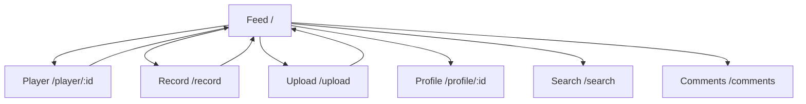
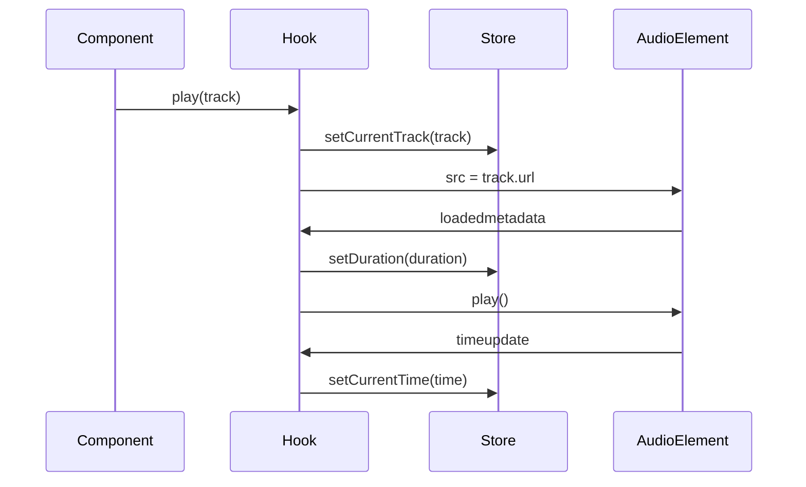
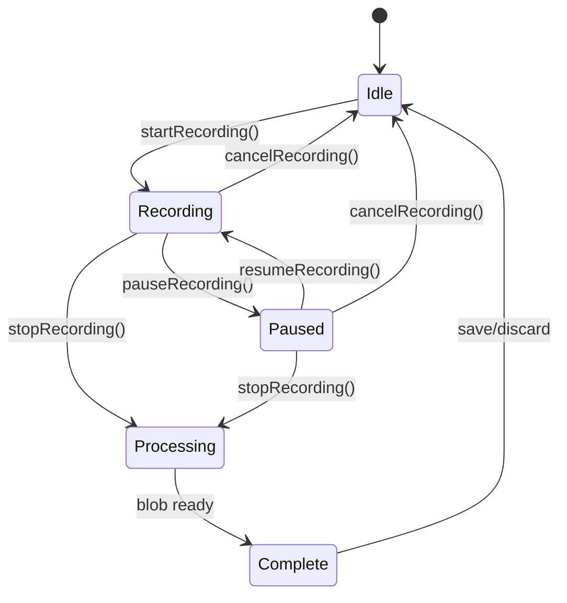

# Aural Application Setup & Configuration Fix

## Overview

This design document provides the complete solution to fix the Tailwind CSS configuration issues and properly set up the Aural voice social network application. The application is a React-based audio sharing platform with recording, playback, and social features.

## Architecture

### Technology Stack
- **Frontend Framework**: React 19 with TypeScript
- **Build Tool**: Vite 7
- **Styling**: Tailwind CSS v4 with PostCSS
- **State Management**: Zustand with localStorage persistence
- **Routing**: React Router v7
- **Animations**: Framer Motion
- **Audio Processing**: Web Audio API + MediaRecorder API
- **Icons**: Lucide React

### Application Structure
```
src/
├── components/
│   ├── audio/          # Audio-related components
│   ├── feed/           # Feed display components
│   └── layout/         # Layout and navigation
├── hooks/              # Custom React hooks
├── pages/              # Route-level components
├── stores/             # Zustand state stores
├── types/              # TypeScript definitions
└── utils/              # Utility functions
```

## Configuration Fixes

### 1. Tailwind CSS v4 Configuration

#### Problem Resolution
The current error occurs because Tailwind CSS v4 requires the `@import 'tailwindcss'` directive in your CSS file.

#### Required Changes

**File: `src/index.css`**
Replace the entire content with:
```css
@import 'tailwindcss';

/* Custom styles for Aural - Voice Social Network */
:root {
  font-family: 'Inter', 'Manrope', system-ui, sans-serif;
  -webkit-font-smoothing: antialiased;
  -moz-osx-font-smoothing: grayscale;
}

body {
  margin: 0;
  background-color: #0f0f0f;
  color: #ffffff;
  font-family: 'Inter', 'Manrope', system-ui, sans-serif;
}

/* Neon gradient utilities */
.gradient-neon {
  background: linear-gradient(135deg, #ff007f, #8b5cf6, #06b6d4, #14b8a6);
}

.text-gradient-neon {
  background: linear-gradient(135deg, #ff007f, #8b5cf6, #06b6d4, #14b8a6);
  -webkit-background-clip: text;
  -webkit-text-fill-color: transparent;
  background-clip: text;
}

/* Custom color variables */
.bg-bg-primary { background-color: #0f0f0f; }
.bg-bg-secondary { background-color: #1a1a1a; }
.text-text-primary { color: #ffffff; }
.text-text-secondary { color: #a1a1aa; }
.bg-gradient-pink { background: linear-gradient(135deg, #ff007f, #8b5cf6); }
.text-accent-blue { color: #06b6d4; }
```

### 2. React Router Setup

#### Problem Resolution
The App.tsx component is currently showing the default Vite template instead of the Aural application routes.

#### Required Changes

**File: `src/App.tsx`**
Replace the entire content with:
```tsx
import { BrowserRouter, Routes, Route } from 'react-router-dom';
import { AppLayout } from './components/layout/AppLayout';
import { FeedPage } from './pages/FeedPage';
import { PlayerPage } from './pages/PlayerPage';
import { RecordPage } from './pages/RecordPage';
import { UploadPage } from './pages/UploadPage';
import { ProfilePage } from './pages/ProfilePage';
import { SearchPage } from './pages/SearchPage';
import { CommentsPage } from './pages/CommentsPage';

function App() {
  return (
    <BrowserRouter>
      <Routes>
        <Route path="/" element={<AppLayout />}>
          <Route index element={<FeedPage />} />
          <Route path="player/:id" element={<PlayerPage />} />
          <Route path="record" element={<RecordPage />} />
          <Route path="upload" element={<UploadPage />} />
          <Route path="profile/:id" element={<ProfilePage />} />
          <Route path="search" element={<SearchPage />} />
          <Route path="comments" element={<CommentsPage />} />
        </Route>
      </Routes>
    </BrowserRouter>
  );
}

export default App;
```

## Component Architecture

### Layout System


### State Management Architecture


### Navigation Flow


## Data Models & Store Integration

### Core Data Types

| Type | Properties | Store |
|------|------------|-------|
| **AudioTrack** | id, title, duration, url, user, likes, comments | feedStore |
| **User** | id, username, avatar, totalLikes, totalUploads | userStore |
| **PlaybackState** | currentTrack, isPlaying, currentTime, duration | playerStore |

### Store Responsibilities

#### playerStore
- Audio playback control
- Current track management
- Playback progress tracking
- Volume control
- Expanded player state

#### feedStore
- Track listing and filtering
- Like/unlike functionality
- Feed refresh and pagination
- Track discovery

#### userStore
- Current user profile
- User authentication state
- Personal track uploads
- Recording state management

## Audio Processing Layer

### useAudioPlayer Hook


### useMediaRecorder Hook


## Testing Strategy

### Component Testing
1. **Navigation Components**
   - Route transitions
   - Active state indicators
   - Mobile responsiveness

2. **Audio Components**
   - Playback controls
   - Progress tracking
   - Volume control
   - Recording functionality

3. **Feed Components**
   - Track listing
   - Like interactions
   - Filter functionality

### Integration Testing
1. **Audio Flow**
   - Track selection → Player activation
   - Mini-player → Full player transition
   - Recording → Upload → Feed integration

2. **State Persistence**
   - Zustand localStorage persistence
   - Player state across navigation
   - User session management

## Implementation Steps

### Phase 1: Configuration Fix
1. Update `src/index.css` with Tailwind import
2. Replace `src/App.tsx` with router configuration
3. Verify PostCSS configuration is correct
4. Test development server startup

### Phase 2: Verification
1. Start development server: `npm run dev`
2. Verify Tailwind classes are working
3. Test navigation between routes
4. Verify component rendering

### Phase 3: Feature Testing
1. Test audio playback functionality
2. Verify recording capabilities
3. Test upload and feed integration
4. Validate responsive design

## Development Commands

| Command | Purpose |
|---------|---------|
| `npm install` | Install dependencies |
| `npm run dev` | Start development server |
| `npm run build` | Build for production |
| `npm run preview` | Preview production build |
| `npm run lint` | Run ESLint |

## Design System Specifications

### Color Palette
- **Background Primary**: #0f0f0f (near black)
- **Background Secondary**: #1a1a1a (dark gray)
- **Text Primary**: #ffffff (white)
- **Text Secondary**: #a1a1aa (light gray)
- **Neon Gradients**: Pink (#ff007f) → Violet (#8b5cf6) → Blue (#06b6d4) → Turquoise (#14b8a6)

### Typography
- **Primary Font**: Inter, Manrope, system-ui, sans-serif
- **Font Smoothing**: Antialiased for crisp text rendering
- **Responsive Scale**: Mobile-first approach with Tailwind classes

### Responsive Design
- **Mobile First**: 320px+ (default)
- **Tablet**: 768px+ (md:)
- **Desktop**: 1024px+ (lg:)
- **Large Desktop**: 1280px+ (xl:)

### Animation Guidelines
- **Framer Motion**: Used for page transitions and component animations
- **Hover States**: Smooth transitions (0.25s duration)
- **Loading States**: Skeleton loaders and progress indicators
- **Micro-interactions**: Button presses, like animations, progress updates